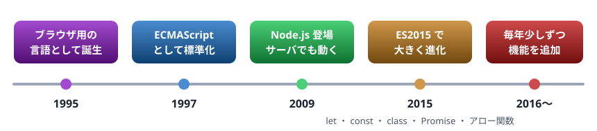
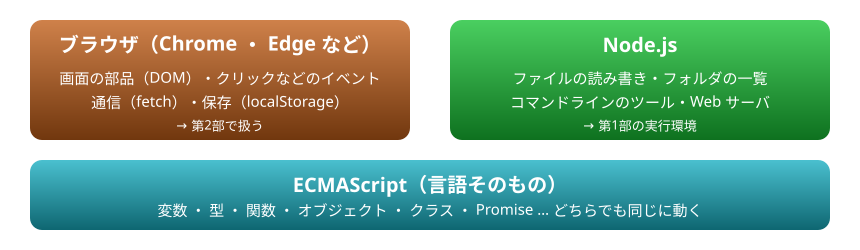
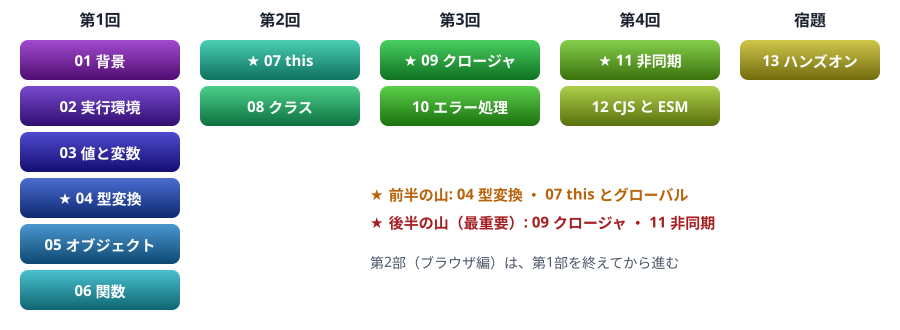

# 01. 背景

JavaScript がどこで生まれ、どこで動くのか。Java ・ C# ・ VBA と何が違うのかを、ざっと掴む

> 📅 作成: 2026-10-09 / 更新: 2026-10-09

[^^](README.md)

1. [JavaScript とは](#1-javascript-とは)
2. [言語と実行環境](#2-言語と実行環境)
3. [Java ・ C# ・ VBA との違い](#3-java--c--vba-との違い)
4. [この資料の歩き方](#4-この資料の歩き方)

## 1. JavaScript とは

JavaScript は、もともと**Web ページを動かすため**にブラウザへ組み込まれた言語です。ボタンを押したら表示が変わる、入力をその場で確かめる、といった処理を受け持ってきました。

いまはブラウザの外でも動きます。サーバー、コマンドラインのツール、デスクトップアプリ、スマートフォンアプリまで、同じ言語で書けます。



JavaScript の歩み。この資料は、2015 年以降の書き方（モダンな JavaScript）で書く

まずは 1 行動かしてみます。下の「▶ 実行」を押すと、このページの中でコードが動き、結果が黒い欄に出ます。

```javascript
console.log("こんにちは、JavaScript！");
console.log(1 + 2);
```

```text
こんにちは、JavaScript！
3
```

`console.log` は、値を画面（コンソール）に出す命令です。Java の `System.out.println`、C# の `Console.WriteLine`、VBA の `Debug.Print` に当たります。この資料では、ほとんどの例でこれを使って結果を確かめます。

> [!IMPORTANT]
> Java ・ C# ・ VBA から来た人へ: 名前は似ていますが、**JavaScript と Java は別の言語**です。生まれたときに、当時人気だった Java にあやかって名付けられただけです。文法の見た目（波かっこ `{ }` や `if` の書き方）は似ていますが、考え方はかなり違います。

## 2. 言語と実行環境

JavaScript を学ぶときは、**言語そのもの**と、**それを動かす環境**を分けて考えると見通しがよくなります。

- **ECMAScript**: 言語そのものの決まり。変数・関数・オブジェクト・Promise など。毎年改訂され、「ES2015」「ES2024」のように年で呼ぶ
- **実行環境**: 言語を動かすプログラム。言語に加えて、その環境ならではの機能を足す



言語は共通で、その上に環境ごとの機能が載る

第1部では Node.js を実行環境として、言語そのものを学びます。ただし言語の部分はブラウザでも同じに動くので、この資料の「▶ 実行」ボタンはブラウザの中で実際にコードを動かしています。ファイルの読み書きのように Node.js にしか無い機能だけは、ブラウザでは動かせません。そうした例は、Node.js で動かしたときの結果を記録して見せます。

> [!TIP]
> ヒント: 調べものをするときは、知りたいのが「言語」なのか「環境」なのかを意識すると、検索がうまくいきます。たとえば「配列を並べ替えたい」は言語の話、「ファイルを読みたい」は Node.js の話、「ボタンの色を変えたい」はブラウザの話です。

## 3. Java ・ C# ・ VBA との違い

最初に戸惑いやすい違いを表にまとめます。細かいことは、それぞれの章で扱います。

| 項目 | Java ・ C# | VBA | JavaScript |
|---|---|---|---|
| 型の決まり方 | 変数に型を書き、コンパイル時に確かめる | `Dim x As Long`。書かなければ `Variant` | 変数に型は無い。**値**が型を持つ |
| 実行の前に | コンパイルが要る | エディタで実行 | コンパイル不要。書いたらすぐ動く |
| プログラムの入口 | `main` メソッドが要る | `Sub` を選んで実行 | ファイルの上から順に実行。入口は要らない |
| クラス | すべてのコードはクラスの中 | クラスモジュールは任意 | 使わなくてもよい。関数だけで書ける |
| 数値の型 | `int` ・ `long` ・ `double` … | `Integer` ・ `Long` ・ `Double` … | ふだん使うのは `number` の 1 種類だけ |
| 待ち時間のある処理 | スレッドや `async` | 基本的に待つ | 待たずに先へ進み、後で結果を受け取る（11 章） |

入口が要らないことを確かめてみます。クラスも `main` もありません。上から順に実行されるだけです。

```javascript
function greet(who) {
  return "ようこそ、" + who + " さん";
}

console.log(greet("ゲスト"));
console.log(greet("チーム"));
```

```text
ようこそ、ゲスト さん
ようこそ、チーム さん
```

変数に型が無いことも見ておきます。`typeof` は値の型を調べる演算子です。同じ変数に、数値を入れた後で文字列を入れられます。

```javascript
let x = 10;
console.log(typeof x);

x = "十";
console.log(typeof x);
```

```text
number
string
```

> [!WARNING]
> 注意: 型を書かなくてよい分、間違った型の値が入っても**実行するまで気づけません**。この弱点は 04 章（型変換）で詳しく見ます。型を書けるようにした言語が TypeScript で、この資料を終えた後の進み先になります。

## 4. この資料の歩き方

### 全体の地図

第1部は 13 の資料で、勉強会 4 回と宿題で進めます。★ の付いた章が山場です。前半の山（04 ・ 07）で JavaScript らしい落とし穴を知り、後半の山（09 ・ 11）で最も大事な仕組みを身につけます。



第1部の地図。左から勉強会の回の順に並ぶ

### 「▶ 実行」ボタンの使い方

例のコードには、ボタンが付いています。

- **▶ 実行**: その場でコードを動かし、結果を黒い欄に出す。押す前に、どうなるか予想してみるのがおすすめ
- **✎ 書き換える**: コードを編集できる欄に切り替える。数字や文字を変えて、もう一度「▶ 実行」を押す
- **↺ 元に戻す**: 書き換えたコードを、資料の元のコードに戻す
- **■ 止める**: 動いているコードを止める。止めなくても 5 秒たつと自動で止まる

下のコードを書き換えて、表示される文字を変えてみてください。

```javascript
const message = "書き換えてみよう";
console.log(message);
console.log(message.length + " 文字");
```

```text
書き換えてみよう
8 文字
```

結果はすぐに出るとは限りません。次の例は、1 行目がすぐ出て、2 行目は 1 秒後に出ます。こうした「待つ処理」は 11 章で扱います。

```javascript
console.log("すぐ表示");
setTimeout(() => console.log("1 秒後に表示"), 1000);
```

```text
すぐ表示
1 秒後に表示
```

### エラーの読み方

間違いがあると、赤い字でエラーが出ます。エラーが起きた行で処理は止まり、その先は実行されません。

```javascript
console.log("ここまでは動く");
console.log(undefinedValue);
console.log("ここは実行されない");
```

```text
ここまでは動く
Uncaught ReferenceError: undefinedValue is not defined
```

エラーは英語で出ます。形はいつも「`エラーの種類: 説明`」です。上の例は「`ReferenceError`（参照のエラー）: `undefinedValue` は定義されていない」という意味です。この資料ではエラーを英語のまま載せ、訳を添えます。

> [!NOTE]
> メモ: エラーの文面は、実行するプログラムで少し変わります。この資料の文面は Chrome ・ Edge と Node.js のもので、この 3 つは同じ仕組み（V8）で動くため一致します。Firefox や Safari では言い回しが違うことがあります。先頭の `Uncaught` は「どこでも捕まえられなかった」という意味で、10 章で扱います。

[^^](README.md)
