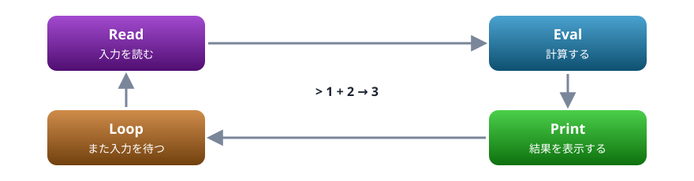

# 02. 実行環境

Node.js を入れて、1 行ずつ試す方法と、ファイルに書いて実行する方法を身につける

> 📅 作成: 2026-10-09 / 更新: 2026-10-09

[<<](01-背景.md)[>>](03-値と変数.md)[^^](../README.md)

1. [Node.js を入れる](#1-nodejs-を入れる)
2. [REPL で 1 行ずつ試す](#2-repl-で-1-行ずつ試す)
3. [ファイルに書いて実行する](#3-ファイルに書いて実行する)
4. [console で値を見る](#4-console-で値を見る)
5. [エディタと書き方の決まり](#5-エディタと書き方の決まり)

## 1. Node.js を入れる

Node.js は、JavaScript をパソコンの上で直接動かすためのプログラムです。公式サイト（[https://nodejs.org/](https://nodejs.org/)）からインストーラーを取ってきて入れます。


入れてから動かすまでの 4 段階

入れ終えたら、ターミナル（Windows なら PowerShell かコマンドプロンプト）を開き、版を表示させます。数字が出れば成功です。

```shell
node --version
```

```text
v26.10.0
```

数字は、入れた時期によって違います。この資料は v26 系で確かめています。

> [!TIP]
> ヒント: サイトには「LTS」と「Current」の 2 種類が並んでいることがあります。LTS は長く保守される安定版、Current は最新の機能が入った版です。迷ったら LTS を選びます。

> [!WARNING]
> 注意: `node` が見つからないと言われたら、インストールの前から開いていたターミナルを閉じて、開き直してください。インストールで足された設定は、新しく開いたターミナルにしか効きません。

## 2. REPL で 1 行ずつ試す

ターミナルで `node` とだけ打つと、`>` が出て入力を待つ状態になります。これを **REPL** と呼びます。打った式をその場で計算して、結果を表示します。



REPL は Read ・ Eval ・ Print ・ Loop の頭文字。この 4 つをくり返す

実際のやり取りはこうなります。`>` の後ろが打った内容で、その次の行が結果です。

```text
> 1 + 2
3
> "Java" + "Script"
'JavaScript'
> Math.max(3, 9, 4)
9
> .exit
```

終えるときは `.exit` と打つか、<kbd>Ctrl</kbd>+<kbd>C</kbd> を 2 回押します。ちょっとした計算や、メソッドの動きを確かめるのに便利です。

> [!NOTE]
> メモ: 文字列の結果が `'JavaScript'` のように引用符付きで出るのは、「これは文字列です」と分かるようにするためです。`console.log` で表示したときは引用符が付きません。

## 3. ファイルに書いて実行する

何行もあるプログラムは、ファイルに書いて実行します。拡張子は `.js` にします。好きなフォルダに `hello.js` を作り、次の内容を書いて保存します。

hello.js

```javascript
console.log("Node.js から、こんにちは");
console.log("1 + 2 =", 1 + 2);
console.log("今日の作業:", ["読む", "書く", "動かす"]);
```

```text
Node.js から、こんにちは
1 + 2 = 3
今日の作業: [ '読む', '書く', '動かす' ]
```

ターミナルで、そのファイルのあるフォルダへ移ってから、`node` の後ろにファイル名を付けて実行します。

```shell
cd 作業フォルダ
node hello.js
```

この例の「▶ 実行」ボタンは、Node.js で実際に動かしたときの結果（記録）を表示します。ここに載せている結果は、資料を作るときに Node.js で実行して確かめたものです。

> [!IMPORTANT]
> Java ・ C# ・ VBA から来た人へ: コンパイルの手順はありません。`node hello.js` の 1 回で、読み込みから実行まで終わります。書き換えたら、保存してもう一度 `node hello.js` を打つだけです。

## 4. console で値を見る

`console.log` には、値をいくつでも渡せます。間は空白 1 つでつながります。配列やオブジェクトも、中身が分かる形で表示されます。

```javascript
console.log("合計", 10, "円");
console.log([1, 2, 3]);
console.log({ name: "りんご", price: 120 });
console.log(true, null, undefined);
```

```text
合計 10 円
[ 1, 2, 3 ]
{ name: 'りんご', price: 120 }
true null undefined
```

直接渡した文字列は引用符なしで出ますが、オブジェクトの中の文字列は `'りんご'` のように引用符付きで出ます。数値の `120` と文字列の `'120'` を見分けるためです。

ほかにも、目的に合わせた仲間があります。

| 書き方 | 使いどころ |
|---|---|
| `console.log(…)` | ふだんの表示 |
| `console.error(…)` | エラーの表示。Node.js では標準エラー出力に出る |
| `console.warn(…)` | 警告の表示 |
| `console.count(名前)` | 呼ばれた回数を数えて表示する |

```javascript
console.warn("在庫が少なくなっています");
console.error("在庫がありません");
console.count("呼び出し");
console.count("呼び出し");
```

```text
在庫が少なくなっています
在庫がありません
呼び出し: 1
呼び出し: 2
```

## 5. エディタと書き方の決まり

### エディタ

メモ帳でも書けますが、色付けや補完のあるエディタを使うと楽です。よく使われるのは Visual Studio Code（VS Code）です。保存するときの文字コードは UTF-8 にします。

### コメント

コメントの書き方は Java ・ C# と同じです。VBA の `'` とは違います。

```javascript
// 1 行のコメント
/*
  複数行のコメント
*/
console.log("コメントは実行されない"); // 行の途中からも書ける
```

```text
コメントは実行されない
```

### セミコロン

文の終わりにはセミコロン `;` を書きます。JavaScript は省略しても多くの場合に補ってくれますが、補い方が思いどおりにならないことがあります。この資料では必ず書きます。

### 大文字と小文字

大文字と小文字は区別されます。`console.log` を `Console.Log` と書くと動きません。VBA は区別しないので、特に気をつけてください。

```javascript
Console.log("動く？");
```

```text
Uncaught ReferenceError: Console is not defined
```

「`ReferenceError`: `Console` は定義されていない」というエラーです。`Console`（大文字）という名前のものは無い、と言われています。

[<<](01-背景.md)[>>](03-値と変数.md)[^^](../README.md)
