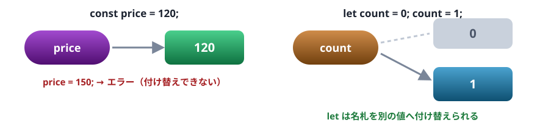
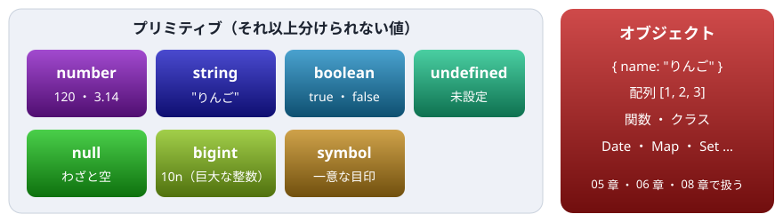

# 03. 値と変数

`const` と `let` の使い分け、7 種類のプリミティブ型、数値と文字列の性質、`null` と `undefined`

> 📅 作成: 2026-10-09 / 更新: 2026-10-09

[<<](02-実行環境.md)[>>](04-演算子と型変換.md)[^^](../README.md)

1. [変数を作る](#1-変数を作る)
2. [値の型](#2-値の型)
3. [数値](#3-数値)
4. [文字列](#4-文字列)
5. [null と undefined](#5-null-と-undefined)

## 1. 変数を作る

変数は `const` か `let` で作ります。違いは**あとで別の値を入れ直せるかどうか**です。

| 書き方 | 入れ直し | 使いどころ |
|---|---|---|
| `const` | ❌ **できない** | 基本はこれ。値が変わらないことが読み手に伝わる |
| `let` | ✅ **できる** | 数え上げや合計など、途中で値が変わるもの |
| `var` | ✅ **できる** | 古い書き方。新しいコードでは使わない（理由は 07 章） |



変数は「値に付けた名札」と考えると分かりやすい

```javascript
const price = 120;
let count = 0;
count = count + 1;
count += 2;
console.log(price, count);
```

```text
120 3
```

`const` の変数に入れ直そうとすると、エラーになります。

```javascript
const price = 120;
price = 150;
```

```text
Uncaught TypeError: Assignment to constant variable.
```

「`TypeError`: 定数の変数への代入」という意味です。迷ったら `const` で書き、入れ直す必要が出たときだけ `let` に変えます。

> [!IMPORTANT]
> Java ・ C# ・ VBA から来た人へ: `int` や `As Long` のような型は書きません。`const` は Java の `final`、C# の `readonly` に近いものです。変数名には日本語も使えますが、英語で書くのがふつうです。

## 2. 値の型

変数に型はありませんが、**値には型があります**。JavaScript の値は、7 種類の**プリミティブ**と、それ以外の**オブジェクト**に分かれます。



値は 7 種類のプリミティブと、オブジェクトに分かれる。ふだんよく使うのは左上の 4 つと null

値の型は `typeof` で調べられます。結果は型の名前の文字列です。

```javascript
console.log(typeof 120);
console.log(typeof "りんご");
console.log(typeof true);
console.log(typeof undefined);
console.log(typeof 10n);
console.log(typeof { name: "りんご" });
console.log(typeof [1, 2, 3]);
console.log(typeof null);
```

```text
number
string
boolean
undefined
bigint
object
object
object
```

最後の 2 つに注意してください。配列も `"object"` になります。配列かどうかは `Array.isArray(値)` で調べます。`typeof null` が `"object"` になるのは、最初の実装の誤りが互換性のために残ったものです。`null` かどうかは `値 === null` で調べます。

## 3. 数値

JavaScript の数値（`number`）は 1 種類だけで、中身はいつも小数を扱える 64 ビットの浮動小数点数（Java ・ C# の `double`）です。整数と小数を区別しません。

```javascript
console.log(7 / 2);
console.log(7 % 2);
console.log(Math.floor(7 / 2));
console.log(2 ** 10);
console.log(0.1 + 0.2);
```

```text
3.5
1
3
1024
0.30000000000000004
```

- `7 / 2` は `3.5`。Java ・ C# の整数どうしの割り算のように切り捨てられない。切り捨てたいときは `Math.floor` を使う
- `%` は割った余り、`**` はべき乗
- `0.1 + 0.2` がぴったり `0.3` にならないのは、`double` を使う言語に共通の性質。お金の計算は円単位の整数で行う

整数として正確に扱えるのは、およそ 9000 兆（`Number.MAX_SAFE_INTEGER`）までです。それを超える整数は `bigint` を使います。数字の後ろに `n` を付けて書きます。

```javascript
console.log(Number.MAX_SAFE_INTEGER);
console.log(9007199254740993);
console.log(9007199254740993n);
```

```text
9007199254740991
9007199254740992
9007199254740993n
```

2 行目は、書いた数と違う値が出ています。正確に表せない大きさだからです。

## 4. 文字列

文字列は `"…"` か `'…'` で囲みます。どちらも同じ意味です。この資料では `"…"` を使います。

3 つ目の囲み方として、バッククォート ``…`` を使う**テンプレート文字列**があります。中に `${式}` を書くと、式の値が埋め込まれます。改行もそのまま書けます。

```javascript
const item = "りんご";
const price = 120;
const count = 3;
console.log(item + "を" + count + "個で" + price * count + "円");
console.log(`${item}を${count}個で${price * count}円`);
console.log(`1 行目
2 行目`);
```

```text
りんごを3個で360円
りんごを3個で360円
1 行目
2 行目
```

`+` でつなぐより、テンプレート文字列のほうが読みやすくなります。C# の `$"{item}"`（文字列補間）と同じ役割です。

文字列には、便利なメソッドがたくさんあります。元の文字列は変わらず、新しい文字列が返ります。

```javascript
const text = "JavaScript Primer";
console.log(text.length);
console.log(text.toUpperCase());
console.log(text.includes("Script"));
console.log(text.slice(0, 4));
console.log(text.split(" "));
console.log(text.replace("Primer", "入門"));
console.log(text);
```

```text
17
JAVASCRIPT PRIMER
true
Java
[ 'JavaScript', 'Primer' ]
JavaScript 入門
JavaScript Primer
```

> [!WARNING]
> 注意: `length` は「文字数」ではなく、内部の単位（UTF-16）の数です。日本語の多くは 1 文字が 1 ですが、絵文字などは 1 文字が 2 になります。

```javascript
console.log("日本語".length);
console.log("🍎".length);
console.log([..."🍎"].length);
```

```text
3
2
1
```

見た目の文字数を数えたいときは、3 行目のように `[...文字列]` で 1 文字ずつの配列に分けてから数えます（`...` は 05 章で扱います）。

## 5. null と undefined

「値が無い」ことを表す値が 2 つあります。どちらも、Java ・ C# の `null`、VBA の `Nothing` や `Empty` に近いものです。

| 値 | 意味 | 出てくる場面 |
|---|---|---|
| `undefined` | まだ決まっていない | 値を入れずに作った変数 ・ 無いプロパティ ・ `return` の無い関数の戻り値 ・ 渡されなかった引数 |
| `null` | わざと空にしてある | プログラムを書く人が「ここは空です」と明示したいとき |

```javascript
let selected;
console.log(selected);

const item = { name: "りんご" };
console.log(item.price);

function noReturn() {}
console.log(noReturn());

let winner = null;
console.log(winner);
```

```text
undefined
undefined
undefined
null
```

`undefined` は JavaScript が自動で入れる値、`null` は人が入れる値、と覚えておくと区別しやすくなります。自分で「空」を表すときは `null` を使います。

無いものに対してさらにプロパティを読もうとすると、エラーになります。実務でいちばんよく見るエラーの 1 つです。

```javascript
const item = { name: "りんご" };
console.log(item.shop.address);
```

```text
Uncaught TypeError: Cannot read properties of undefined (reading 'address')
```

「`TypeError`: `undefined` のプロパティは読めない（`address` を読もうとした）」という意味です。`item.shop` が `undefined` だったのが原因です。安全に読む書き方（`?.`）は 04 章で扱います。

[<<](02-実行環境.md)[>>](04-演算子と型変換.md)[^^](../README.md)
