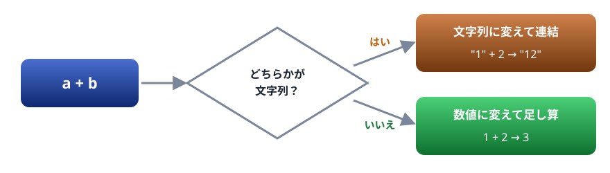
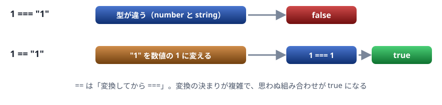
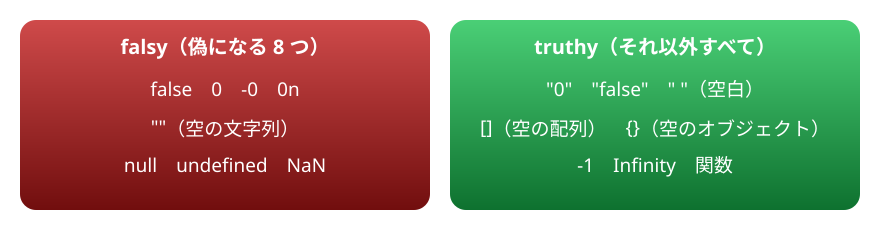
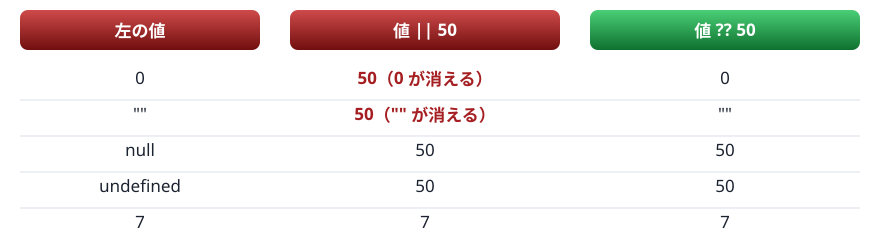

# 04. 演算子と型変換

★ 前半の山。値が知らないうちに別の型へ変わる「暗黙の型変換」と、その落とし穴を避ける書き方

> 📅 作成: 2026-10-09 / 更新: 2026-10-09

[<<](03-値と変数.md)[>>](05-オブジェクトと配列.md)[^^](../README.md)

1. [演算子のおさらい](#1-演算子のおさらい)
2. [+ は足し算か、連結か](#2--は足し算か連結か)
3. [== と ===](#3--と-)
4. [truthy と falsy](#4-truthy-と-falsy)
5. [NaN と明示的な変換](#5-nan-と明示的な変換)
6. [?? と ?.](#6--と-)

## 1. 演算子のおさらい

演算子の見た目は、Java ・ C# とほぼ同じです。VBA と違うところに印を付けました。

| 種類 | JavaScript | VBA では |
|---|---|---|
| 算術 | `+` `-` `*` `/` `%`（余り） `**`（べき乗） | `Mod` ・ `^` |
| 比較 | `===` `!==` `<` `<=` `>` `>=` | `=` ・ `<>` |
| 論理 | `&&`（かつ） `\|\|`（または） `!`（でない） | `And` ・ `Or` ・ `Not` |
| 代入 | `=` `+=` `-=` `++` `--` | `=` だけ |
| 文字列の連結 | `+` | `&` |

```javascript
console.log(10 + 3, 10 - 3, 10 * 3, 10 / 4, 10 % 3);
console.log(10 > 3, 10 <= 3, 10 === 10, 10 !== 10);
console.log(true && false, true || false, !true);
```

```text
13 7 30 2.5 1
true false true false
false true false
```

ここまでは素直です。問題は、**型の違う値どうし**を演算したときに起きます。JavaScript はエラーにせず、どちらかの値を**勝手に別の型へ変えてから**計算します。これを**暗黙の型変換**と呼びます。

## 2. + は足し算か、連結か

`+` は 2 つの仕事を持っています。数値の足し算と、文字列の連結です。どちらになるかは、**どちらかが文字列かどうか**で決まります。



+ は「どちらかが文字列なら連結」。左から順に 2 つずつ計算される

```javascript
console.log(1 + 2);
console.log("1" + 2);
console.log(1 + "2");
console.log(1 + 2 + "3");
console.log("1" + 2 + 3);
```

```text
3
12
12
33
123
```

4 行目と 5 行目に注意してください。`+` は左から 2 つずつ計算されます。`1 + 2 + "3"` は、先に `1 + 2` が `3` になり、次に `3 + "3"` で `"33"` になります。`"1" + 2 + 3` は、最初から文字列なので `"12"` → `"123"` と連結が続きます。

一方、`-` ・ `*` ・ `/` には連結の仕事がないので、文字列を**数値に変えて**計算します。

```javascript
console.log("3" * "4");
console.log("10" - 1);
console.log("10" / "4");
console.log("abc" * 2);
```

```text
12
9
2.5
NaN
```

数値にできない文字列は `NaN`（Not a Number、数ではない）になります。エラーにならずに計算が続いてしまうのが厄介な点です。

### よくある事故

画面の入力欄やファイルから読んだ値は、数字に見えても**文字列**です。そのまま `+` すると連結されます。

```javascript
// 入力欄から来た値は、いつも文字列
const a = "100";
const b = "50";
console.log(a + b);
console.log(Number(a) + Number(b));
```

```text
10050
150
```

> [!TIP]
> ヒント: 外から来た値は、使う前に `Number(値)` で数値に変えます。**変換は暗黙に任せず、自分で書く**のが落とし穴を避ける基本です。

## 3. == と ===

等しいかどうかを比べる演算子は 2 つあります。

- `===`（厳密等価）: **型も値も**同じときだけ `true`。型が違えば、その時点で `false`
- `==`（等価）: 型が違うと、**型を変換してから**比べる



=== は変換しない。== は変換してから比べる

```javascript
console.log(1 === 1);
console.log(1 === "1");
console.log(1 == "1");
console.log(0 == "");
console.log(0 == "0");
console.log("" == "0");
console.log(null == undefined);
console.log(null == 0);
```

```text
true
false
true
true
true
false
true
false
```

4 〜 6 行目を見てください。`0 == ""` も `0 == "0"` も `true` なのに、`"" == "0"` は `false` です。「A と B が等しく、A と C が等しいのに、B と C は等しくない」という、直感に反する結果です。

| 式 | `==` | `===` |
|---|---|---|
| `1` と `"1"` | ⚠️ **true** | ❌ **false** |
| `0` と `""` | ⚠️ **true** | ❌ **false** |
| `0` と `false` | ⚠️ **true** | ❌ **false** |
| `null` と `undefined` | ⚠️ **true** | ❌ **false** |
| `null` と `0` | ❌ **false** | ❌ **false** |

> [!IMPORTANT]
> 決まり: 比べるときは**いつも `===` と `!==` を使います**。型の違う値を比べたいときは、先に `Number()` などで型をそろえてから `===` で比べます。

> [!IMPORTANT]
> VBA から来た人へ: VBA の比較は `=` ですが、JavaScript の `=` は代入です。`if (x = 1)` と書くと、比べるのではなく `x` に 1 を入れてしまいます。

## 4. truthy と falsy

`if` の条件には、`true` ・ `false` 以外の値も書けます。そのとき値は真偽値に変換されます。**偽になる値（falsy）は 8 つだけ**で、それ以外はすべて真（truthy）です。



文字列の "0" や空の配列 [] は truthy。ほかの言語の感覚と違う

```javascript
const values = [0, "", null, undefined, NaN, "0", "false", [], {}, -1];
for (const v of values) {
  console.log([v], v ? "真" : "偽");
}
```

```text
[ 0 ] 偽
[ '' ] 偽
[ null ] 偽
[ undefined ] 偽
[ NaN ] 偽
[ '0' ] 真
[ 'false' ] 真
[ [] ] 真
[ {} ] 真
[ -1 ] 真
```

値を `[v]` のように配列に入れて表示しているのは、文字列の引用符が見えるようにするためです。`条件 ? A : B` は、条件が真なら A、偽なら B になる式です（三項演算子。Java ・ C# と同じ）。

### よくある事故

「値があるかどうか」を `if (値)` で調べると、`0` や `""` という**正しい値**まで「無い」と判断してしまいます。

```javascript
function showStock(count) {
  if (count) {
    console.log(`在庫 ${count} 個`);
  } else {
    console.log("在庫の情報がありません");
  }
}
showStock(5);
showStock(0);
showStock(undefined);
```

```text
在庫 5 個
在庫の情報がありません
在庫の情報がありません
```

在庫 0 個は「情報がある」のに、無いと判断されました。`if (count === undefined)` のように、**何を調べたいのかを明確に書きます**。

## 5. NaN と明示的な変換

暗黙の変換に任せず、自分で変換する書き方をまとめます。

| 変換 | 書き方 | メモ |
|---|---|---|
| 数値へ | `Number(値)` | 全体が数として読めなければ `NaN` |
| 数値へ（先頭だけ） | `parseInt(値, 10)` ・ `parseFloat(値)` | 先頭から読めるところまで読む。`parseInt` には基数 `10` を渡す |
| 文字列へ | `String(値)` | `null` ・ `undefined` でもエラーにならない |
| 真偽値へ | `Boolean(値)` | truthy なら `true` |

```javascript
console.log(Number("42"));
console.log(Number(" 42 "));
console.log(Number(""));
console.log(Number("42px"));
console.log(parseInt("42px", 10));
console.log(parseFloat("3.5kg"));
console.log(Number(true), Number(null), Number(undefined));
```

```text
42
42
0
NaN
42
3.5
1 0 NaN
```

`Number("")` が `0` になる点に注意してください。空の入力欄を数値にすると、エラーにならず `0` になります。

### NaN の調べ方

`NaN` は、自分自身とも等しくならない特別な値です。`=== NaN` では調べられないので、`Number.isNaN` を使います。

```javascript
const n = Number("abc");
console.log(n);
console.log(n === NaN);
console.log(Number.isNaN(n));
```

```text
NaN
false
true
```

### 文字列への変換と桁の指定

```javascript
console.log(String(120) + "円");
console.log((3.14159).toFixed(2));
console.log((1234567).toLocaleString());
console.log(Boolean(""), Boolean("a"), !!0);
```

```text
120円
3.14
1,234,567
false true false
```

`toFixed(桁数)` は小数点以下の桁をそろえた文字列を、`toLocaleString()` は 3 桁区切りの文字列を返します。`!!値` は `Boolean(値)` と同じ意味の短い書き方です。

## 6. ?? と ?.

### 既定値は ?? で決める

「値が無ければ既定値を使う」とき、昔は `||` がよく使われました。しかし `||` は falsy な値をすべて「無い」と扱うため、`0` や `""` も既定値に置き換えてしまいます。`??`（Null 合体演算子）は **`null` と `undefined` のときだけ**既定値を使います。



|| は falsy をすべて置き換える。?? は null と undefined だけを置き換える

```javascript
const settings = { volume: 0, title: "" };
console.log(settings.volume || 50);
console.log(settings.volume ?? 50);
console.log(`「${settings.title || "無題"}」`);
console.log(`「${settings.title ?? "無題"}」`);
console.log(settings.speed ?? 1.5);
```

```text
50
0
「無題」
「」
1.5
```

音量 0 は「消音」という正しい設定です。`||` では 50 に戻ってしまいます。既定値には `??` を使います。

### 無いかもしれないものは ?. で読む

`?.`（オプショナルチェーン）は、左が `null` か `undefined` なら、その先を読まずに `undefined` を返します。03 章で見た「`Cannot read properties of undefined`」のエラーを防げます。

```javascript
const order = { item: "りんご", shop: null };
console.log(order.shop?.address);
console.log(order.customer?.name ?? "名前なし");
console.log(order.item?.length);
```

```text
undefined
名前なし
3
```

2 行目のように `?.` と `??` を組み合わせると、「あればその値、無ければ既定値」を 1 行で書けます。C# の `?.` ・ `??` と同じ考え方です。

> [!TIP]
> この章のまとめ: 比べるときは `===`。外から来た値は `Number()` で変換してから使う。「無い」の判定は何を調べたいのかを明確に書き、既定値は `??`、無いかもしれない先は `?.` で読む。

[<<](03-値と変数.md)[>>](05-オブジェクトと配列.md)[^^](../README.md)
