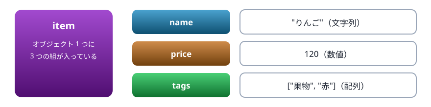
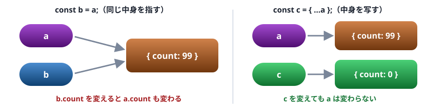
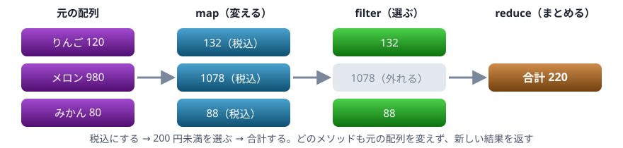

# 05. オブジェクトと配列

データをまとめて持つ 2 つの入れ物。参照とコピーの違い、分割代入、配列のメソッド、JSON

> 📅 作成: 2026-10-09 / 更新: 2026-10-09

[<<](04-演算子と型変換.md)[>>](06-関数.md)[^^](../README.md)

1. [オブジェクト](#1-オブジェクト)
2. [配列](#2-配列)
3. [参照とコピー](#3-参照とコピー)
4. [分割代入とスプレッド](#4-分割代入とスプレッド)
5. [配列のメソッド](#5-配列のメソッド)
6. [JSON](#6-json)

## 1. オブジェクト

オブジェクトは、**名前（キー）と値の組**をまとめた入れ物です。クラスを定義しなくても、`{ }` の中に直接書いて作れます。この書き方をオブジェクトリテラルと呼びます。



キー（左）と値（右）の組。値には何の型でも入る

```javascript
const item = {
  name: "りんご",
  price: 120,
  tags: ["果物", "赤"],
};
console.log(item.name);
console.log(item["price"]);
item.stock = 30;
delete item.tags;
console.log(item);
console.log("price" in item, "tags" in item);
```

```text
りんご
120
{ name: 'りんご', price: 120, stock: 30 }
true false
```

- 読むときは `item.name` か `item["name"]`。キーを変数で指定したいときは `[ ]` を使う
- 無いキーに代入すると、その場で組が増える（`stock`）。`delete` で消せる
- 最後の要素の後ろの `,` は書いてよい。行を足すときの差分が小さくなる

変数名とキーが同じなら、`{ fruit: fruit }` を `{ fruit }` と短く書けます。

```javascript
const fruit = "みかん";
const price = 80;
const product = { fruit, price };
console.log(product);

const key = "price";
console.log(product[key]);
```

```text
{ fruit: 'みかん', price: 80 }
80
```

キーや値をまとめて取り出すには、`Object.keys` ・ `Object.values` ・ `Object.entries` を使います。

```javascript
const scores = { 国語: 80, 数学: 65, 英語: 90 };
console.log(Object.keys(scores));
console.log(Object.values(scores));
for (const [subject, score] of Object.entries(scores)) {
  console.log(`${subject}: ${score} 点`);
}
```

```text
[ '国語', '数学', '英語' ]
[ 80, 65, 90 ]
国語: 80 点
数学: 65 点
英語: 90 点
```

> [!IMPORTANT]
> Java ・ C# ・ VBA から来た人へ: JavaScript のオブジェクトは、Java の `HashMap`、C# の `Dictionary`、VBA の `Dictionary` と、クラスのインスタンスを兼ねたようなものです。決まった形のデータを手軽に作れます。

## 2. 配列

配列は、値を**順番に並べた**入れ物です。`[ ]` で作り、0 から始まる番号（インデックス）で読みます。長さは自由に伸び縮みします。Java の `ArrayList`、C# の `List` に近いものです。

```javascript
const fruits = ["りんご", "みかん"];
fruits.push("ぶどう");
console.log(fruits.length);
console.log(fruits[0], fruits[2]);
console.log(fruits[5]);
const last = fruits.pop();
console.log(last, fruits);
console.log(fruits.includes("みかん"), fruits.indexOf("みかん"));
for (const f of fruits) {
  console.log(f);
}
```

```text
3
りんご ぶどう
undefined
ぶどう [ 'りんご', 'みかん' ]
true 1
りんご
みかん
```

| 書き方 | すること |
|---|---|
| `arr.push(値)` ・ `arr.pop()` | 末尾に足す ・ 末尾を取り出す |
| `arr.unshift(値)` ・ `arr.shift()` | 先頭に足す ・ 先頭を取り出す |
| `arr.includes(値)` | 含まれているか |
| `arr.indexOf(値)` | 何番目か。無ければ `-1` |
| `arr.slice(開始, 終了)` | 一部を取り出した新しい配列 |
| `arr.join(区切り)` | つないだ文字列 |

範囲の外を読んでもエラーにならず、`undefined` が返ります（`fruits[5]`）。Java ・ C# のように例外は起きません。

> [!NOTE]
> メモ: `for (const f of fruits)` は、要素を 1 つずつ取り出すくり返しです。Java の拡張 for 文、C# ・ VBA の `For Each` に当たります。番号が要るときは `for (let i = 0; i < fruits.length; i++)` と書きます。

## 3. 参照とコピー

オブジェクトと配列を変数に入れるとき、変数が持つのは<strong>中身そのものではなく、中身の場所（参照）</strong>です。別の変数に代入しても、同じ中身を指す名札が 2 つになるだけです。



代入は名札を増やすだけ。別の中身が欲しいときはコピーする

```javascript
const a = { count: 1 };
const b = a;
b.count = 99;
console.log(a.count);

const c = { ...a };
c.count = 0;
console.log(a.count, c.count);
console.log(a === b, a === c);
console.log({ x: 1 } === { x: 1 });
```

```text
99
99 0
true false
false
```

`===` でオブジェクトを比べると、**同じ中身を指しているか**を比べます。中身が同じでも、別々に作ったものは `false` です。数値や文字列などのプリミティブは、値そのものを比べます。

### const でも中身は変えられる

`const` が禁止するのは、名札を**別の中身に付け替えること**だけです。中身を変えることはできます。

```javascript
const cart = [];
cart.push("りんご");
console.log(cart);
cart = ["みかん"];
```

```text
[ 'りんご' ]
Uncaught TypeError: Assignment to constant variable.
```

### コピーは 1 段だけ

`{ ...a }` や `[...arr]` のコピーは、**1 段目だけ**を写します（浅いコピー）。中に入っている配列やオブジェクトは、元と共有されたままです。全部を写すには `structuredClone` を使います。

```javascript
const original = { title: "A", tags: ["x"] };
const copy = { ...original };
copy.tags.push("y");
console.log(original.tags);

const deep = structuredClone(original);
deep.tags.push("z");
console.log(original.tags, deep.tags);
```

```text
[ 'x', 'y' ]
[ 'x', 'y' ] [ 'x', 'y', 'z' ]
```

## 4. 分割代入とスプレッド

オブジェクトや配列から、中身を取り出して変数に入れる書き方を**分割代入**と呼びます。`...` は「残り全部」や「中身を広げる」を表します（スプレッド構文）。

```javascript
const book = { title: "入門", price: 2400, stock: 3 };
const { title, price } = book;
console.log(title, price);

const [first, second, ...rest] = [10, 20, 30, 40];
console.log(first, second, rest);

const merged = { ...book, price: 2000, sale: true };
console.log(merged);

const all = [...rest, 50];
console.log(all);
```

```text
入門 2400
10 20 [ 30, 40 ]
{ title: '入門', price: 2000, stock: 3, sale: true }
[ 30, 40, 50 ]
```

- `const { title, price } = book` は、`const title = book.title` と `const price = book.price` をまとめた書き方
- `{ ...book, price: 2000 }` は、`book` の中身を広げてから `price` を上書きした新しいオブジェクト。元の `book` は変わらない
- 2 つの値を入れ替える `[x, y] = [y, x]` も、分割代入の応用

## 5. 配列のメソッド

配列の要素をまとめて処理するメソッドがあります。`for` で書くより短く、何をしているかが名前で分かります。`(it) => it.name` は関数の短い書き方で、06 章で詳しく扱います。ここでは「各要素 `it` をどうするか」を書いている、と読んでください。



map で変え、filter で選び、reduce でまとめる

```javascript
const items = [
  { title: "りんご", price: 120 },
  { title: "メロン", price: 980 },
  { title: "みかん", price: 80 },
];
const titles = items.map((it) => it.title);
console.log(titles);

const cheap = items.filter((it) => it.price < 200);
console.log(cheap.length);

const melon = items.find((it) => it.title === "メロン");
console.log(melon);

const total = items.reduce((sum, it) => sum + it.price, 0);
console.log(total);
```

```text
[ 'りんご', 'メロン', 'みかん' ]
2
{ title: 'メロン', price: 980 }
1180
```

| メソッド | 返すもの |
|---|---|
| `map(f)` | 各要素を `f` で変えた、同じ長さの新しい配列 |
| `filter(f)` | `f` が真を返した要素だけの新しい配列 |
| `find(f)` | `f` が真を返した最初の要素。無ければ `undefined` |
| `some(f)` ・ `every(f)` | 1 つでも真か ・ すべて真か |
| `reduce(f, 初期値)` | 要素を順に 1 つの値へまとめた結果 |
| `sort(f)` | 並べ替えた配列。**元の配列も変わる** |

### sort の落とし穴

`sort()` を引数なしで呼ぶと、要素を**文字列として**並べます。数値は思った順になりません。数値は比べ方の関数を渡します。また `sort` は元の配列を並べ替えてしまうので、元を残したいときは `[...nums]` でコピーしてから並べます。

```javascript
const nums = [10, 9, 1, 100];
console.log([...nums].sort());
console.log([...nums].sort((a, b) => a - b));
console.log(nums);
```

```text
[ 1, 10, 100, 9 ]
[ 1, 9, 10, 100 ]
[ 10, 9, 1, 100 ]
```

比べ方の関数は、`a` を先にしたいとき負の数、`b` を先にしたいとき正の数を返します。`a - b` で小さい順、`b - a` で大きい順です。

## 6. JSON

JSON は、データを文字列で表すための書式です。ファイルへの保存や、サーバとのやり取りに使います。見た目は JavaScript のオブジェクトリテラルとほぼ同じですが、キーは必ず `"` で囲みます。

```javascript
const data = { title: "メモ", done: false, tags: ["家", "急ぎ"] };
const text = JSON.stringify(data);
console.log(text);
console.log(typeof text);

const back = JSON.parse(text);
console.log(back.tags[1]);

console.log(JSON.stringify(data, null, 2));
```

```text
{"title":"メモ","done":false,"tags":["家","急ぎ"]}
string
急ぎ
{
  "title": "メモ",
  "done": false,
  "tags": [
    "家",
    "急ぎ"
  ]
}
```

- `JSON.stringify(値)`: 値を JSON の文字列にする。3 つ目の引数で字下げの幅を指定すると、読みやすく整える
- `JSON.parse(文字列)`: JSON の文字列を値に戻す。書式が正しくないと `SyntaxError` になる（10 章）
- 関数や `undefined` は JSON にできず、落とされる

[<<](04-演算子と型変換.md)[>>](06-関数.md)[^^](../README.md)
