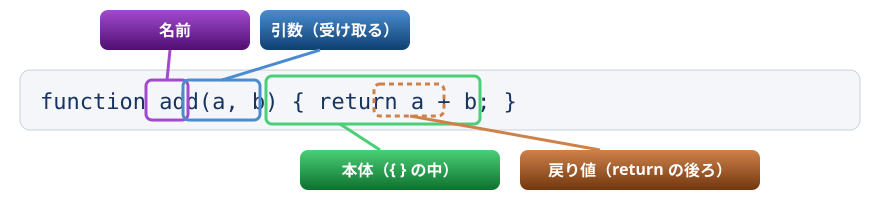
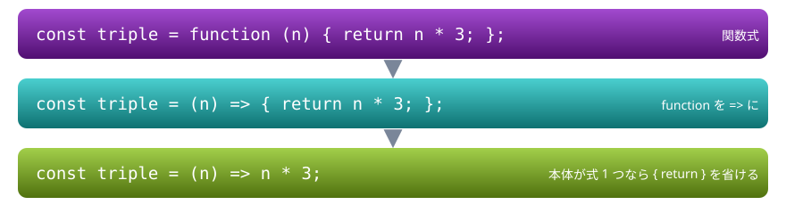
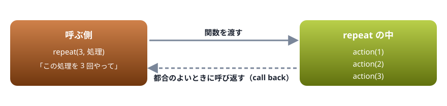

# 06. 関数

関数の 3 つの書き方、引数の既定値と残余引数、そして「関数は値である」ことを使ったコールバック

> 📅 作成: 2026-10-09 / 更新: 2026-10-09

[<<](05-オブジェクトと配列.md)[>>](07-スコープとthis.md)[^^](README.md)

1. [関数を作って呼ぶ](#1-関数を作って呼ぶ)
2. [関数式とアロー関数](#2-関数式とアロー関数)
3. [引数の既定値と残余引数](#3-引数の既定値と残余引数)
4. [関数は値](#4-関数は値)
5. [関数を返す関数](#5-関数を返す関数)

## 1. 関数を作って呼ぶ

関数は、処理に名前を付けてまとめたものです。Java ・ C# のメソッド、VBA の `Function` に当たります。



型は書かない。引数にも戻り値にも、どんな値でも渡せる

```javascript
function add(a, b) {
  return a + b;
}
console.log(add(2, 3));
console.log(add(2));
console.log(add(2, 3, 4));
```

```text
5
NaN
5
```

引数の数は確かめられません。足りない引数は `undefined` になり（`2 + undefined` で `NaN`）、多すぎる引数は無視されます。どちらもエラーにはなりません。

> [!IMPORTANT]
> Java ・ C# から来た人へ: 引数の数や型で使い分ける**オーバーロードはありません**。同じ名前の関数を 2 つ書くと、後の方で上書きされます。引数の違いに対応したいときは、既定値（このあと扱います）や、中で値を調べる書き方を使います。

`function` で書いた関数は、定義より前の行から呼べます。ファイルを読み込んだ時点で、先に用意されるからです（巻き上げ。07 章）。

```javascript
console.log(square(4));
function square(n) {
  return n * n;
}
```

```text
16
```

## 2. 関数式とアロー関数

関数は、変数に入れる形でも作れます。`function` を使う**関数式**と、`=>` を使う**アロー関数**です。アロー関数は短く書けるので、引数として渡す小さな関数によく使います。



3 つとも同じ動きをする関数

```javascript
const double = function (n) {
  return n * 2;
};
const triple = (n) => n * 3;
const greet = () => "こんにちは";
const makeTask = (title) => ({ title, done: false });

console.log(double(5), triple(5), greet());
console.log(makeTask("買い物"));
```

```text
10 15 こんにちは
{ title: '買い物', done: false }
```

- 引数が無いときは `()` を書く（`greet`）
- オブジェクトをそのまま返すときは `( )` で囲む（`makeTask`）。囲まないと `{ }` が本体の波かっこと読まれる
- アロー関数と `function` には、`this` の扱いに違いがある。07 章で扱う

変数に入れた関数は、`function` 宣言と違って、定義より前では呼べません。

```javascript
console.log(half(10));
const half = (n) => n / 2;
```

```text
Uncaught ReferenceError: Cannot access 'half' before initialization
```

「`ReferenceError`: 初期化の前に `half` にはアクセスできない」という意味です。

## 3. 引数の既定値と残余引数

引数に `= 値` を書くと、渡されなかったとき（`undefined` のとき）にその値が使われます。`...名前` と書くと、残りの引数を配列で受け取れます。

```javascript
function greet(who = "ゲスト", greeting = "こんにちは") {
  return `${greeting}、${who}さん`;
}
console.log(greet());
console.log(greet("チーム"));
console.log(greet(undefined, "おはよう"));

function sum(...nums) {
  return nums.reduce((total, n) => total + n, 0);
}
console.log(sum(1, 2, 3, 4));

const prices = [120, 80, 300];
console.log(Math.max(...prices));
```

```text
こんにちは、ゲストさん
こんにちは、チームさん
おはよう、ゲストさん
10
300
```

最後の行の `...prices` は、配列を広げて 1 つずつの引数として渡す書き方です（05 章のスプレッド構文と同じ記号）。

### 引数が多いときはオブジェクトで渡す

引数が 3 つを超えると、どれが何か分かりにくくなります。オブジェクトにまとめて渡し、受け取る側で分割代入すると、名前付きの引数のように書けます。

```javascript
function describeUser({ id, role = "guest", active = true }) {
  return `${id}: ${role}（${active ? "有効" : "無効"}）`;
}
console.log(describeUser({ id: "user1" }));
console.log(describeUser({ id: "user2", role: "admin", active: false }));
```

```text
user1: guest（有効）
user2: admin（無効）
```

## 4. 関数は値

JavaScript の関数は、数値や文字列と同じ**値**です。変数に入れる、オブジェクトに入れる、引数として渡す、戻り値として返す、のどれもできます。この性質が、JavaScript らしい書き方の土台になります。

```javascript
function hello() {
  return "やあ";
}
const f = hello;
console.log(f());
console.log(typeof hello);
console.log(hello);

const ops = {
  plus: (a, b) => a + b,
  times: (a, b) => a * b,
};
console.log(ops.plus(2, 3), ops.times(2, 3));
```

```text
やあ
function
[Function: hello]
5 6
```

`f = hello` は関数を**呼ばずに**、関数そのものを入れています。呼ぶには `()` を付けます。`console.log(hello)` のように `()` を付け忘れると、結果ではなく関数そのものが表示されます。

### コールバック

引数として渡す関数を**コールバック**と呼びます。「この処理を、そちらの都合のよいときに呼んでください」と頼む形です。



渡した関数を、受け取った側が呼ぶ

```javascript
function repeat(times, action) {
  for (let i = 1; i <= times; i++) {
    action(i);
  }
}
repeat(3, (n) => console.log(`${n} 回目`));
```

```text
1 回目
2 回目
3 回目
```

05 章の `map` ・ `filter` ・ `sort` も、コールバックを受け取るメソッドです。並べ替えの決まりを関数で渡せるので、どんな順にも並べられます。

```javascript
const members = [
  { id: "user1", score: 72 },
  { id: "user2", score: 95 },
  { id: "user3", score: 88 },
];
members.sort((a, b) => b.score - a.score);
members.forEach((m, index) => {
  console.log(`${index + 1} 位 ${m.id} ${m.score} 点`);
});
```

```text
1 位 user2 95 点
2 位 user3 88 点
3 位 user1 72 点
```

`forEach` は要素ごとにコールバックを呼ぶメソッドで、2 つ目の引数に番号も渡してくれます。

## 5. 関数を返す関数

関数は戻り値にもできます。次の `makeGreeter` は、あいさつの言葉を決めた関数を作って返します。

```javascript
function makeGreeter(greeting) {
  return (who) => `${greeting}、${who}`;
}
const morning = makeGreeter("おはよう");
const night = makeGreeter("こんばんは");
console.log(morning("チーム"));
console.log(night("チーム"));
```

```text
おはよう、チーム
こんばんは、チーム
```

不思議な点に気づいたでしょうか。`makeGreeter("おはよう")` はもう終わっているのに、返された関数は `greeting` の値を覚えています。これが**クロージャ**で、09 章（後半の山）で詳しく扱います。

### よい関数の目安

- **1 つの関数は 1 つの仕事**。名前で何をするかが分かるようにする（`calcTotal` ・ `formatPrice` など、動詞で始める）
- **受け取った引数を書き換えない**。配列やオブジェクトは参照で渡る（05 章）ので、中で変えると呼んだ側のデータまで変わる
- **同じ引数なら同じ結果を返す**形にできると、テストしやすい。画面への表示やファイルへの書き込みのような「外への作用」は、関数の端に寄せる

[<<](05-オブジェクトと配列.md)[>>](07-スコープとthis.md)[^^](README.md)
