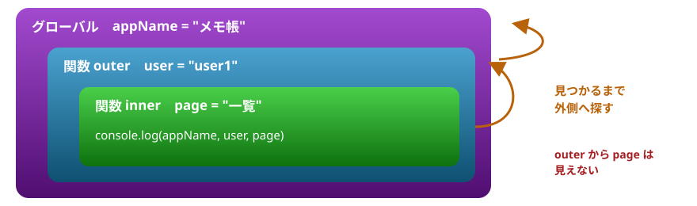
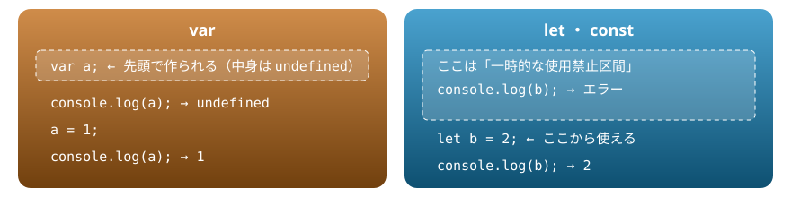
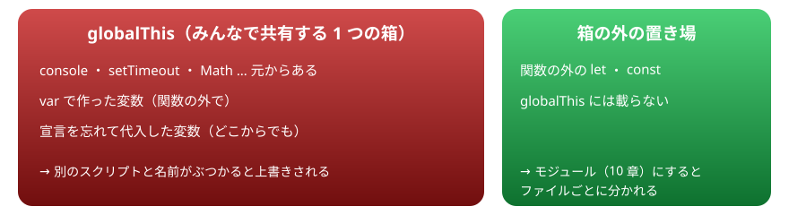
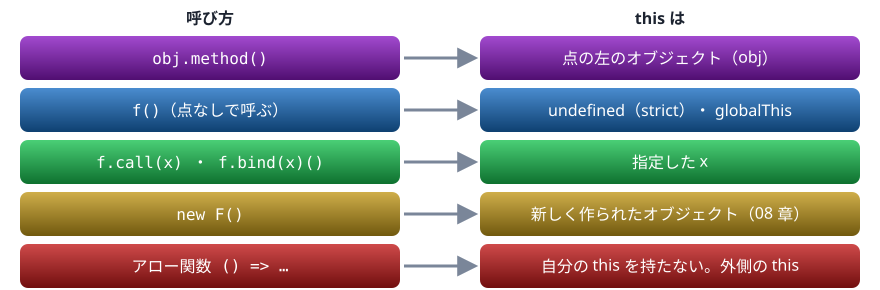

# 07. スコープ・this・グローバル

★ 前半の山。変数が見える範囲、var の巻き上げ、グローバル変数の事故、呼び方で変わる this

> 📅 作成: 2026-10-09 / 更新: 2026-10-09

[<<](06-関数.md)[>>](08-クラスとプロトタイプ.md)[^^](README.md)

1. [スコープ](#1-スコープ)
2. [var と巻き上げ](#2-var-と巻き上げ)
3. [グローバル変数の事故](#3-グローバル変数の事故)
4. [this は呼び方で決まる](#4-this-は呼び方で決まる)
5. [this を失わない書き方](#5-this-を失わない書き方)
6. [strict モード](#6-strict-モード)

## 1. スコープ

変数が見える範囲を**スコープ**と呼びます。`let` と `const` の変数は、作った `{ }`（ブロック）の中だけで見えます。Java ・ C# と同じ考え方です。

```javascript
const x = "外";
{
  const x = "内";
  console.log(x);
}
console.log(x);

if (true) {
  let y = 1;
}
console.log(typeof y);
```

```text
内
外
undefined
```

内側で同じ名前の変数を作ると、内側ではそちらが優先されます（外側の `x` は隠れるだけで、変わりません）。`y` はブロックの外からは見えないので、`typeof y` は `"undefined"` です。

### 内から外は見え、外から内は見えない

関数の中に関数を書くと、スコープは入れ子になります。変数を探すときは、**今いる場所から外側へ順に**探します。外から内の変数は見えません。



inner からは 3 つとも見える。outer からは page が見えない

```javascript
const appName = "メモ帳";
function outer() {
  const user = "user1";
  function inner() {
    const page = "一覧";
    console.log(appName, user, page);
  }
  inner();
  console.log(typeof page);
}
outer();
```

```text
メモ帳 user1 一覧
undefined
```

この「関数は、書かれた場所の外側の変数が見える」という決まりは、09 章のクロージャの土台になります。

## 2. var と巻き上げ

古い書き方の `var` は、スコープの決まりが違います。**ブロックを無視して、関数全体**（関数の外ならグローバル全体）が範囲になります。

```javascript
for (var i = 0; i < 3; i++) {}
console.log(i);

for (let j = 0; j < 3; j++) {}
console.log(typeof j);
```

```text
3
undefined
```

`var i` はループが終わっても残っています。`let j` はループの中だけです。

### 巻き上げ

`var` の変数は、実行の前にスコープの先頭で作られ、`undefined` が入った状態になります。これを<strong>巻き上げ（hoisting）</strong>と呼びます。そのため、宣言より前で読んでもエラーにならず、`undefined` が返ります。`let` ・ `const` は、宣言より前で読むとエラーになります。



var は先頭で undefined として用意される。let ・ const は宣言の行まで使えない

```javascript
console.log(a);
var a = 1;
console.log(a);

console.log(b);
let b = 2;
```

```text
undefined
1
Uncaught ReferenceError: Cannot access 'b' before initialization
```

宣言の前で読めてしまうのは、書き間違いに気づけない原因になります。**新しいコードでは `var` を使わず、`const` と `let` だけを使います**。古いコードや資料で `var` を見かけたら、このような違いがあることを思い出してください。

## 3. グローバル変数の事故

どの関数にも入っていない一番外側を**グローバル**と呼びます。グローバルには、`globalThis` という特別なオブジェクトがあり、ブラウザでは `window`、Node.js では `global` という名前でも呼べます。



var と宣言忘れは、共有の箱を汚す

### 宣言を忘れると、グローバルに作られる

`let` ・ `const` を付けずに代入すると、関数の中であっても、**グローバルに変数ができてしまいます**。エラーにならないので気づけません。

```javascript
function setCount() {
  count = 10; // let も const も付け忘れた
}
setCount();
console.log(count);
console.log(globalThis.count);
```

```text
10
10
```

### var はグローバルオブジェクトに載る

```javascript
var fromVar = "var";
let fromLet = "let";
console.log(globalThis.fromVar);
console.log(globalThis.fromLet);
```

```text
var
undefined
```

### 名前がぶつかる

ブラウザでは、1 つのページに複数のスクリプトを読み込みます。グローバルの名前は全スクリプトで共有なので、別の人が同じ名前を使うと上書きされます。次の例は、2 つのスクリプトが続けて読み込まれた様子を 1 つにまとめたものです。

```javascript
// a.js
var total = 100;

// b.js（別の人が書いた）
var total = "合計";

// a.js の関数があとで呼ばれる
console.log(total + 1);
```

```text
合計1
```

エラーにはならず、計算結果だけがおかしくなります。グローバルに置くものは最小限にし、関数やモジュール（10 章）の中に閉じ込めます。

## 4. this は呼び方で決まる

`this` は「この関数を呼んだ持ち主」を指す特別な変数です。Java ・ C# の `this` は「そのクラスのインスタンス」に決まっていますが、JavaScript の `this` は**関数を書いた場所ではなく、呼んだときの書き方で決まります**。



同じ関数でも、呼び方が変わると this が変わる

### メソッドとして呼ぶ

`obj.method()` の形で呼ぶと、`this` は点の左のオブジェクトになります。

```javascript
const counter = {
  count: 0,
  up() {
    this.count++;
    return this.count;
  },
};
console.log(counter.up());
console.log(counter.up());
```

```text
1
2
```

### 取り出して呼ぶと、this を失う

同じ関数を変数に取り出してから呼ぶと、点の左が無くなります。すると `this` は `counter` ではなくなります。

```javascript
const counter = {
  count: 0,
  up() {
    this.count++;
    return this.count;
  },
};
const up = counter.up;
console.log(up());
console.log(counter.count);
```

```text
NaN
0
```

点なしで呼んだので、`this` はグローバルオブジェクト（`globalThis`）になりました。`globalThis.count` は無い（`undefined`）ので、`undefined + 1` で `NaN` です。`counter.count` は変わっていません。しかもエラーにならず、グローバルを汚しています。

### 呼ぶ相手を指定する

`call` は `this` を指定して呼びます。`bind` は `this` を固定した新しい関数を作ります。

```javascript
function introduce(greeting) {
  return `${greeting}、${this.title}です`;
}
const shop = { title: "青果店" };
console.log(introduce.call(shop, "こんにちは"));

const bound = introduce.bind(shop);
console.log(bound("いらっしゃいませ"));
```

```text
こんにちは、青果店です
いらっしゃいませ、青果店です
```

## 5. this を失わない書き方

実務で `this` を失うのは、ほとんどが**メソッドをコールバックとして渡したとき**です。渡した先では、点なしで呼ばれるからです。

```javascript
const timer = {
  label: "タイマー",
  show() {
    console.log(this.label);
  },
};
setTimeout(timer.show, 0);
setTimeout(timer.show.bind(timer), 0);
setTimeout(() => timer.show(), 0);
```

```text
undefined
タイマー
タイマー
```

1 つ目は `this` を失っています。2 つ目は `bind` で固定し、3 つ目はアロー関数の中で `timer.show()` と点付きで呼び直しています。

### アロー関数は外側の this を使う

アロー関数は自分の `this` を持たず、**書かれた場所の外側の `this`** をそのまま使います。メソッドの中でコールバックを書くときは、アロー関数にしておくと `this` を失いません。

```javascript
const timer = {
  label: "タイマー",
  start() {
    setTimeout(function () {
      console.log("function:", this.label);
    }, 0);
    setTimeout(() => {
      console.log("アロー関数:", this.label);
    }, 0);
  },
};
timer.start();
```

```text
function: undefined
アロー関数: タイマー
```

> [!WARNING]
> 注意: 逆に、**メソッドそのものをアロー関数で書くと**、`this` がオブジェクトになりません。オブジェクトの外側の `this` を使ってしまうからです。メソッドは `up() { … }` の形で書き、その中のコールバックをアロー関数にします。

| 場面 | 書き方 |
|---|---|
| オブジェクトやクラスのメソッド | `method() { … }` |
| メソッドの中で渡すコールバック | アロー関数 `() => { … }` |
| メソッドを外へ渡す | `obj.method.bind(obj)` か `() => obj.method()` |

## 6. strict モード

ファイルや関数の先頭に `"use strict";` と書くと、**strict モード**になります。この章で見た事故のいくつかが、黙って進まずにエラーになります。

```javascript
"use strict";
function setTotal() {
  total = 10;
}
setTotal();
```

```text
Uncaught ReferenceError: total is not defined
```

```javascript
"use strict";
const counter = {
  count: 0,
  up() {
    this.count++;
    return this.count;
  },
};
const up = counter.up;
console.log(up());
```

```text
Uncaught TypeError: Cannot read properties of undefined (reading 'count')
```

宣言忘れはエラーになり、点なしで呼んだ関数の `this` は `undefined` になります。グローバルを黙って汚すより、その場で止まるほうが原因を見つけやすくなります。

> [!TIP]
> ヒント: ES Modules（`import` ・ `export` を使うファイル。10 章 ・ 12 章）と、`class` の中は、**自動で strict モード**になります。モジュールで書いていれば、`"use strict";` を書く必要はありません。

### 一番外側の this は、環境で違う

関数の外に書いた `this` の値は、どう実行されたかで変わります。

```javascript
console.log(this === globalThis);
```

```text
true
```

このページの「▶ 実行」のように、ふつうのスクリプトとして動かすと `globalThis` です。Node.js でファイルを実行すると、形式によって違います（形式の違いは 12 章）。

top-this.cjs

```javascript
console.log(this);
console.log(this === module.exports);
```

```text
{}
true
```

top-this.mjs

```javascript
console.log(this);
```

```text
undefined
```

一番外側の `this` に頼るコードは、環境が変わると壊れます。グローバルオブジェクトが欲しいときは `globalThis` と名前で書きます。

> [!NOTE]
> メモ: ブラウザのページに直接書いたスクリプトでは、`globalThis` は `window` です。この資料の「▶ 実行」は、ページを固まらせないために Web Worker という別の場所で動いているので、`globalThis` は `self` という名前のオブジェクトです。どちらも「グローバルオブジェクト」として同じように振る舞います。

[<<](06-関数.md)[>>](08-クラスとプロトタイプ.md)[^^](README.md)
