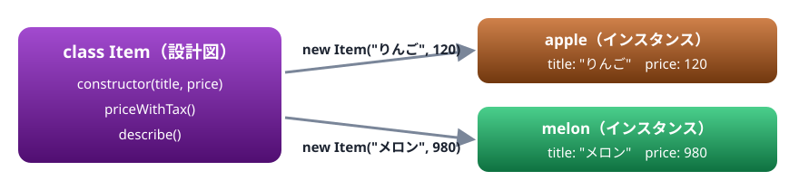
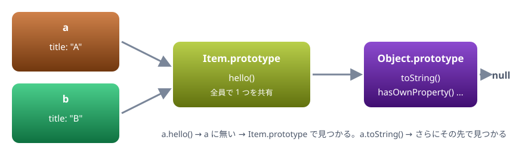

# 08. クラスとプロトタイプ

class 構文の書き方と継承。その裏で動いているプロトタイプの仕組み。Java ・ C# のクラスとの違い

> 📅 作成: 2026-10-09 / 更新: 2026-10-09

[<<](07-スコープとthis.md)[^^](README.md)

1. [class の基本](#1-class-の基本)
2. [フィールド ・ private ・ static ・ getter](#2-フィールド--private--static--getter)
3. [継承](#3-継承)
4. [裏にあるプロトタイプ](#4-裏にあるプロトタイプ)
5. [Java ・ C# のクラスとの違い](#5-java--c-のクラスとの違い)

## 1. class の基本

`class` で、同じ形のオブジェクトを作るための設計図を書きます。`new クラス名(…)` で、設計図から実物（インスタンス）を作ります。見た目は Java ・ C# のクラスとよく似ています。



設計図は 1 つ、実物はいくつでも作れる。データは実物ごとに別々に持つ

```javascript
class Item {
  constructor(title, price) {
    this.title = title;
    this.price = price;
  }
  priceWithTax() {
    return Math.floor(this.price * 1.1);
  }
  describe() {
    return `${this.title}（税込 ${this.priceWithTax()} 円）`;
  }
}
const apple = new Item("りんご", 120);
console.log(apple.describe());
console.log(apple);
console.log(apple instanceof Item);
```

```text
りんご（税込 132 円）
Item { title: 'りんご', price: 120 }
true
```

- `constructor` は `new` のときに呼ばれる。中の `this` は作られたばかりのインスタンス
- メソッドの中で自分のデータやメソッドを使うときは、**必ず `this.` を付ける**。Java ・ C# のように省略はできない
- メソッドの書き方は、オブジェクトリテラルのメソッドと同じ。`function` は付けない

## 2. フィールド ・ private ・ static ・ getter

クラスの中には、メソッドのほかに次のものを書けます。

| 書き方 | 意味 |
|---|---|
| `count = 0;` | フィールド。インスタンスごとに作られ、初期値が入る |
| `#count = 0;` | private フィールド。クラスの外からは読めない |
| `static created = 0;` | static。インスタンスではなく、クラスそのものに 1 つだけ持つ |
| `get value() { … }` | getter。`c.value` とプロパティのように読めるメソッド |

```javascript
class Counter {
  #count = 0;
  static created = 0;
  constructor() {
    Counter.created++;
  }
  up() {
    this.#count++;
    return this;
  }
  get value() {
    return this.#count;
  }
}
const c = new Counter();
c.up().up().up();
console.log(c.value);
new Counter();
console.log(Counter.created);
console.log(c);
console.log(c.count);
```

```text
3
2
Counter {}
undefined
```

`up` は `this` を返すので、`c.up().up().up()` とつなげて呼べます。`#count` は外からは見えず、表示しても `Counter {}` です。外から `#count` を読もうとすると、実行する前の段階でエラーになります。

```javascript
class Wallet {
  #balance = 1000;
}
const w = new Wallet();
console.log(w.#balance);
```

```text
Uncaught SyntaxError: Private field '#balance' must be declared in an enclosing class
```

> [!IMPORTANT]
> Java ・ C# から来た人へ: `private` ・ `public` というキーワードはありません。`#` を付けたものだけが private で、それ以外はすべて public です。`#` の付かない名前に `_balance` のように `_` を付けるのは「外から触らないで」という昔からの目印ですが、実際には触れてしまいます。

## 3. 継承

`extends` で、別のクラスを引き継いだクラスを作れます。親のメソッドは `super.メソッド名()` で呼びます。

```javascript
class Animal {
  constructor(label) {
    this.label = label;
  }
  speak() {
    return `${this.label}が鳴いた`;
  }
}
class Dog extends Animal {
  speak() {
    return `${super.speak()}（ワン）`;
  }
}
class Cat extends Animal {
  constructor(label, indoor) {
    super(label);
    this.indoor = indoor;
  }
}
const animals = [new Dog("ポチ"), new Cat("タマ", true)];
for (const a of animals) {
  console.log(a.speak());
}
console.log(animals[1]);
console.log(animals[0] instanceof Animal);
```

```text
ポチが鳴いた（ワン）
タマが鳴いた
Cat { label: 'タマ', indoor: true }
true
```

子クラスで `constructor` を書くときは、`this` を使う前に `super(…)` で親の `constructor` を呼ぶ決まりです。忘れるとエラーになります。

```javascript
class Base {}
class Child extends Base {
  constructor() {
    this.x = 1;
  }
}
new Child();
```

```text
Uncaught ReferenceError: Must call super constructor in derived class before accessing 'this' or returning from derived constructor
```

「派生クラスでは、`this` に触る前か戻る前に、親の constructor を呼ばなければならない」という意味です。

## 4. 裏にあるプロトタイプ

JavaScript の `class` は、Java ・ C# のクラスとは仕組みが違います。中身は**プロトタイプ**という仕組みで、`class` はそれを書きやすくした見た目（糖衣構文）です。

インスタンスが自分で持っているのは、`this.title = …` で入れた**データだけ**です。メソッドは、すべてのインスタンスが共有する**プロトタイプ**というオブジェクトに 1 つだけ置かれています。インスタンスに無いものを読もうとすると、JavaScript は自動でプロトタイプを探しに行きます。



無いものは矢印の先へ順に探す。この鎖をプロトタイプチェーンと呼ぶ

```javascript
class Item {
  constructor(title) {
    this.title = title;
  }
  hello() {
    return `${this.title}です`;
  }
}
const a = new Item("A");
const b = new Item("B");
console.log(Object.keys(a));
console.log(a.hello === b.hello);
console.log(Object.getPrototypeOf(a) === Item.prototype);
console.log(Object.getOwnPropertyNames(Item.prototype));
console.log(typeof Item);
```

```text
[ 'title' ]
true
true
[ 'constructor', 'hello' ]
function
```

- `a` 自身が持っているのは `title` だけ。`hello` は `Item.prototype` にある
- `a.hello` と `b.hello` は同じ 1 つの関数
- `typeof Item` は `"function"`。クラスの正体は、`new` で呼ぶための関数

どのオブジェクトも、たどっていくと最後は `Object.prototype` に行き着きます。`toString` などのメソッドを書いていないのに使えるのは、そこにあるからです。

```javascript
const obj = { x: 1 };
console.log(obj.toString());
console.log(Object.getPrototypeOf(obj) === Object.prototype);
console.log(Object.getPrototypeOf(Object.prototype));
```

```text
[object Object]
true
null
```

プロトタイプは共有されているので、あとからメソッドを足すと、**すでに作ったインスタンスでも使えるように**なります。

```javascript
class Item {
  constructor(title) {
    this.title = title;
  }
}
const a = new Item("A");
Item.prototype.shout = function () {
  return this.title + "!";
};
console.log(a.shout());
```

```text
A!
```

> [!WARNING]
> 注意: `Array.prototype` や `String.prototype` のような**組み込みのプロトタイプには、メソッドを足さない**でください。すべての配列や文字列に影響し、将来の JavaScript に同じ名前のメソッドが追加されたときに衝突します。

## 5. Java ・ C# のクラスとの違い

| 項目 | Java ・ C# | JavaScript |
|---|---|---|
| オーバーロード | 引数の違いで同名のメソッドを並べられる | できない。`constructor` も 1 つだけ |
| interface | ある | 無い。同じ名前のメソッドを持っていれば、同じように扱える |
| 自分のメンバー | `this.` は省略できる | 必ず `this.` を付ける |
| メソッドの this | いつもそのインスタンス | 呼び方で決まる。取り出して渡すと失う（07 章） |
| アクセス修飾子 | `private` ・ `protected` ・ `public` | `#` で private にできるだけ。`protected` は無い |

### interface が無くても困らない

JavaScript では、型を確かめずにメソッドを呼ぶので、同じ名前のメソッドさえあれば、どのクラスでも同じように扱えます。

```javascript
class Square {
  constructor(side) {
    this.side = side;
  }
  area() {
    return this.side ** 2;
  }
}
class Circle {
  constructor(r) {
    this.r = r;
  }
  area() {
    return Math.round(Math.PI * this.r ** 2);
  }
}
for (const shape of [new Square(3), new Circle(2)]) {
  console.log(shape.constructor.name, shape.area());
}
```

```text
Square 9
Circle 13
```

### メソッドを渡すと this を失う

07 章の落とし穴は、クラスでも同じです。`class` の中は strict モードなので、`this` は `undefined` になり、エラーで止まります。

```javascript
class Button {
  constructor(label) {
    this.label = label;
  }
  click() {
    return `${this.label} を押した`;
  }
}
const ok = new Button("OK");
console.log(ok.click());
const handler = ok.click;
console.log(handler());
```

```text
OK を押した
Uncaught TypeError: Cannot read properties of undefined (reading 'label')
```

メソッドを外へ渡すときは、`() => ok.click()` か `ok.click.bind(ok)` にします。第2部のイベント処理で、よく出会う場面です。

[<<](07-スコープとthis.md)[^^](README.md)
