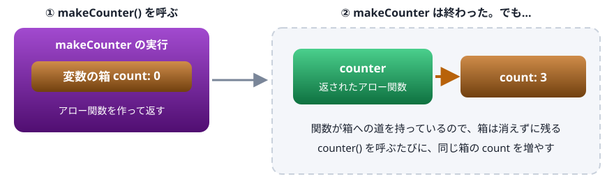
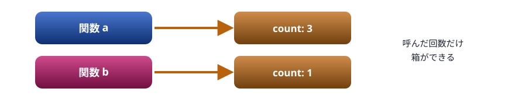
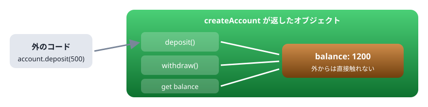
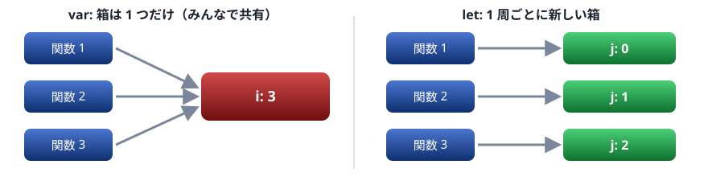

# 09. クロージャ

★ 後半の山（最重要）。関数が、生まれた場所の変数を覚え続ける仕組み。状態を隠す ・ 関数を作る関数 ・ ループの落とし穴

> 📅 作成: 2026-10-09 / 更新: 2026-10-09

[<<](08-クラスとプロトタイプ.md)[>>](10-エラー処理とモジュール.md)[^^](../README.md)

1. [関数は生まれた場所を覚えている](#1-関数は生まれた場所を覚えている)
2. [呼ぶたびに新しい箱ができる](#2-呼ぶたびに新しい箱ができる)
3. [外から隠す](#3-外から隠す)
4. [ループの中の関数](#4-ループの中の関数)
5. [使いどころ](#5-使いどころ)

## 1. 関数は生まれた場所を覚えている

07 章で、関数は「書かれた場所の外側の変数が見える」ことを見ました。**クロージャ**は、この決まりの続きです。関数は、外側の変数が見えるだけでなく、**外側の関数が終わった後も、その変数を覚え続けます**。

```javascript
function makeCounter() {
  let count = 0;
  return () => {
    count++;
    return count;
  };
}
const counter = makeCounter();
console.log(counter());
console.log(counter());
console.log(counter());
```

```text
1
2
3
```

`makeCounter()` は 1 回呼ばれて、もう終わっています。ふつうなら、中の変数 `count` はそこで消えるはずです。ところが、返されたアロー関数を呼ぶたびに、`count` は 1 ずつ増えていきます。



返された関数が、生まれた場所の変数の箱を持ち続ける。これがクロージャ

関数は、作られたときに**周りの変数の箱への道**を一緒に持ちます。その道がある限り、箱は消えません。「関数」と「生まれた場所の変数」の組をクロージャと呼びます。

覚えているのは**変数そのもの**で、作ったときの値の写しではありません。後から変数を変えると、関数から見える値も変わります。

```javascript
let greeting = "こんにちは";
const greet = () => `${greeting}、チーム`;
console.log(greet());
greeting = "こんばんは";
console.log(greet());
```

```text
こんにちは、チーム
こんばんは、チーム
```

## 2. 呼ぶたびに新しい箱ができる

`makeCounter()` を 2 回呼ぶと、変数の箱も 2 つできます。それぞれの関数は、自分が生まれたときの箱だけを持っているので、互いに影響しません。

```javascript
function makeCounter() {
  let count = 0;
  return () => ++count;
}
const a = makeCounter();
const b = makeCounter();
console.log(a(), a(), a());
console.log(b());
```

```text
1 2 3
1
```



a と b は、それぞれ自分の箱を持つ

08 章のクラスで `new` するたびにインスタンスができたのと、よく似ています。クロージャは、**データと、それを扱う関数をひとまとめにする**もう 1 つの方法です。

## 3. 外から隠す

箱の中の変数には、返した関数を通してしか触れません。この性質を使うと、**外から勝手に書き換えられない状態**を作れます。



残高は、用意したメソッドを通してしか変えられない

```javascript
function createAccount(initial) {
  let balance = initial;
  return {
    deposit(amount) {
      balance += amount;
      return balance;
    },
    withdraw(amount) {
      if (amount > balance) {
        return "残高が足りません";
      }
      balance -= amount;
      return balance;
    },
    get balance() {
      return balance;
    },
  };
}
const account = createAccount(1000);
console.log(account.deposit(500));
console.log(account.withdraw(2000));
console.log(account.withdraw(300));
console.log(account.balance);
account.balance = 999999;
console.log(account.balance);
console.log(account);
```

```text
1500
残高が足りません
1200
1200
1200
{
  deposit: [Function: deposit],
  withdraw: [Function: withdraw],
  balance: [Getter]
}
```

`account.balance = 999999` は無視されました。`balance` は読むための getter しか用意していないからです。中の変数 `balance` は、どこからも直接は見えません。08 章の `#balance`（private フィールド）と同じことを、クラスを使わずに実現しています。

## 4. ループの中の関数

クロージャで有名な落とし穴です。ループの中で関数を作り、後で呼ぶと、思った値になりません。

```javascript
for (var i = 0; i < 3; i++) {
  setTimeout(() => console.log("var:", i), 0);
}
for (let j = 0; j < 3; j++) {
  setTimeout(() => console.log("let:", j), 0);
}
```

```text
var: 3
var: 3
var: 3
let: 0
let: 1
let: 2
```

`setTimeout` に渡した関数は、ループが全部終わった後で呼ばれます。そのとき何が見えるかは、**変数の箱がいくつあるか**で決まります。



var は 1 つの箱を共有し、最後の値 3 を見る。let は周ごとの箱を見る

`var i` は関数全体で 1 つの変数なので、3 つの関数はすべて同じ箱を見ます。呼ばれた時点で、その箱には最後の値 `3` が入っています。`let j` は、ループが 1 周するたびに新しい箱が作られるので、それぞれの関数は自分の周の値を見ます。**ループでも `let` を使えば、この落とし穴は起きません**。

## 5. 使いどころ

### 設定済みの関数を作る

引数の一部を先に決めた関数を作れます。`(n) => (x) => …` は「関数を返す関数」を短く書いたものです。

```javascript
const multiplier = (n) => (x) => x * n;
const double = multiplier(2);
const withTax = multiplier(1.1);
console.log(double(21));
console.log(Math.floor(withTax(1000)));
console.log([1, 2, 3].map(multiplier(10)));
```

```text
42
1100
[ 10, 20, 30 ]
```

### 1 回だけ実行する

「もう実行したか」を箱に覚えておけば、何度呼ばれても 1 回しか動かない関数を作れます。初期化の処理などに使います。

```javascript
function once(fn) {
  let done = false;
  let result;
  return (...args) => {
    if (!done) {
      done = true;
      result = fn(...args);
    }
    return result;
  };
}
const init = once(() => {
  console.log("初期化します");
  return "準備完了";
});
console.log(init());
console.log(init());
```

```text
初期化します
準備完了
準備完了
```

### 計算結果を覚えておく

一度計算した結果を箱に記録しておき、同じ引数ならそれを返します（メモ化）。`Map` は、キーと値の組を持つ入れ物です。

```javascript
function memoize(fn) {
  const cache = new Map();
  return (n) => {
    if (cache.has(n)) {
      return `${cache.get(n)}（記録から）`;
    }
    const value = fn(n);
    cache.set(n, value);
    return value;
  };
}
const square = memoize((n) => n * n);
console.log(square(9));
console.log(square(9));
```

```text
81
81（記録から）
```

### コールバックに状態を持たせる

タイマやイベントに渡すコールバックは、何度も呼ばれます。呼ばれるたびに変わる状態を、クロージャの箱に持たせます。第2部のイベント処理では、この形をたくさん書きます。

```javascript
function startCountdown(from) {
  let rest = from;
  const id = setInterval(() => {
    console.log(rest);
    rest--;
    if (rest === 0) {
      clearInterval(id);
      console.log("発射！");
    }
  }, 200);
}
startCountdown(3);
```

```text
3
2
1
発射！
```

`setInterval` は、指定したミリ秒ごとにコールバックを呼び続けます。`clearInterval` で止めます。`rest` と `id` は、コールバックが覚えている箱の中にあります。

> [!WARNING]
> 注意: クロージャが持っている箱は、その関数がどこかに残っている限り消えません。大きなデータを抱えた関数を、使い終わった後もイベントなどに登録したままにすると、メモリが解放されません。使い終わったコールバックは、`clearInterval` などで外します。

> [!TIP]
> この章のまとめ: 関数は、生まれた場所の変数（の箱）を覚えている。外側の関数を呼ぶたびに新しい箱ができる。箱には返した関数からしか触れないので、状態を隠せる。ループでは `let` を使う。

[<<](08-クラスとプロトタイプ.md)[>>](10-エラー処理とモジュール.md)[^^](../README.md)
