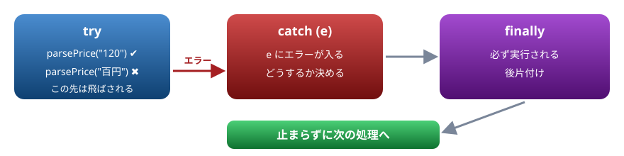
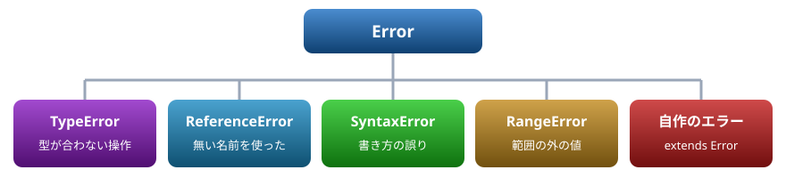
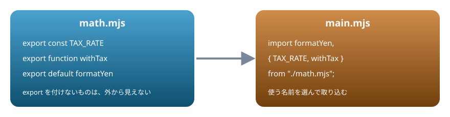

# 10. エラー処理とモジュール

try ・ catch ・ throw でエラーを扱う。ファイルを分けて import ・ export でつなぐ。npm の最小限

> 📅 作成: 2026-10-09 / 更新: 2026-10-09

[<<](09-クロージャ.md)[>>](11-非同期.md)[^^](README.md)

1. [try ・ catch ・ finally](#1-try--catch--finally)
2. [エラーの種類](#2-エラーの種類)
3. [エラーの扱い方の方針](#3-エラーの扱い方の方針)
4. [モジュール](#4-モジュール)
5. [npm の最小限](#5-npm-の最小限)

## 1. try ・ catch ・ finally

エラーが起きると、処理はその場で止まります。`try` で囲んでおくと、止まる代わりに `catch` へ飛び、エラーを受け取って続きを決められます。`finally` は、エラーがあってもなくても最後に必ず実行されます。書き方は Java ・ C# と同じです。



エラーが起きた行から catch へ飛び、finally を通って次へ進む

```javascript
function parsePrice(text) {
  const n = Number(text);
  if (Number.isNaN(n)) {
    throw new Error(`数値ではありません: ${text}`);
  }
  return n;
}
try {
  console.log(parsePrice("120"));
  console.log(parsePrice("百円"));
  console.log("ここは実行されない");
} catch (e) {
  console.log("捕まえた:", e.message);
} finally {
  console.log("後片付け");
}
console.log("処理は続く");
```

```text
120
捕まえた: 数値ではありません: 百円
後片付け
処理は続く
```

- `throw` でエラーを起こす。投げるのは `new Error(説明)` にする
- `catch (e)` の `e` に、投げられたものが入る。`e.message` が説明、`e.name` がエラーの種類
- `try` の中でエラーが起きた行より後は、実行されない

どこでも捕まえられなかったエラーは、処理を止めて「`Uncaught`（捕まえられなかった）」と表示されます。01 章から見てきた表示です。

## 2. エラーの種類

JavaScript が自分で起こすエラーには、種類ごとの名前があります。どれも `Error` の仲間（子クラス）です。



よく見るエラーと、自分で作るエラー

```javascript
const samples = [
  () => null.length,
  () => undefinedName,
  () => JSON.parse("{壊れた JSON}"),
  () => new Array(-1),
];
for (const run of samples) {
  try {
    run();
  } catch (e) {
    console.log(`${e.name}: ${e.message}`);
  }
}
```

```text
TypeError: Cannot read properties of null (reading 'length')
ReferenceError: undefinedName is not defined
SyntaxError: Expected property name or '}' in JSON at position 1 (line 1 column 2)
RangeError: Invalid array length
```

| メッセージ | 意味 |
|---|---|
| `Cannot read properties of null (reading 'length')` | `null` のプロパティは読めない（`length` を読もうとした） |
| `undefinedName is not defined` | `undefinedName` は定義されていない |
| `Expected property name or '}' in JSON at position 1` | JSON の 1 文字目の位置に、プロパティ名か `}` があるはずだった |
| `Invalid array length` | 配列の長さとして正しくない |

### 自分のエラーを作る

`Error` を継承すると、自分用のエラーを作れます。`instanceof` で種類を見分けて、扱えるものだけを扱い、それ以外は `throw e` で外へ投げ直します。

```javascript
class ValidationError extends Error {
  constructor(field, message) {
    super(message);
    this.name = "ValidationError";
    this.field = field;
  }
}
function checkAge(age) {
  if (!Number.isInteger(age) || age < 0) {
    throw new ValidationError("age", `年齢が正しくありません: ${age}`);
  }
  return age;
}
for (const input of [20, -3, "abc"]) {
  try {
    console.log("OK:", checkAge(input));
  } catch (e) {
    if (e instanceof ValidationError) {
      console.log(`${e.field} の入力エラー → ${e.message}`);
    } else {
      throw e;
    }
  }
}
```

```text
OK: 20
age の入力エラー → 年齢が正しくありません: -3
age の入力エラー → 年齢が正しくありません: abc
```

> [!IMPORTANT]
> Java ・ C# から来た人へ: `catch` に型を書いて分けることはできません（`catch (TypeError e)` とは書けない）。1 つの `catch` で受けて、中で `instanceof` を使って分けます。また、メソッドが投げる例外を宣言する仕組み（Java の `throws`）もありません。

## 3. エラーの扱い方の方針

- **握りつぶさない**。`catch (e) {}` と空にすると、エラーが起きたことすら分からなくなる。扱えないなら捕まえない、捕まえたなら記録するか投げ直す
- **投げるのは `Error` の仲間**。`throw "失敗"` のように文字列を投げると、`e.message` も、どこで起きたかの情報（スタックトレース）も無くなる
- **入口で確かめる**。外から来た値（入力 ・ ファイル ・ 通信）は、使う前に形を確かめ、おかしければその場で `throw` する。04 章のように黙って `NaN` が広がるより、早く止まるほうが原因を見つけやすい
- **後片付けは `finally`**。ファイルを閉じる ・ 処理中の表示を消す、などは成功しても失敗しても必要

> [!WARNING]
> 注意: `try` ・ `catch` で捕まえられるのは、`try` の中で**その場で**起きたエラーだけです。`setTimeout` などで後から動く処理の中のエラーは、外側の `try` では捕まりません。後から動く処理のエラーの扱い方は 11 章で見ます。

## 4. モジュール

プログラムが大きくなったら、ファイルを分けます。分けたファイルを**モジュール**と呼び、`export` で外に出したものだけを、別のファイルから `import` で使えます。この形式を <strong>ES Modules（ESM）</strong>と呼びます。Node.js では、拡張子を `.mjs` にするとこの形式になります（拡張子の決まりは 12 章）。



モジュールはファイルごとに中身が閉じていて、export したものだけが行き来する

次の 2 つのファイルを同じフォルダに置き、`node main.mjs` で実行します。

math.mjs

```javascript
export const TAX_RATE = 0.1;

export function withTax(price) {
  return Math.floor(price * (1 + TAX_RATE));
}

export default function formatYen(n) {
  return `${n.toLocaleString()} 円`;
}
```

main.mjs

```javascript
import formatYen, { TAX_RATE, withTax } from "./math.mjs";

console.log(TAX_RATE);
console.log(withTax(1000));
console.log(formatYen(withTax(12000)));
```

```text
0.1
1100
13,200 円
```

| 書き方 | 意味 |
|---|---|
| `export const X = …` | 名前付き export。いくつでも書ける |
| `export default …` | 既定の export。1 つのファイルに 1 つだけ |
| `import { X, Y } from "…"` | 名前付き export を名前で取り込む |
| `import 好きな名前 from "…"` | 既定の export を取り込む。名前は取り込む側が決める |
| `import * as m from "…"` | 全部をまとめて 1 つのオブジェクトとして取り込む |

all.mjs

```javascript
import * as math from "./math.mjs";

console.log(Object.keys(math));
console.log(math.default(500));
```

```text
[ 'TAX_RATE', 'default', 'withTax' ]
500 円
```

`from` の後ろのパスは、`./` で始まる相対パスで書き、拡張子も省略しません。

### モジュールの中は、ファイルごとに閉じている

モジュールの一番外側で作った変数は、`var` であってもグローバルにはなりません。07 章で見た「名前のぶつかり」が起きなくなります。また、モジュールの中は自動で strict モードです。

scope.mjs

```javascript
var secret = "モジュールの中";
console.log(globalThis.secret);
console.log(typeof secret);

function setTotal() {
  total = 10;
}
try {
  setTotal();
} catch (e) {
  console.log(`${e.name}: ${e.message}`);
}
```

```text
undefined
string
ReferenceError: total is not defined
```

## 5. npm の最小限

ほかの人が作ったモジュールは、**npm** というしくみで取ってこられます。npm は Node.js と一緒に入っています。

```shell
npm init -y
npm install パッケージ名
```

- `npm init -y`: そのフォルダに `package.json`（プロジェクトの設定ファイル）を作る
- `npm install パッケージ名`: パッケージを `node_modules` フォルダに取ってきて、`package.json` の `dependencies` に名前と版を書き込む
- `package-lock.json`: 実際に入れた版を正確に記録するファイル。`package.json` と一緒に保存しておく

入れたパッケージは、`./` を付けずに名前だけで取り込みます。

```javascript
import something from "パッケージ名";
```

> [!TIP]
> ヒント: `node_modules` は大きくなりやすく、`npm install` でいつでも作り直せるので、Git などで管理するときは対象から外します。共有するのは `package.json` と `package-lock.json` です。

`package.json` には `"type"` という項目があり、`.js` のファイルをどちらの形式として読むかを決めます。もう 1 つの形式（CommonJS）と合わせて、12 章で扱います。

[<<](09-クロージャ.md)[>>](11-非同期.md)[^^](README.md)
