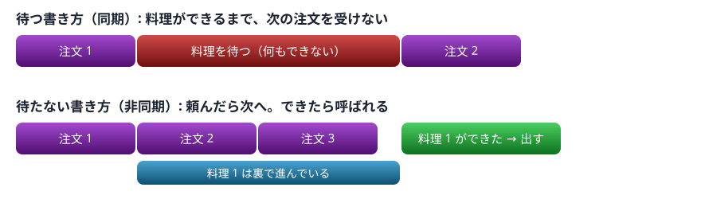
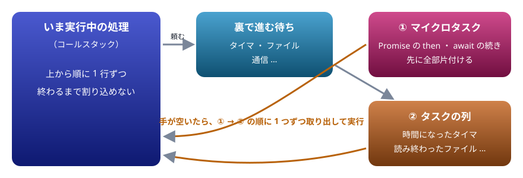
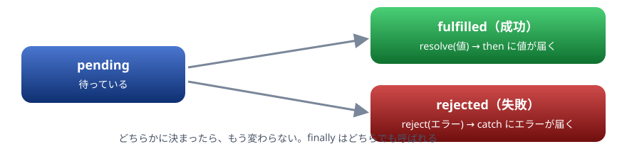
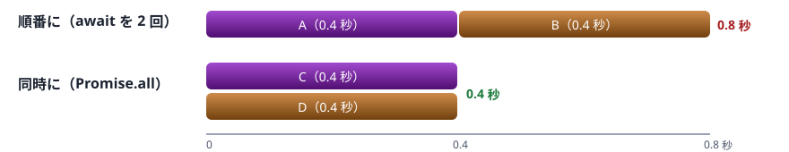

# 11. 非同期

★ 後半の山（最重要）。待たずに先へ進む仕組み、イベントループ、Promise と async ・ await、ファイルの読み書き

> 📅 作成: 2026-10-09 / 更新: 2026-10-09

[<<](10-エラー処理とモジュール.md)[>>](12-CommonJSとESModules.md)[^^](../README.md)

1. [待たずに先へ進む](#1-待たずに先へ進む)
2. [イベントループ](#2-イベントループ)
3. [コールバックで書く](#3-コールバックで書く)
4. [Promise](#4-promise)
5. [async と await](#5-async-と-await)
6. [非同期のエラー](#6-非同期のエラー)
7. [Node.js でファイルを読み書きする](#7-nodejs-でファイルを読み書きする)

## 1. 待たずに先へ進む

プログラムには「時間のかかる処理」があります。タイマ、ファイルの読み込み、ネットワークの通信などです。JavaScript は、こうした処理を**頼んだら結果を待たずに次の行へ進み**、結果が出たときに続きを実行します。これを**非同期**処理と呼びます。

```javascript
console.log("1. 注文を受けた");
setTimeout(() => {
  console.log("3. 料理ができた（1 秒後）");
}, 1000);
console.log("2. 次のお客さんの注文を受けた");
```

```text
1. 注文を受けた
2. 次のお客さんの注文を受けた
3. 料理ができた（1 秒後）
```

書いた順は 1 ・ 3 ・ 2 ですが、表示は 1 ・ 2 ・ 3 です。`setTimeout` は「1 秒後にこの関数を呼んで」と頼むだけで、待ちません。



非同期では、待ち時間の間に別の仕事を進められる

### JavaScript は 1 本の流れで動く

JavaScript のコードは、<strong>1 本の流れ（シングルスレッド）</strong>で順に実行されます。同時に 2 つの関数が動くことはありません。だからこそ、待ち時間で流れを止めないように、非同期の仕組みがあります。逆に、重い計算で流れを止めてしまうと、タイマの時刻になっても呼ばれません。

```javascript
const start = Date.now();
setTimeout(() => console.log("タイマ: 0 ミリ秒後のはず"), 0);
while (Date.now() - start < 500) {} // 0.5 秒、何もせずに回り続ける
console.log("重い処理が終わった");
```

```text
重い処理が終わった
タイマ: 0 ミリ秒後のはず
```

> [!IMPORTANT]
> Java ・ C# から来た人へ: 非同期をスレッドで実現するのではありません。`Thread.sleep` のように「その場で待つ」命令もありません。ブラウザでは、流れを止めると画面がまるごと固まります。

## 2. イベントループ

「後で呼ばれる関数」は、どの順に呼ばれるのでしょうか。その順番を決めているのが**イベントループ**です。



実行中の処理が終わってから、マイクロタスク、次にタスクの順で呼ばれる

1. いま実行中の処理（コードの上から下まで）を、最後まで実行する
2. 手が空いたら、**マイクロタスク**（Promise の続き）を全部片付ける
3. 次に、**タスクの列**（時間になったタイマなど）から 1 つ取り出して実行する
4. 2 に戻る。これをずっとくり返す

```javascript
console.log("A");
setTimeout(() => console.log("B（タイマ）"), 0);
Promise.resolve().then(() => console.log("C（Promise）"));
console.log("D");
```

```text
A
D
C（Promise）
B（タイマ）
```

A と D は、いま実行中の処理なので先に出ます。C は Promise の続き（マイクロタスク）なので、0 ミリ秒のタイマ B よりも先に呼ばれます。

## 3. コールバックで書く

非同期の結果を受け取る一番古い方法は、06 章のコールバックです。「終わったらこの関数を呼んで」と渡します。ただ、「A が終わったら B、B が終わったら C」と順につなぐと、字下げがどんどん深くなります。

```javascript
function step(label, ms, next) {
  setTimeout(() => {
    console.log(label);
    next();
  }, ms);
}
step("材料を切る", 100, () => {
  step("炒める", 100, () => {
    step("盛り付ける", 100, () => {
      console.log("完成");
    });
  });
});
```

```text
材料を切る
炒める
盛り付ける
完成
```

手順が増えるほど右へずれていき、エラーの扱いも手順ごとに書く必要があります。この形は「コールバック地獄」と呼ばれました。これを解決するために生まれたのが Promise です。

## 4. Promise

**Promise** は「いつか結果が出る約束」を表すオブジェクトです。非同期の処理を頼むと、結果の代わりに Promise がすぐに返ってきます。結果が出たら、`then` に渡した関数が呼ばれます。



Promise は待ち状態から、成功か失敗のどちらかに 1 回だけ決まる

Promise を自分で作るときは、`new Promise((resolve, reject) => { … })` と書きます。成功したら `resolve(値)`、失敗したら `reject(エラー)` を呼びます。次の `wait` は、指定したミリ秒の後に値を届ける Promise を返します。

```javascript
function wait(ms, value) {
  return new Promise((resolve) => {
    setTimeout(() => resolve(value), ms);
  });
}
const p = wait(300, "届いた");
console.log(typeof p.then);
p.then((value) => {
  console.log(value);
});
console.log("待っている間も先へ進む");
```

```text
function
待っている間も先へ進む
届いた
```

### then をつなぐ

`then` も Promise を返すので、つないで書けます。`then` の中で値を返すと次の `then` に渡り、Promise を返すと、その結果を待ってから次へ進みます。コールバックのように右へずれていきません。

```javascript
function wait(ms, value) {
  return new Promise((resolve) => setTimeout(() => resolve(value), ms));
}
wait(100, 1)
  .then((n) => {
    console.log("1 つ目:", n);
    return n + 1;
  })
  .then((n) => {
    console.log("2 つ目:", n);
    return wait(100, n * 10);
  })
  .then((n) => {
    console.log("3 つ目:", n);
  });
```

```text
1 つ目: 1
2 つ目: 2
3 つ目: 20
```

### 失敗を受け取る

`reject` されると、途中の `then` は飛ばされ、`catch` が呼ばれます。`finally` は成功でも失敗でも呼ばれます。

```javascript
function fetchStock(item) {
  return new Promise((resolve, reject) => {
    setTimeout(() => {
      if (item === "りんご") {
        resolve(30);
      } else {
        reject(new Error(`${item} は扱っていません`));
      }
    }, 100);
  });
}
fetchStock("りんご")
  .then((n) => console.log("在庫:", n))
  .catch((e) => console.log("失敗:", e.message))
  .finally(() => console.log("問い合わせ 1 終わり"));
fetchStock("メロン")
  .then((n) => console.log("在庫:", n))
  .catch((e) => console.log("失敗:", e.message))
  .finally(() => console.log("問い合わせ 2 終わり"));
```

```text
在庫: 30
問い合わせ 1 終わり
失敗: メロン は扱っていません
問い合わせ 2 終わり
```

## 5. async と await

`async` ・ `await` を使うと、Promise を**ふつうの上から下へのコードのように**書けます。いまの JavaScript では、これが基本の書き方です。

- 関数の前に `async` を付けると、その関数はいつも Promise を返す
- `async` 関数の中で、Promise の前に `await` を付けると、結果が出るまでその関数の続きを止め、結果の値を受け取る
- 止まるのは**その関数の続きだけ**。呼んだ側は待たずに先へ進む

次の例で、`cook を呼んだ直後` が何番目に出るか、予想してから「▶ 実行」を押してみてください。

```javascript
function wait(ms, value) {
  return new Promise((resolve) => setTimeout(() => resolve(value), ms));
}
async function cook() {
  console.log("調理開始");
  const a = await wait(100, "材料を切った");
  console.log(a);
  const b = await wait(100, "炒めた");
  console.log(b);
  return "完成";
}
cook().then((result) => console.log(result));
console.log("cook を呼んだ直後");
```

```text
調理開始
cook を呼んだ直後
材料を切った
炒めた
完成
```

`cook` は最初の `await` までをすぐに実行し、そこで止まって呼んだ側に戻ります。だから `cook を呼んだ直後` は 2 番目に出ます。

### 失敗は try ・ catch で受ける

`await` した Promise が失敗すると、その行で例外が起きたのと同じ扱いになります。10 章の `try` ・ `catch` がそのまま使えます。

```javascript
function fetchStock(item) {
  return new Promise((resolve, reject) => {
    setTimeout(() => {
      if (item === "りんご") resolve(30);
      else reject(new Error(`${item} は扱っていません`));
    }, 100);
  });
}
async function main() {
  for (const item of ["りんご", "メロン"]) {
    try {
      const n = await fetchStock(item);
      console.log(`${item}: 在庫 ${n}`);
    } catch (e) {
      console.log(`${item}: ${e.message}`);
    }
  }
  console.log("すべて終わり");
}
main();
```

```text
りんご: 在庫 30
メロン: メロン は扱っていません
すべて終わり
```

### 順番に待つか、同時に待つか

`await` を 2 行続けると、1 つ目が終わってから 2 つ目を始めます。互いに関係のない処理なら、`Promise.all` で同時に始めてまとめて待つほうが早く終わります。



関係のない待ちは、同時に始めると合計の時間が短くなる

```javascript
const wait = (ms, value) =>
  new Promise((resolve) => setTimeout(() => resolve(value), ms));
const seconds = (ms) => `${(Math.round(ms / 400) * 0.4).toFixed(1)} 秒くらい`;

async function main() {
  let start = Date.now();
  const a = await wait(400, "A");
  const b = await wait(400, "B");
  console.log("順番に:", a, b, seconds(Date.now() - start));

  start = Date.now();
  const [c, d] = await Promise.all([wait(400, "C"), wait(400, "D")]);
  console.log("同時に:", c, d, seconds(Date.now() - start));
}
main();
```

```text
順番に: A B 0.8 秒くらい
同時に: C D 0.4 秒くらい
```

`Promise.all` は、配列で渡した Promise が**全部成功したら**、結果を同じ順の配列で返します。1 つでも失敗すると、その時点で失敗になります。全部の結果を成功 ・ 失敗にかかわらず受け取りたいときは `Promise.allSettled` を使います。

```javascript
const ok = (v) => new Promise((resolve) => setTimeout(() => resolve(v), 100));
const ng = (msg) =>
  new Promise((_, reject) => setTimeout(() => reject(new Error(msg)), 50));

async function main() {
  try {
    await Promise.all([ok("A"), ng("B が失敗"), ok("C")]);
  } catch (e) {
    console.log("all:", e.message);
  }
  const results = await Promise.allSettled([ok("A"), ng("B が失敗")]);
  for (const r of results) {
    console.log("allSettled:", r.status, r.value ?? r.reason.message);
  }
}
main();
```

```text
all: B が失敗
allSettled: fulfilled A
allSettled: rejected B が失敗
```

## 6. 非同期のエラー

### 受け取り手のいない失敗

失敗した Promise を誰も `catch` しないと、「`Uncaught (in promise)`」と表示されます。`async` 関数の中で投げたエラーも、呼んだ側で受けなければ同じです。Node.js では、この状態になるとプログラムが止まります。

```javascript
async function load() {
  throw new Error("読み込み失敗");
}
load();
console.log("呼んだ後も先へ進む");
```

```text
呼んだ後も先へ進む
Uncaught (in promise) Error: 読み込み失敗
```

`async` 関数を呼ぶときは、`await` して `try` ・ `catch` で囲むか、`.catch(…)` を付けます。

### try はその場のエラーしか捕まえない

10 章の注意の続きです。`setTimeout` に渡した関数は、`try` を抜けた後で呼ばれるので、中で起きたエラーは外側の `try` では捕まりません。

```javascript
try {
  setTimeout(() => {
    throw new Error("タイマの中のエラー");
  }, 0);
} catch (e) {
  console.log("捕まえた？", e.message);
}
console.log("try を抜けた");
```

```text
try を抜けた
Uncaught Error: タイマの中のエラー
```

タイマなどの古い仕組みは、Promise で包んでから `await` すると、`try` ・ `catch` で扱えるようになります（前の節の `wait` や `fetchStock` がその形です）。

## 7. Node.js でファイルを読み書きする

非同期の代表例が、ファイルの読み書きです。Node.js の `node:fs/promises` は、Promise を返す関数をそろえています。ここからの例は Node.js でしか動かないので、「▶ 実行」は Node.js で実行した結果（記録）を表示します。使っているファイルは [docs/samples](https://github.com/LightSpeedC/20261009-javascript-learn/tree/develop/docs/samples) にあります。

> [!TIP]
> ヒント: `.mjs` のファイル（ES Modules）では、関数の外でも `await` を書けます（トップレベル await）。ここからの例はその書き方です。

### 読む

read.mjs

```javascript
import { readFile } from "node:fs/promises";

const text = await readFile("memo.txt", "utf8");
const lines = text.trim().split(/\r?\n/);
console.log(`${lines.length} 行`);
for (const line of lines) {
  console.log(`- ${line}`);
}
```

```text
3 行
- 牛乳
- パン
- たまご
```

`split(/\r?\n/)` は、改行で分けるときの書き方です。Windows で作ったファイルは改行が `\r\n` になっていることがあるので、どちらでも分けられるようにしています。

### 読めなかったとき

missing.mjs

```javascript
import { readFile } from "node:fs/promises";

try {
  await readFile("nothing.txt", "utf8");
} catch (e) {
  console.log(e.code);
  console.log(e.syscall);
}
```

```text
ENOENT
open
```

`ENOENT` は「そのファイルやフォルダは無い（Error NO ENTry）」という意味のコードで、`syscall` は失敗した操作（ここではファイルを開く `open`）です。`e.message` には「`ENOENT: no such file or directory, open '…'`」のように、開こうとしたファイルの場所まで入っています。

### 書く

write.mjs

```javascript
import { appendFile, readFile, writeFile } from "node:fs/promises";

await writeFile("log.txt", "1 行目\n");
await appendFile("log.txt", "2 行目\n");
const text = await readFile("log.txt", "utf8");
console.log(text.trimEnd());
```

```text
1 行目
2 行目
```

`writeFile` は中身を置き換え、`appendFile` は末尾に足します。どちらもファイルが無ければ作ります。

### フォルダの一覧

list.mjs

```javascript
import { readdir, stat } from "node:fs/promises";

const names = (await readdir("notes")).sort();
for (const name of names) {
  const info = await stat(`notes/${name}`);
  console.log(`${name}  ${info.size} バイト`);
}
```

```text
a.txt  18 バイト
b.txt  31 バイト
c.md  27 バイト
```

`readdir` が返す順番は、OS によって違うことがあります。順番が大事なときは `sort()` で並べ替えます。大きさが文字数より大きいのは、日本語が 1 文字 3 バイト（UTF-8）で保存されているからです。

### まとめて読む

複数のファイルを読むときは、`Promise.all` で同時に読みます。

many.mjs

```javascript
import { readdir, readFile } from "node:fs/promises";

const names = (await readdir("notes")).filter((n) => n.endsWith(".txt")).sort();
const texts = await Promise.all(names.map((n) => readFile(`notes/${n}`, "utf8")));
names.forEach((n, i) => {
  console.log(`${n}: ${texts[i].split(/\r?\n/)[0]}`);
});
```

```text
a.txt: 1 行目のメモ
b.txt: 2 つ目のメモ
```

### 古い書き方: コールバック

`node:fs`（`/promises` が付かない方）は、コールバックで結果を受け取る古い形です。古いコードや資料でよく見かけます。コールバックの 1 つ目の引数がエラー、2 つ目が結果、という決まりです。

callback.mjs

```javascript
import { readFile } from "node:fs";

readFile("memo.txt", "utf8", (err, text) => {
  if (err) {
    console.log("読めませんでした:", err.code);
    return;
  }
  console.log("読めた文字数:", text.length);
});
console.log("読み込みを頼んだ");
```

```text
読み込みを頼んだ
読めた文字数: 10
```

> [!TIP]
> この章のまとめ: 時間のかかる処理は、頼んだら待たずに先へ進む。後で呼ばれる順番はイベントループが決める。Promise は「いつか出る結果」で、`async` ・ `await` で上から下へ書ける。失敗は `try` ・ `catch` で受け、関係のない待ちは `Promise.all` で同時に待つ。

[<<](10-エラー処理とモジュール.md)[>>](12-CommonJSとESModules.md)[^^](../README.md)
