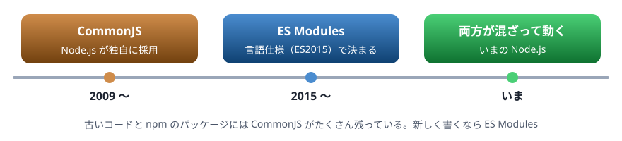
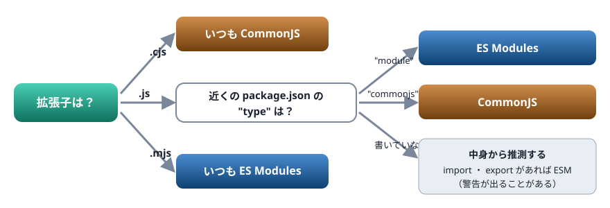

# 12. CommonJS と ES Modules

Node.js にある 2 つのモジュール形式。require と import、拡張子 .cjs ・ .mjs ・ .js と package.json の "type"、古いコードの見分け方

> 📅 作成: 2026-10-09 / 更新: 2026-10-09

[<<](11-非同期.md)[>>](13-ハンズオン.md)[^^](README.md)

1. [なぜ 2 つあるのか](#1-なぜ-2-つあるのか)
2. [書き方の比較](#2-書き方の比較)
3. [拡張子と "type" の決まり](#3-拡張子と-type-の決まり)
4. [お互いを読み込む](#4-お互いを読み込む)
5. [__dirname と import.meta](#5-__dirname-と-importmeta)
6. [古いコードの見分け方](#6-古いコードの見分け方)

## 1. なぜ 2 つあるのか

10 章で見た `import` ・ `export`（ES Modules）は、JavaScript の言語仕様として決まったモジュールの形式です。ところが Node.js は、言語仕様にモジュールが無かった時代に生まれたため、独自の形式 **CommonJS**（`require` と `module.exports`）を先に使い始めました。



先に広まった CommonJS と、言語の標準になった ES Modules が共存している

いまの Node.js は両方を扱えます。新しく書くコードは ES Modules にするのが基本ですが、古いコードや npm のパッケージには CommonJS がたくさん残っています。読めるようにしておく必要があります。

## 2. 書き方の比較

| すること | CommonJS | ES Modules |
|---|---|---|
| 外に出す | `module.exports = { add }`<br>`exports.add = add` | `export function add() {}`<br>`export default …` |
| 取り込む | `const { add } = require("./math.cjs")` | `import { add } from "./math.mjs"` |
| 取り込むとき | その行を実行したとき（途中でも書ける） | 実行の前に、ファイルの先頭でまとめて |
| 拡張子の省略 | できる（`require("./math")`） | できない |
| strict モード | 書かなければ、ならない | いつもなる |
| 一番外側の `await` | 書けない | 書ける |

### CommonJS

math.cjs

```javascript
function add(a, b) {
  return a + b;
}
module.exports = { add, PI_ISH: 3.14 };
```

main.cjs

```javascript
const { add } = require("./math.cjs");
const math = require("./math.cjs");

console.log(add(2, 3));
console.log(math);
```

```text
5
{ add: [Function: add], PI_ISH: 3.14 }
```

`require` はふつうの関数で、呼んだところでファイルを読み込み、`module.exports` に入れたものを返します。

### ES Modules

math.mjs

```javascript
export function add(a, b) {
  return a + b;
}
export const PI_ISH = 3.14;
```

main.mjs

```javascript
import { add, PI_ISH } from "./math.mjs";

console.log(add(2, 3));
console.log(PI_ISH);
```

```text
5
3.14
```

## 3. 拡張子と "type" の決まり

Node.js がファイルをどちらの形式で読むかは、**拡張子**で決まります。`.js` のときだけは、近くの `package.json` の `"type"` で決まります。



迷いたくなければ .cjs ・ .mjs を使うか、package.json に "type" を書く

フォルダ `app-esm` に `"type": "module"` の `package.json` を置くと、その中の `.js` は ES Modules として読まれます。

app-esm/package.json

```json
{
  "type": "module"
}
```

app-esm/main.js

```javascript
import { basename } from "node:path";

console.log(basename(import.meta.filename));
console.log(typeof require);
```

```text
main.js
undefined
```

`"type": "commonjs"` にすると、同じ `.js` でも CommonJS になります。CommonJS には `require` があり、ES Modules には無いことが分かります。

app-cjs/package.json

```json
{
  "type": "commonjs"
}
```

app-cjs/main.js

```javascript
const { basename } = require("node:path");

console.log(basename(__filename));
console.log(typeof require);
```

```text
main.js
function
```

> [!WARNING]
> 注意: `"type"` の無い `package.json` があるフォルダで、`.js` に `import` を書くと、動きはしますが「`MODULE_TYPELESS_PACKAGE_JSON`」という警告が出ます。形式が書かれていないので中身から推測した、という意味です。`package.json` に `"type": "module"` を書けば消えます。

## 4. お互いを読み込む

2 つの形式は、お互いを読み込めます。ただし、できることに少し差があります。

### ES Modules から CommonJS を読む

`import` で読めます。`module.exports` 全体は、既定の export（`import 名前 from`）として受け取れます。名前付きで取り込めるのは、Node.js が中身から見つけられた名前だけです。

cjs-lib.cjs

```javascript
exports.hello = () => "やあ";
exports.count = 1;
```

use-cjs.mjs

```javascript
import lib, { hello } from "./cjs-lib.cjs";

console.log(hello());
console.log(Object.keys(lib));
```

```text
やあ
[ 'hello', 'count' ]
```

> [!TIP]
> ヒント: 名前付きの `import` がエラーになったら、既定の export として受け取ってから分けます。`import lib from "./x.cjs";` の次に `const { hello } = lib;` と書けば、どんな CommonJS でも読めます。エラーのメッセージにも、この書き方が案内されます。

### CommonJS から ES Modules を読む

この資料で使う Node.js（v26）では、`require` で ES Modules も読めます。受け取るのは、export したものをまとめたオブジェクトです。

esm-lib.mjs

```javascript
export function add(a, b) {
  return a + b;
}
export default "既定の値";
```

use-esm.cjs

```javascript
const lib = require("./esm-lib.mjs");

console.log(lib.add(1, 2));
console.log(lib.default);
```

```text
3
既定の値
```

> [!WARNING]
> 注意: 一番外側で `await` を使っている ES Modules は、`require` では読めません。また、古い版の Node.js では `require` で ES Modules を読めず、`ERR_REQUIRE_ESM` というエラーになります。古い資料に「CommonJS から ES Modules は読めない」と書かれているのはそのためです。

## 5. __dirname と import.meta

「このスクリプトのファイルがある場所」を知りたいときの書き方が、形式によって違います。

| 知りたいこと | CommonJS | ES Modules |
|---|---|---|
| このファイルのパス | `__filename` | `import.meta.filename` |
| このファイルのあるフォルダ | `__dirname` | `import.meta.dirname` |
| このファイルの URL | （無い） | `import.meta.url`（`file:///…`） |

ファイルの読み込みで `"memo.txt"` のように書いたパスは、**スクリプトの場所ではなく、`node` を実行したフォルダ（カレントフォルダ）から**数えられます。スクリプトの隣のファイルを読みたいときは、`import.meta.dirname` から組み立てます。

tools/show.mjs

```javascript
import { readFile } from "node:fs/promises";
import { basename, join } from "node:path";

console.log(basename(import.meta.dirname));
const fromScript = await readFile(join(import.meta.dirname, "..", "memo.txt"), "utf8");
const fromCurrent = await readFile("memo.txt", "utf8");
console.log(fromScript === fromCurrent);
```

```text
tools
true
```

この例は、`memo.txt` のあるフォルダで `node tools/show.mjs` と実行したものです。カレントフォルダから数えた `memo.txt` と、スクリプトの 1 つ上のフォルダの `memo.txt` が同じファイルを指しています。別のフォルダから実行すると、カレントフォルダから数えた方だけが見つからなくなります。

## 6. 古いコードの見分け方

コードや資料を読むときは、次の手がかりで形式を見分けます。

| 見えたもの | 形式 |
|---|---|
| `require(…)` ・ `module.exports` ・ `exports.名前` | ⚠️ **CommonJS** |
| `__dirname` ・ `__filename` | ⚠️ **CommonJS** |
| 拡張子 `.cjs` | ⚠️ **CommonJS** |
| `import … from` ・ `export` | ✅ **ES Modules** |
| `import.meta` ・ 一番外側の `await` | ✅ **ES Modules** |
| 拡張子 `.mjs` ・ `package.json` に `"type": "module"` | ✅ **ES Modules** |

> [!IMPORTANT]
> 決まり: 新しく書くコードは ES Modules にします。拡張子を `.mjs` にするか、`package.json` に `"type": "module"` を書きます。CommonJS は読めれば十分で、自分から書く必要はありません。ブラウザ（第2部）が理解するのも ES Modules だけです。

[<<](11-非同期.md)[>>](13-ハンズオン.md)[^^](README.md)
