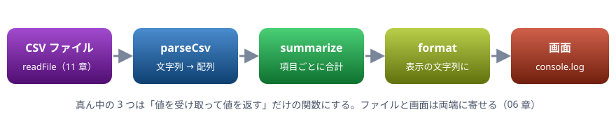

# 13. ハンズオン

宿題。家計簿の CSV を集計するコマンドラインのツールを、4 つの手順で作る。第1部で学んだことを 1 つにつなげる

> 📅 作成: 2026-10-09 / 更新: 2026-10-09

[<<](12-CommonJSとESModules.md)[>>](14-ブラウザで動かす.md)[^^](../README.md)

1. [作るもの](#1-作るもの)
2. [手順 1: CSV を読み取る](#2-手順-1-csv-を読み取る)
3. [手順 2: 集計して並べる](#3-手順-2-集計して並べる)
4. [手順 3: ファイルから読む](#4-手順-3-ファイルから読む)
5. [手順 4: まとめて集計する](#5-手順-4-まとめて集計する)
6. [振り返りと発展課題](#6-振り返りと発展課題)

## 1. 作るもの

家計簿の CSV ファイルを読み、項目ごとの合計を、金額の大きい順に表示するツールを作ります。第2部の初回の冒頭で、できたものを見せ合って振り返ります。

```text
date,category,amount
2026-10-01,食費,1200
2026-10-02,交通費,480
2026-10-02,食費,860
2026-10-05,日用品,1530
```

この CSV から、次の表示を作るのが目標です。

```text
食費: 2,060 円
日用品: 1,530 円
交通費: 480 円
合計: 4,070 円
```



処理を 3 つの関数に分け、両端でファイルを読み、画面に出す

### 進め方

1. 手順 1 と 2 は、このページの「▶ 実行」と「✎ 書き換える」で試しながら進められる
2. 手順 3 と 4 は、自分のパソコンに Node.js でファイルを作って動かす。CSV は [docs/samples/kakeibo](https://github.com/LightSpeedC/20261009-javascript-learn/tree/develop/docs/samples/kakeibo) にある
3. 各手順の例は、答えの一例です。まず自分で書いてから、見比べてください

## 2. 手順 1: CSV を読み取る

CSV の文字列を、1 行 1 件のオブジェクトの配列にします。1 行目は見出し（キーの名前）です。

> [!NOTE]
> ヒント: 改行で分ける（03 章 `split`）→ 1 行目と残りに分ける（05 章 分割代入）→ 各行をカンマで分けて、見出しと組にする（05 章 `map`）。キーと値の組の配列からオブジェクトを作るには `Object.fromEntries` が使えます。

```javascript
const csv = `date,category,amount
2026-10-01,食費,1200
2026-10-02,交通費,480
2026-10-02,食費,860
2026-10-05,日用品,1530`;

function parseCsv(text) {
  const [header, ...lines] = text.trim().split(/\r?\n/);
  const keys = header.split(",");
  return lines.map((line) => {
    const cells = line.split(",");
    return Object.fromEntries(keys.map((key, i) => [key, cells[i]]));
  });
}

const rows = parseCsv(csv);
console.log(rows.length);
console.log(rows[0]);
```

```text
4
{ date: '2026-10-01', category: '食費', amount: '1200' }
```

`amount` が `'1200'` と文字列のままであることに注意してください。CSV から読んだ値はすべて文字列です（04 章）。

## 3. 手順 2: 集計して並べる

項目ごとに金額を足し、大きい順に並べて、表示用の文字列を作ります。関数は 3 つに分けます。

- `summarize(rows)`: 項目ごとの合計を、`[項目, 合計]` の配列にして大きい順に返す
- `format(entries)`: 表示用の文字列を返す。最後に全体の合計を付ける
- 金額が数値にできないときは、黙って `NaN` を広げずに、エラーを投げる（10 章）

```javascript
const csv = `date,category,amount
2026-10-01,食費,1200
2026-10-02,交通費,480
2026-10-02,食費,860
2026-10-05,日用品,1530`;

function parseCsv(text) {
  const [header, ...lines] = text.trim().split(/\r?\n/);
  const keys = header.split(",");
  return lines.map((line) => {
    const cells = line.split(",");
    return Object.fromEntries(keys.map((key, i) => [key, cells[i]]));
  });
}

function summarize(rows) {
  const totals = {};
  for (const row of rows) {
    const amount = Number(row.amount);
    if (Number.isNaN(amount)) {
      throw new Error(`金額が数値ではありません: ${row.amount}`);
    }
    totals[row.category] = (totals[row.category] ?? 0) + amount;
  }
  return Object.entries(totals).sort((a, b) => b[1] - a[1]);
}

function format(entries) {
  const lines = entries.map(([category, sum]) => `${category}: ${sum.toLocaleString()} 円`);
  const total = entries.reduce((s, [, sum]) => s + sum, 0);
  lines.push(`合計: ${total.toLocaleString()} 円`);
  return lines.join("\n");
}

console.log(format(summarize(parseCsv(csv))));
```

```text
食費: 2,060 円
日用品: 1,530 円
交通費: 480 円
合計: 4,070 円
```

「✎ 書き換える」で CSV の金額を `abc` に変えて実行し、エラーで止まることも確かめてください。

> [!TIP]
> ヒント: `(totals[row.category] ?? 0) + amount` は「まだ無ければ 0 から足す」という意味です（04 章 `??`）。`[, sum]` は、配列の 1 つ目を読み飛ばして 2 つ目だけを受け取る分割代入です。

## 4. 手順 3: ファイルから読む

ここから先は、自分のパソコンで作ります。作業フォルダを 1 つ作り、その中に `kakeibo` フォルダを作って、CSV を 2 つ置きます。

```text
作業フォルダ/
  lib.mjs
  report.mjs
  kakeibo.mjs
  kakeibo/
    2026-09.csv
    2026-10.csv
```

手順 2 の 3 つの関数は、`lib.mjs` に移して `export` します（10 章）。

lib.mjs

```javascript
export function parseCsv(text) {
  const [header, ...lines] = text.trim().split(/\r?\n/);
  const keys = header.split(",");
  return lines.map((line) => {
    const cells = line.split(",");
    return Object.fromEntries(keys.map((key, i) => [key, cells[i]]));
  });
}

export function summarize(rows) {
  const totals = {};
  for (const row of rows) {
    const amount = Number(row.amount);
    if (Number.isNaN(amount)) {
      throw new Error(`金額が数値ではありません: ${row.amount}`);
    }
    totals[row.category] = (totals[row.category] ?? 0) + amount;
  }
  return Object.entries(totals).sort((a, b) => b[1] - a[1]);
}

export function format(entries) {
  const lines = entries.map(([category, sum]) => `${category}: ${sum.toLocaleString()} 円`);
  const total = entries.reduce((s, [, sum]) => s + sum, 0);
  lines.push(`合計: ${total.toLocaleString()} 円`);
  return lines.join("\n");
}
```

ファイルを読んで集計するのは、`readFile` と `await` の 2 行です（11 章）。

report.mjs

```javascript
import { readFile } from "node:fs/promises";
import { format, parseCsv, summarize } from "./lib.mjs";

const text = await readFile("kakeibo/2026-10.csv", "utf8");
console.log(format(summarize(parseCsv(text))));
```

```text
食費: 2,060 円
日用品: 1,530 円
交通費: 480 円
合計: 4,070 円
```

```shell
node report.mjs
```

## 5. 手順 4: まとめて集計する

最後に、ツールとして仕上げます。

- コマンドラインでファイルを指定できるようにする。`process.argv` は、`node` に渡した引数の配列で、3 つ目以降（`slice(2)`）が自分で渡したもの
- 指定が無ければ、`kakeibo` フォルダの CSV を全部読む。読むのは `Promise.all` で同時に（11 章）
- ファイルごとの集計と、全部をまとめた集計を表示する
- ファイルが無いときは、分かりやすいメッセージを出して、終了コードを 1 にする

kakeibo.mjs

```javascript
import { readdir, readFile } from "node:fs/promises";
import { basename, join } from "node:path";
import { format, parseCsv, summarize } from "./lib.mjs";

async function loadRows(file) {
  try {
    return parseCsv(await readFile(file, "utf8"));
  } catch (e) {
    if (e.code === "ENOENT") {
      throw new Error(`ファイルが見つかりません: ${file}`);
    }
    throw e;
  }
}

async function listCsv(dir) {
  const names = await readdir(dir);
  return names.filter((n) => n.endsWith(".csv")).sort().map((n) => join(dir, n));
}

async function main(args) {
  const files = args.length > 0 ? args : await listCsv("kakeibo");
  const all = await Promise.all(files.map(loadRows));
  files.forEach((file, i) => {
    console.log(`== ${basename(file)}`);
    console.log(format(summarize(all[i])));
  });
  console.log("== すべて");
  console.log(format(summarize(all.flat())));
}

try {
  await main(process.argv.slice(2));
} catch (e) {
  console.log(e.message);
  process.exitCode = 1;
}
```

```text
== 2026-09.csv
趣味: 2,800 円
食費: 2,430 円
日用品: 640 円
交通費: 320 円
合計: 6,190 円
== 2026-10.csv
食費: 2,060 円
日用品: 1,530 円
交通費: 480 円
合計: 4,070 円
== すべて
食費: 4,490 円
趣味: 2,800 円
日用品: 2,170 円
交通費: 800 円
合計: 10,260 円
```

上の結果は、引数を付けずに `node kakeibo.mjs` と実行したものです。ファイルを指定したときと、無いファイルを指定したときは、次のようになります。

```shell
node kakeibo.mjs kakeibo/2026-09.csv
node kakeibo.mjs nothing.csv
```

```text
== 2026-09.csv
趣味: 2,800 円
食費: 2,430 円
日用品: 640 円
交通費: 320 円
合計: 6,190 円
== すべて
趣味: 2,800 円
食費: 2,430 円
日用品: 640 円
交通費: 320 円
合計: 6,190 円
ファイルが見つかりません: nothing.csv
```

`all.flat()` は、配列の配列を 1 段の配列にするメソッドです。ファイルごとの行をまとめて 1 つの `summarize` に渡しています。

## 6. 振り返りと発展課題

### 使ったもの

| 使ったもの | 章 |
|---|---|
| テンプレート文字列 ・ `split` ・ 文字列は数値ではない | 03 ・ 04 |
| 分割代入 ・ `map` ・ `sort` ・ `reduce` ・ `Object.entries` | 05 |
| 関数を分ける ・ アロー関数 ・ コールバック | 06 |
| `throw` ・ `try` ・ `catch` ・ `import` ・ `export` | 10 |
| `async` ・ `await` ・ `Promise.all` ・ ファイルの読み込み | 11 |
| `.mjs` ・ `import.meta` | 12 |

### 発展課題

余裕があれば、次のどれかに挑戦してください。答えは載せていません。第2部の初回で見せ合いましょう。

1. **前の月との比較**: 項目ごとに、前の月から増えたか減ったかを `+120 円` のように表示する
2. **壊れた行を飛ばす**: 金額が空や数値でない行は、エラーで止めずに飛ばし、最後に「3 行を飛ばしました」と表示する
3. **JSON で保存する**: 集計結果を `summary.json` に書き出す（05 章 `JSON.stringify`、11 章 `writeFile`）
4. **項目で絞り込む**: `node kakeibo.mjs --category 食費` のように指定した項目だけを表示する
5. **Map で書き直す**: `summarize` の `totals` を、オブジェクトではなく `Map`（09 章）で書き直す

> [!TIP]
> ヒント: 書き換えたら、手順 2 の例で確かめた入力と同じ結果になるかを毎回確かめます。期待する結果を先に決めてから書き換えると、壊したときにすぐ気づけます。

[<<](12-CommonJSとESModules.md)[>>](14-ブラウザで動かす.md)[^^](../README.md)
