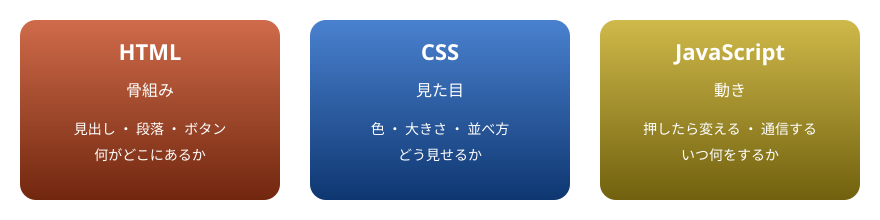
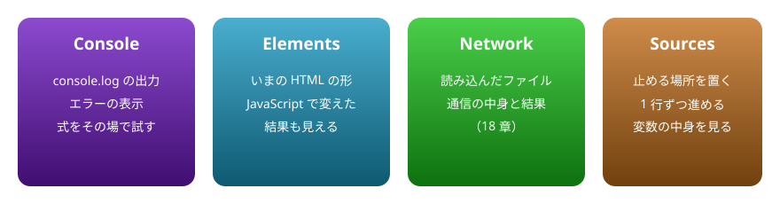
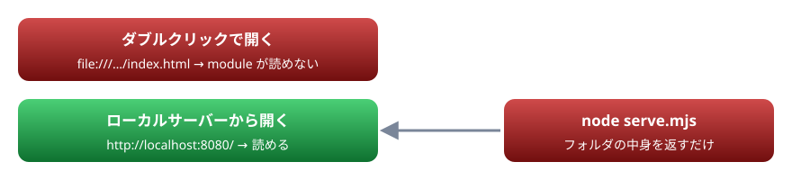

# 14. ブラウザで動かす

第2部の始まり。HTML から JavaScript を読み込む方法、開発者ツール、手元でページを開くためのローカルサーバー

> 📅 作成: 2026-10-10 / 更新: 2026-10-10

[<<](13-ハンズオン.md)[>>](15-DOM.md)[^^](../README.md)

1. [ページを作る 3 つの言語](#1-ページを作る-3-つの言語)
2. [HTML から JavaScript を読み込む](#2-html-から-javascript-を読み込む)
3. [開発者ツール](#3-開発者ツール)
4. [ローカルサーバーで開く](#4-ローカルサーバーで開く)

## 1. ページを作る 3 つの言語

第1部では Node.js で、言語そのものを学びました。第2部では、JavaScript が生まれた場所であるブラウザで、**画面を動かす**書き方を学びます。Web ページは、役割の違う 3 つの言語でできています。



HTML が骨組み、CSS が見た目、JavaScript が動きを受け持つ

言語の部分（変数 ・ 関数 ・ クラス ・ Promise など）は、第1部とまったく同じです。違うのは、使える道具です。ファイルの読み書きの代わりに、<strong>画面の部品を読み書きする道具（DOM）</strong>と、<strong>操作に反応する道具（イベント）</strong>を使います。

## 2. HTML から JavaScript を読み込む

HTML の中に `<script type="module" src="ファイル名">` と書くと、そのファイルの JavaScript が実行されます。次の 2 つのファイルを同じフォルダに置きます。

index.html

```html
<!DOCTYPE html>
<html lang="ja">
<head>
<meta charset="utf-8">
<title>はじめてのページ</title>
<script type="module" src="main.js"></script>
</head>
<body>
<h1 id="title">こんにちは</h1>
<p>ボタンを押すと、見出しが変わります。</p>
<button id="change">変える</button>
</body>
</html>
```

main.js

```javascript
const title = document.querySelector("#title");
const button = document.querySelector("#change");
button.addEventListener("click", () => {
  title.textContent = "JavaScript から書き換えました";
});
console.log("準備ができました");
```

このページの中でも動かせます。「▶ 実行」を押すと、上に画面、下に console の出力が出ます。画面のボタンを押してみてください。第2部の例は、このように **HTML（`body` の中身）と JavaScript の組**で載せます。

body の中身

```html
<h1 id="title">こんにちは</h1>
<p>ボタンを押すと、見出しが変わります。</p>
<button id="change">変える</button>
```

スクリプト

```javascript
const title = document.querySelector("#title");
const button = document.querySelector("#change");
button.addEventListener("click", () => {
  title.textContent = "JavaScript から書き換えました";
});
console.log("準備ができました");
```

```text
準備ができました
```

`document.querySelector` で画面の部品を探し、`addEventListener` で「押されたら」の処理を登録しています。どちらも次の章から詳しく見ます。

### type="module" を付ける

| 書き方 | いつ実行されるか | 中身 |
|---|---|---|
| `<script type="module">` | HTML を最後まで読んだ後 | ES Modules。`import` が使え、strict モードで、変数はファイルの中に閉じる |
| `<script>` | その場所に来たとき。読み込みが終わるまで、HTML の続きの表示が止まる | 古い形。変数がグローバルに出る（07 章） |

この資料では、いつも `type="module"` を付けます。HTML を読み終えてから実行されるので、`head` に書いても、`body` の中の部品を見つけられます。

## 3. 開発者ツール

ブラウザには、ページを調べるための**開発者ツール**が入っています。Chrome ・ Edge では <kbd>F12</kbd> キー（または <kbd>Ctrl</kbd>+<kbd>Shift</kbd>+<kbd>I</kbd>）で開きます。



よく使う 4 つのタブ

- **Console**: 第1部の `console.log` の出力は、ブラウザではここに出る。エラーも赤字でここに出るので、**動かないときは、まずここを見る**
- **Elements**: JavaScript で書き換えた後の HTML も、ここで確かめられる
- **Sources**: 行番号をクリックすると、その行で実行が止まる（ブレークポイント）。コードに `debugger;` と書いても止まる

> [!TIP]
> ヒント: Elements タブで部品を選んでから Console で `$0` と打つと、選んだ部品を JavaScript から触れます。部品の探し方を試すのに便利です。

## 4. ローカルサーバーで開く

作った `index.html` をダブルクリックで開くと、`file:///…` という場所で開かれます。この開き方では、`type="module"` のスクリプトが読み込まれず、Console に次のようなエラーが出ます。

```text
Access to script at 'file:///…/main.js' from origin 'null' has been blocked by CORS policy
```

「`main.js` の読み込みは、安全のための決まり（CORS）で止められた」という意味です（CORS は 18 章）。ブラウザは、`file://` で開いたページからほかのファイルを読み込むことを、強く制限しています。



ページはローカルサーバー経由で開く

そこで、手元のパソコンで小さな Web サーバーを動かし、`http://localhost:…` から開きます。サーバーは、第1部の知識で書けます。`index.html` と同じフォルダに次の `serve.mjs` を置き、`node serve.mjs` で起動します。

serve.mjs

```javascript
// 静的なファイルを返すだけの小さな Web サーバー。node serve.mjs で起動する
import { createServer } from "node:http";
import { readFile } from "node:fs/promises";
import { extname, join, normalize } from "node:path";

const root = import.meta.dirname;
const port = Number(process.env.PORT ?? 8080);
const types = {
  ".html": "text/html; charset=utf-8",
  ".js": "text/javascript; charset=utf-8",
  ".css": "text/css; charset=utf-8",
  ".json": "application/json; charset=utf-8",
  ".svg": "image/svg+xml",
  ".png": "image/png",
};

const server = createServer(async (req, res) => {
  const url = new URL(req.url, "http://localhost");
  let path = normalize(join(root, decodeURIComponent(url.pathname)));
  if (!path.startsWith(root)) {
    res.writeHead(403).end("Forbidden");
    return;
  }
  if (url.pathname.endsWith("/")) path = join(path, "index.html");
  try {
    const body = await readFile(path);
    res.writeHead(200, { "content-type": types[extname(path)] ?? "application/octet-stream" });
    res.end(body);
  } catch {
    res.writeHead(404, { "content-type": "text/plain; charset=utf-8" }).end("見つかりません");
  }
});

server.listen(port, () => {
  console.log(`http://localhost:${server.address().port}/ で待っています（Ctrl+C で止める）`);
});
```

```shell
node serve.mjs
```

```text
http://localhost:8080/ で待っています（Ctrl+C で止める）
```

表示された `http://localhost:8080/` をブラウザで開くと、`index.html` が表示され、ボタンが動きます。この 3 つのファイルは [docs/samples/web](https://github.com/LightSpeedC/20261009-javascript-learn/tree/develop/docs/samples/web) にあります。

- URL のパスに対応するファイルを読み、拡張子から種類（`content-type`）を決めて返している
- フォルダの外（`../` で上へ出る）を指定されたら、返さない
- 止めるときは、ターミナルで <kbd>Ctrl</kbd>+<kbd>C</kbd>

> [!NOTE]
> メモ: VS Code の拡張機能（Live Server など）でも、同じことができます。この資料の「▶ 実行」ボタンは、資料のページの中に小さな画面（iframe）を作って動かしているので、サーバーを用意しなくても試せます。

[<<](13-ハンズオン.md)[>>](15-DOM.md)[^^](../README.md)
