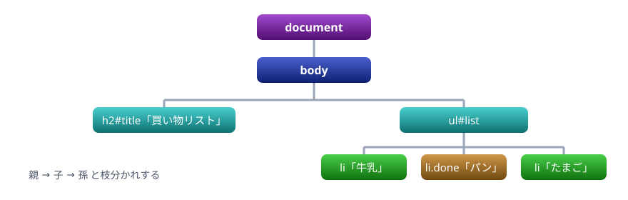
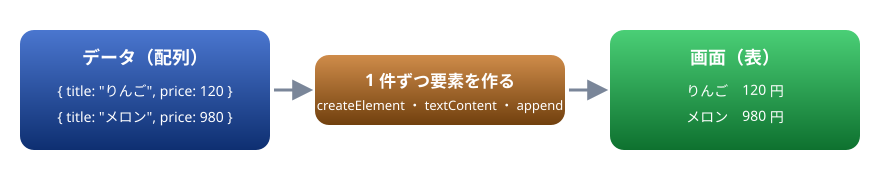

# 15. DOM

画面の部品を JavaScript から探し、書き換え、作って足す。HTML の木構造と、安全な書き換え方

> 📅 作成: 2026-10-10 / 更新: 2026-10-10

[<<](14-ブラウザで動かす.md)[>>](16-イベント.md)[^^](../README.md)

1. [DOM とは](#1-dom-とは)
2. [要素を探す](#2-要素を探す)
3. [中身と見た目を変える](#3-中身と見た目を変える)
4. [要素を作って足す](#4-要素を作って足す)
5. [木をたどる](#5-木をたどる)

## 1. DOM とは

ブラウザは HTML を読むと、部品（要素）を**木の形**に組み立てて持ちます。この木を JavaScript から読み書きするための仕組みを **DOM**（Document Object Model）と呼びます。木の根元は `document` で、どの要素もオブジェクトとして触れます。



HTML の入れ子が、そのまま木の親子になる

JavaScript で木を書き換えると、ブラウザはすぐに画面へ反映します。画面を描き直す命令を自分で書く必要はありません。

## 2. 要素を探す

要素は **CSS セレクタ**（CSS で見た目を当てる相手を指定する書き方）で探します。

| 書き方 | 返すもの |
|---|---|
| `document.querySelector(セレクタ)` | 当てはまる最初の 1 つ。無ければ `null` |
| `document.querySelectorAll(セレクタ)` | 当てはまるものすべて（配列のように `for … of` で回せる） |

| セレクタ | 当てはまるもの |
|---|---|
| `#title` | `id="title"` の要素 |
| `.item` | `class` に `item` を持つ要素 |
| `li` | `li` 要素 |
| `#list li` | `#list` の中（どの深さでも）の `li` |
| `ul > li` | `ul` のすぐ下の `li` |
| `[data-id="a1"]` | 属性 `data-id` が `a1` の要素 |

body の中身

```html
<h2 id="title">買い物リスト</h2>
<ul id="list">
  <li class="item">牛乳</li>
  <li class="item done">パン</li>
  <li class="item">たまご</li>
</ul>
```

スクリプト

```javascript
const title = document.querySelector("#title");
console.log(title.textContent);

const items = document.querySelectorAll(".item");
console.log(items.length);
for (const li of items) {
  console.log(li.textContent, li.classList.contains("done"));
}
console.log(document.querySelector(".nothing"));
```

```text
買い物リスト
3
牛乳 false
パン true
たまご false
null
```

見つからなかったときの `null` に、そのまま `.textContent` を付けるとエラーになります（03 章）。セレクタの書き間違いでよく起きるので、エラーが出たら、まずセレクタを確かめます。

## 3. 中身と見た目を変える

| 変えるもの | 書き方 |
|---|---|
| 文字 | `el.textContent = "…"` |
| クラス | `el.classList.add("x")` ・ `remove` ・ `toggle` ・ `contains` |
| 見た目を直接 | `el.style.color = "crimson"`（CSS の `font-size` は `fontSize` と書く） |
| 属性 | `el.href = "…"` ・ `el.getAttribute("href")` ・ `el.setAttribute("href", "…")` |
| 表示 ・ 非表示 | `el.hidden = true` |

body の中身

```html
<p id="msg">元の文</p>
<a id="link" href="https://example.com/">リンク</a>
```

CSS

```css
.big { font-size: 24px; font-weight: bold; }
```

スクリプト

```javascript
const msg = document.querySelector("#msg");
msg.textContent = "書き換えた文";
msg.style.color = "crimson";
msg.classList.add("big");

const link = document.querySelector("#link");
link.href = "https://developer.mozilla.org/ja/";
link.textContent = "MDN（JavaScript の資料）";

console.log(msg.className);
console.log(link.getAttribute("href"));
```

```text
big
https://developer.mozilla.org/ja/
```

> [!TIP]
> ヒント: 見た目は `style` で直接変えるより、CSS にクラスを用意しておき、`classList` で付け外しするほうが整理しやすくなります。見た目の決まりが CSS に、いつ変えるかが JavaScript に分かれるからです。

### textContent と innerHTML

中身を入れる方法は 2 つあります。`textContent` は文字として入れ、`innerHTML` は HTML として解釈して入れます。

body の中身

```html
<div id="a"></div>
<div id="b"></div>
```

スクリプト

```javascript
const text = "<b>太字</b>";
document.querySelector("#a").textContent = text;
document.querySelector("#b").innerHTML = text;
console.log(document.querySelector("#a").children.length);
console.log(document.querySelector("#b").children.length);
```

```text
0
1
```

上の段は `<b>` がそのまま文字として見え、下の段は太字になります。

> [!CAUTION]
> 注意: 入力欄や通信で受け取った文字を **`innerHTML` に入れてはいけません**。悪意のある人が HTML やスクリプトを書き込むと、それがページの中で動いてしまいます（クロスサイトスクリプティング、XSS）。見た人の情報が盗まれるなど、取り返しのつかない被害につながります。外から来た文字は、いつも `textContent` で入れます。

## 4. 要素を作って足す

`document.createElement("タグ名")` で要素を作り、`append` で親の最後に足します。消すときは `remove()` です。

body の中身

```html
<ul id="list"></ul>
```

スクリプト

```javascript
const fruits = ["りんご", "みかん", "ぶどう"];
const list = document.querySelector("#list");
for (const f of fruits) {
  const li = document.createElement("li");
  li.textContent = f;
  list.append(li);
}
console.log(list.children.length);

list.firstElementChild.remove();
console.log(list.children.length);
```

```text
3
2
```

### データから画面を作る

実務でよく書くのは、**配列のデータから画面を組み立てる**処理です。データが先にあり、画面はそれを映したものと考えると、後で 23 章のハンズオンを組み立てやすくなります。



データが変わったら、作り直して画面に映す

body の中身

```html
<table id="t">
  <thead><tr><th>商品</th><th>価格</th></tr></thead>
  <tbody></tbody>
</table>
```

CSS

```css
table { border-collapse: collapse; }
th, td { border: 1px solid #9aa6b8; padding: 4px 12px; }
```

スクリプト

```javascript
const items = [
  { title: "りんご", price: 120 },
  { title: "メロン", price: 980 },
];
const tbody = document.querySelector("#t tbody");
for (const it of items) {
  const tr = document.createElement("tr");
  for (const value of [it.title, `${it.price.toLocaleString()} 円`]) {
    const td = document.createElement("td");
    td.textContent = value;
    tr.append(td);
  }
  tbody.append(tr);
}
console.log(tbody.rows.length);
```

```text
2
```

## 5. 木をたどる

見つけた要素から、親や子へたどれます。ボタンが押されたとき「どの行のボタンか」を知る、といった場面で使います（16 章）。

| 書き方 | たどる先 |
|---|---|
| `el.parentElement` | 親 |
| `el.children` ・ `el.firstElementChild` | 子の要素たち ・ 最初の子の要素 |
| `el.closest(セレクタ)` | 自分から親の方へさかのぼって、最初に当てはまる要素 |
| `el.dataset.名前` | `data-名前="…"` 属性の値（自分で決めた情報を要素に持たせる） |

body の中身

```html
<ul id="list">
  <li data-id="a1">りんご <button>削除</button></li>
  <li data-id="b2">みかん <button>削除</button></li>
</ul>
```

スクリプト

```javascript
const button = document.querySelectorAll("#list button")[1];
const li = button.closest("li");
console.log(li.dataset.id);
console.log(li.parentElement.id);
console.log(li.firstChild.textContent.trim());
```

```text
b2
list
みかん
```

`firstChild`（`Element` の付かない方）は、要素だけでなく文字の部分も数えます。ここでは「みかん 」という文字が最初の子です。

[<<](14-ブラウザで動かす.md)[>>](16-イベント.md)[^^](../README.md)
