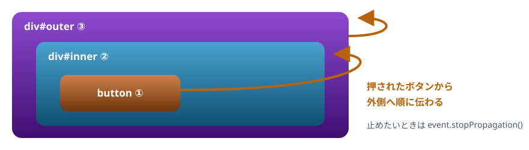

# 16. イベント

クリックや入力に反応する。イベントオブジェクト、伝わり方と委譲、既定の動きを止める、ハンドラの中の this

> 📅 作成: 2026-10-10 / 更新: 2026-10-10

[<<](15-DOM.md)[>>](17-フォーム.md)[^^](README.md)

1. [イベントに反応する](#1-イベントに反応する)
2. [イベントオブジェクト](#2-イベントオブジェクト)
3. [伝わり方と委譲](#3-伝わり方と委譲)
4. [既定の動きを止める](#4-既定の動きを止める)
5. [ハンドラの中の this](#5-ハンドラの中の-this)

## 1. イベントに反応する

クリック ・ キー入力 ・ 文字の入力など、画面で起きた出来事を**イベント**と呼びます。`要素.addEventListener("イベント名", 関数)` で、起きたときに呼ばれる関数（**イベントハンドラ**）を登録します。06 章のコールバックと同じ形です。

body の中身

```html
<button id="btn">押した回数: 0</button>
```

スクリプト

```javascript
const btn = document.querySelector("#btn");
let count = 0;
btn.addEventListener("click", () => {
  count++;
  btn.textContent = `押した回数: ${count}`;
  console.log("押された", count);
});
btn.click(); // コードから押してみる
btn.click();
```

```text
押された 1
押された 2
```

最後の 2 行は、コードからボタンを押しています（`click()`）。画面のボタンを自分で押しても、同じように数が増えます。`count` は、ハンドラが覚えている変数の箱です（09 章のクロージャ）。

| イベント名 | 起きるとき |
|---|---|
| `click` | クリックされた |
| `input` | 入力欄の中身が 1 文字変わるたび |
| `change` | 選択肢 ・ チェックボックスが変わった、入力欄の確定 |
| `keydown` | キーが押された |
| `submit` | フォームが送信された（17 章） |
| `DOMContentLoaded` | HTML を最後まで読み終えた |

## 2. イベントオブジェクト

ハンドラには、起きたことの詳しい情報が入った**イベントオブジェクト**が渡されます。

| プロパティ | 中身 |
|---|---|
| `event.type` | イベント名 |
| `event.target` | 実際に操作された要素 |
| `event.currentTarget` | ハンドラを登録した要素 |
| `event.key` | 押されたキー（キーのイベント） |

body の中身

```html
<input id="name" placeholder="名前を入れて Enter">
<p id="echo"></p>
```

スクリプト

```javascript
const input = document.querySelector("#name");
const echo = document.querySelector("#echo");
input.addEventListener("input", (event) => {
  echo.textContent = `こんにちは、${event.target.value} さん`;
});
input.addEventListener("keydown", (event) => {
  if (event.key === "Enter") {
    console.log("Enter が押された:", input.value);
  }
});

// コードから入力してみる
input.value = "ゲスト";
input.dispatchEvent(new Event("input"));
input.dispatchEvent(new KeyboardEvent("keydown", { key: "Enter" }));
```

```text
Enter が押された: ゲスト
```

`dispatchEvent` は、イベントをコードから起こす命令です。画面の入力欄に文字を打っても、同じハンドラが呼ばれます。

## 3. 伝わり方と委譲

要素の上で起きたイベントは、その要素で終わらず、**親 → そのまた親 → … と順に伝わっていきます**（バブリング）。



ボタンのクリックは、ボタン → 内側の div → 外側の div の順に届く

body の中身

```html
<div id="outer" class="box">外
  <div id="inner" class="box">内
    <button id="btn">ボタン</button>
  </div>
</div>
```

CSS

```css
.box { border: 2px solid #7a8699; padding: 8px 12px; margin: 4px; }
```

スクリプト

```javascript
for (const id of ["outer", "inner", "btn"]) {
  document.querySelector(`#${id}`).addEventListener("click", (event) => {
    console.log(`${id} が受け取った（押されたのは ${event.target.id}）`);
  });
}
document.querySelector("#btn").click();
```

```text
btn が受け取った（押されたのは btn）
inner が受け取った（押されたのは btn）
outer が受け取った（押されたのは btn）
```

画面で「内」の文字のあたりを押すと、`inner` と `outer` だけが受け取ります。`event.target` は、どこで受け取っても**実際に押された要素**です。

### 親にまとめて任せる（イベントの委譲）

伝わる性質を使うと、子の 1 つ 1 つに登録する代わりに、**親に 1 つだけ登録して**、`event.target` で誰が押されたかを見分けられます。あとから足した子にも、自動で効きます。

body の中身

```html
<ul id="list">
  <li>りんご</li>
  <li>みかん</li>
  <li>ぶどう</li>
</ul>
```

CSS

```css
li { cursor: pointer; }
.done { text-decoration: line-through; color: #6b7280; }
```

スクリプト

```javascript
const list = document.querySelector("#list");
list.addEventListener("click", (event) => {
  const li = event.target.closest("li");
  if (!li) return;
  li.classList.toggle("done");
  console.log(`${li.textContent} → ${li.classList.contains("done") ? "済" : "未"}`);
});
list.children[1].click();
list.children[1].click();
list.children[2].click();
```

```text
みかん → 済
みかん → 未
ぶどう → 済
```

## 4. 既定の動きを止める

リンクを押すとページを移動する、フォームの送信ボタンを押すとページを送り直す、といったブラウザの**既定の動き**があります。`event.preventDefault()` で止められます。

body の中身

```html
<a id="link" href="https://example.com/">外へのリンク</a>
```

スクリプト

```javascript
document.querySelector("#link").addEventListener("click", (event) => {
  event.preventDefault();
  console.log("移動を止めた:", event.currentTarget.href);
});
document.querySelector("#link").click();
```

```text
移動を止めた: https://example.com/
```

1 回だけ反応したいときは `{ once: true }` を、登録を外したいときは `removeEventListener` を使います。

body の中身

```html
<button id="start">はじめる</button>
```

スクリプト

```javascript
const start = document.querySelector("#start");
start.addEventListener("click", () => console.log("1 回だけ反応する"), { once: true });

function onClick() {
  console.log("外すまで反応する");
}
start.addEventListener("click", onClick);
start.click();
start.removeEventListener("click", onClick);
start.click();
```

```text
1 回だけ反応する
外すまで反応する
```

`removeEventListener` には、登録したときと**同じ関数**を渡します。その場で書いたアロー関数は、後から外せないので、外す予定があるなら名前を付けておきます。

## 5. ハンドラの中の this

07 章の決まりどおり、`this` は呼ばれ方で決まります。

- `function` で書いたハンドラの `this` は、登録した要素（`event.currentTarget` と同じ）
- アロー関数のハンドラの `this` は、外側の `this`。クラスの中で登録すると、インスタンスになる

body の中身

```html
<button id="a">A</button>
<button id="b">B</button>
```

スクリプト

```javascript
document.querySelector("#a").addEventListener("click", function () {
  console.log("function の this:", this.id);
});

class Counter {
  count = 0;
  constructor(button) {
    button.addEventListener("click", () => this.up());
  }
  up() {
    this.count++;
    console.log("count:", this.count);
  }
}
new Counter(document.querySelector("#b"));

document.querySelector("#a").click();
document.querySelector("#b").click();
```

```text
function の this: a
count: 1
```

> [!WARNING]
> 注意: クラスの中で `button.addEventListener("click", this.up)` と書くと、`up` の中の `this` はボタンになり、`this.count` が読めません（08 章の落とし穴）。`() => this.up()` か `this.up.bind(this)` で渡します。

[<<](15-DOM.md)[>>](17-フォーム.md)[^^](README.md)
