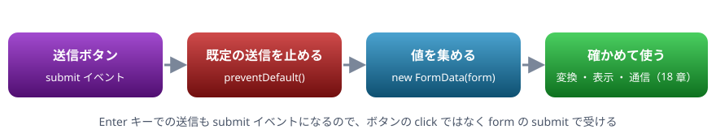

# 17. フォーム

入力欄の値を読む、送信を止めて JavaScript で受け取る、入力を確かめる、入力に合わせて表示を変える

> 📅 作成: 2026-10-10 / 更新: 2026-10-10

[<<](16-イベント.md)[>>](18-通信.md)[^^](../README.md)

1. [フォームの部品](#1-フォームの部品)
2. [送信を受け取る](#2-送信を受け取る)
3. [入力を確かめる](#3-入力を確かめる)
4. [入力に合わせて表示を変える](#4-入力に合わせて表示を変える)

## 1. フォームの部品

入力を受け取る部品は、`<form>` の中にまとめて置きます。

| 部品 | 値の読み方 |
|---|---|
| `<input>`（文字 ・ 数 ・ メール など） | `el.value`。**いつも文字列**（`type="number"` でも） |
| `<input type="checkbox">` | `el.checked`（`true` ・ `false`） |
| `<select>` | `el.value`（選ばれた `option` の `value`） |
| `<textarea>` | `el.value` |

`type="number"` の欄でも値は文字列です。04 章のとおり、計算に使う前に `Number()` で変換します。

## 2. 送信を受け取る

フォームの送信ボタンを押すと、ブラウザは既定の動きとして、入力をサーバへ送ってページを読み込み直します。JavaScript で受け取りたいときは、`submit` イベントで `preventDefault()` を呼んで止めます。



submit を受けて止め、値を集めて使う

body の中身

```html
<form id="form">
  <label>名前 <input name="name" required></label>
  <label>年齢 <input name="age" type="number" min="0"></label>
  <label>コース
    <select name="course">
      <option value="basic">基本</option>
      <option value="advanced">応用</option>
    </select>
  </label>
  <label><input type="checkbox" name="mail"> お知らせを受け取る</label>
  <button>送信</button>
</form>
<p id="result"></p>
```

CSS

```css
label { display: block; margin: 4px 0; }
```

スクリプト

```javascript
const form = document.querySelector("#form");
form.addEventListener("submit", (event) => {
  event.preventDefault();
  const data = new FormData(form);
  const entry = {
    name: data.get("name"),
    age: Number(data.get("age")),
    course: data.get("course"),
    mail: data.get("mail") === "on",
  };
  console.log(entry);
  document.querySelector("#result").textContent = `${entry.name} さんを受け付けました`;
});

// コードから入力して送信してみる
form.elements.name.value = "ゲスト";
form.elements.age.value = "20";
form.requestSubmit();
```

```text
{ name: 'ゲスト', age: 20, course: 'basic', mail: false }
```

- `new FormData(form)` は、`name` 属性を持つ部品の値をまとめて集める。`data.get("name")` で読む
- チェックボックスは、チェックされていれば `"on"`、されていなければ `null` になる
- `form.elements.名前` で、フォームの中の部品を `name` で取り出せる
- `form.requestSubmit()` は、送信ボタンを押したのと同じ動き（確かめも行う）をコードから起こす

## 3. 入力を確かめる

入力の確かめ（バリデーション）は 2 段で行います。

1. **HTML の属性**: `required`（必須） ・ `min` ・ `max` ・ `type="email"` ・ `pattern` などを書くと、ブラウザが送信の前に確かめ、メッセージを出す
2. **JavaScript**: 属性で表せない決まりや、表示の仕方を細かく決めたいときに、自分で確かめる

確かめの決まりは、画面と切り離した関数にしておくと、何度でも試せます（06 章「よい関数の目安」）。

```javascript
function validate({ name, age }) {
  const errors = [];
  if (name.trim() === "") errors.push("名前を入れてください");
  if (!Number.isInteger(age) || age < 0) errors.push("年齢は 0 以上の整数で入れてください");
  return errors;
}
console.log(validate({ name: "", age: -1 }));
console.log(validate({ name: "ゲスト", age: 20 }));
```

```text
[ '名前を入れてください', '年齢は 0 以上の整数で入れてください' ]
[]
```

入力のたびに確かめて、送信ボタンを押せるかどうかを切り替えることもできます。`el.validity.valid` は、HTML の属性での確かめに通っているかを返します。

body の中身

```html
<input id="email" type="email" placeholder="メールアドレス">
<button id="send" disabled>送る</button>
<p id="hint"></p>
```

CSS

```css
#hint { color: #a51f22; }
```

スクリプト

```javascript
const email = document.querySelector("#email");
const send = document.querySelector("#send");
const hint = document.querySelector("#hint");
email.addEventListener("input", () => {
  const ok = email.validity.valid && email.value !== "";
  send.disabled = !ok;
  hint.textContent = ok ? "" : "メールアドレスの形で入れてください";
});

for (const v of ["abc", "user1@example.com"]) {
  email.value = v;
  email.dispatchEvent(new Event("input"));
  console.log(v, "→ 送れる:", !send.disabled);
}
```

```text
abc → 送れる: false
user1@example.com → 送れる: true
```

> [!IMPORTANT]
> 決まり: ブラウザでの確かめは、入力する人を助けるためのものです。ブラウザの JavaScript は、見ている人が書き換えられるので、**サーバ側でも必ず同じ確かめを行います**。ブラウザで確かめたから安全、とはなりません。

## 4. 入力に合わせて表示を変える

`input` ・ `change` イベントで計算し直すと、入力した瞬間に表示が変わる画面を作れます。計算は 1 つの関数にまとめ、どのイベントからも同じ関数を呼びます。

body の中身

```html
<label>個数 <input id="qty" type="number" value="1" min="1"></label>
<label><input id="gift" type="checkbox"> ギフト包装（+200 円）</label>
<p>合計: <strong id="total"></strong></p>
```

スクリプト

```javascript
const PRICE = 1200;
const qty = document.querySelector("#qty");
const gift = document.querySelector("#gift");
const total = document.querySelector("#total");

function update() {
  const sum = PRICE * Number(qty.value) + (gift.checked ? 200 : 0);
  total.textContent = `${sum.toLocaleString()} 円`;
  return sum;
}
qty.addEventListener("input", update);
gift.addEventListener("change", update);

console.log(update());
qty.value = "3";
gift.checked = true;
console.log(update());
```

```text
1200
3800
```

画面の個数を変えたり、チェックを付け外ししたりすると、合計がすぐに変わります。「データ（入力の値）が変わったら、表示を作り直す」という形は、15 章のデータから画面を作る考え方と同じです。

[<<](16-イベント.md)[>>](18-通信.md)[^^](../README.md)
