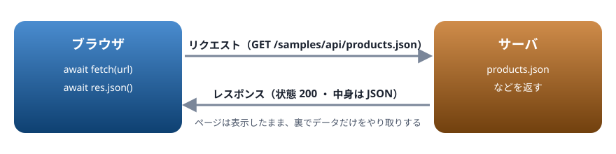
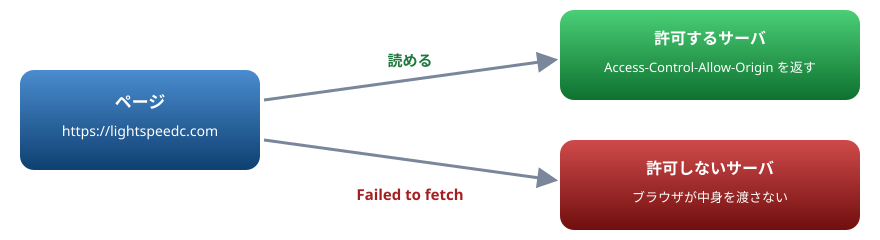

# 18. 通信

fetch でサーバーからデータを受け取り、画面に映す。失敗の扱い、データを送る、CORS の入口

> 📅 作成: 2026-10-10 / 更新: 2026-10-10

[<<](17-フォーム.md)[>>](19-ブラウザの機能.md)[^^](README.md)

1. [fetch で受け取る](#1-fetch-で受け取る)
2. [JSON を受け取って画面に映す](#2-json-を受け取って画面に映す)
3. [失敗を扱う](#3-失敗を扱う)
4. [データを送る](#4-データを送る)
5. [CORS の入口](#5-cors-の入口)

## 1. fetch で受け取る

ページを開いた後で、サーバーから追加のデータを受け取るには `fetch` を使います。通信には時間がかかるので、`fetch` は Promise を返します（11 章）。`await` で待ちます。



fetch はリクエストを送り、レスポンスを Promise で返す

スクリプト

```javascript
const res = await fetch("samples/api/message.txt");
console.log(res.status, res.ok);
const text = await res.text();
console.log(text.trim());
```

```text
200 true
サーバーから届いた文字です
```

- `fetch` が返すのはレスポンス（`Response`）。`status` は状態の番号（200 は成功、404 は見つからない）、`ok` は 200 番台なら `true`
- 中身は、もう一度 `await` して読む。文字なら `res.text()`、JSON なら `res.json()`
- `type="module"` のスクリプトでは、一番外側で `await` を書ける（12 章）

この章の例が読んでいるファイルは [docs/samples/api](https://github.com/LightSpeedC/20261009-javascript-learn/tree/develop/docs/samples/api) にあります。手元で試すときは、14 章のローカルサーバーで、このフォルダを返すようにします。

## 2. JSON を受け取って画面に映す

Web の API の多くは、データを JSON で返します（05 章）。`res.json()` は、JSON の文字列をオブジェクトや配列に変えて返します。

body の中身

```html
<ul id="list"></ul>
```

スクリプト

```javascript
const res = await fetch("samples/api/products.json");
const products = await res.json();
const list = document.querySelector("#list");
for (const p of products) {
  const li = document.createElement("li");
  li.textContent = `${p.title}: ${p.price} 円`;
  list.append(li);
}
console.log(`${products.length} 件を表示しました`);
```

```text
3 件を表示しました
```

受け取ったデータを画面に入れるときは、`textContent` を使います（15 章の XSS の注意）。

### まとめて受け取る

関係のない通信は、`Promise.all` で同時に始めます（11 章）。

スクリプト

```javascript
const [products, message] = await Promise.all([
  fetch("samples/api/products.json").then((r) => r.json()),
  fetch("samples/api/message.txt").then((r) => r.text()),
]);
console.log(products.map((p) => p.title).join("・"));
console.log(message.trim());
```

```text
りんご・メロン・みかん
サーバーから届いた文字です
```

## 3. 失敗を扱う

`fetch` の失敗には 2 種類あります。扱い方が違うので注意します。

| 失敗 | 例 | fetch の結果 |
|---|---|---|
| サーバーが「だめ」と返した | 404 見つからない ・ 500 サーバーの不具合 | **成功として返る**。`res.ok` が `false` |
| 通信そのものができなかった | ネットワークが切れている ・ CORS で止められた | 失敗（`TypeError: Failed to fetch`） |

404 でも `fetch` は失敗しません。`res.ok` を確かめて、だめなら自分で `throw` します。この確かめを関数にまとめておくと、どこからでも使えます。

スクリプト

```javascript
const res = await fetch("samples/api/nothing.json");
console.log(res.ok, res.status);

async function getJson(url) {
  const res = await fetch(url);
  if (!res.ok) {
    throw new Error(`読み込みに失敗しました: ${res.status}`);
  }
  return res.json();
}
try {
  await getJson("samples/api/nothing.json");
} catch (e) {
  console.log(e.message);
}
```

```text
false 404
読み込みに失敗しました: 404
```

### 待っている間の表示

通信には時間がかかることがあります。読み込み中であることを表示し、二重に押されないようにボタンを止め、終わったら `finally` で元に戻します（10 章）。

body の中身

```html
<button id="load">商品を読み込む</button>
<p id="status-text"></p>
```

スクリプト

```javascript
async function getJson(url) {
  const res = await fetch(url);
  if (!res.ok) throw new Error(`読み込みに失敗しました: ${res.status}`);
  return res.json();
}

const button = document.querySelector("#load");
const statusText = document.querySelector("#status-text");
button.addEventListener("click", async () => {
  button.disabled = true;
  statusText.textContent = "読み込み中…";
  try {
    const products = await getJson("samples/api/products.json");
    statusText.textContent = `${products.length} 件ありました`;
  } catch (e) {
    statusText.textContent = `失敗: ${e.message}`;
  } finally {
    button.disabled = false;
  }
  console.log(statusText.textContent);
});
button.click();
```

```text
3 件ありました
```

## 4. データを送る

サーバーにデータを送るときは、`fetch` の 2 つ目の引数で、送り方（`method`）と中身（`body`）を指定します。JSON で送るときは、`JSON.stringify` で文字列にし、中身の種類を `content-type` で伝えます。

```javascript
const res = await fetch("https://api.example.com/orders", {
  method: "POST",
  headers: { "content-type": "application/json" },
  body: JSON.stringify({ productId: 1, quantity: 3 }),
});
if (!res.ok) throw new Error(`送信に失敗しました: ${res.status}`);
const result = await res.json();
```

この例は、受け取る側のサーバーが必要なので、このページでは動かせません。

| method | 意味 |
|---|---|
| `GET` | 受け取る（何も書かなければこれ） |
| `POST` | 新しく作る ・ 送る |
| `PUT` ・ `PATCH` | 変える |
| `DELETE` | 消す |

> [!TIP]
> ヒント: 通信の中身は、開発者ツールの Network タブで確かめられます（14 章）。送ったものと返ってきたもの、状態の番号、かかった時間が見えます。思ったように動かないときは、まずここを見ます。

## 5. CORS の入口

ブラウザは安全のため、**ページと違う場所（オリジン）のサーバーから、JavaScript でデータを読むこと**を、原則として止めます。オリジンは「`https`」「`lightspeedc.com`」「ポート番号」の組です。1 つでも違えば別のオリジンです。



別のオリジンのデータを読めるかは、サーバーが許可するかどうかで決まる

別のオリジンから読んでよいかは、**サーバー側**が `Access-Control-Allow-Origin` という見出し（ヘッダー）で答えます。許可されていないと、Console に次のようなエラーが出て、JavaScript には `TypeError: Failed to fetch` が届きます。

```text
Access to fetch at 'https://api.example.com/data' from origin 'https://lightspeedc.com'
has been blocked by CORS policy: No 'Access-Control-Allow-Origin' header is present on the requested resource.
```

この仕組みを **CORS**（オリジン間リソース共有）と呼びます。**ブラウザ側の JavaScript では解決できません**。使いたい API が許可していないときは、自分のサーバーを経由して取ってくるなど、サーバー側で対応します。

> [!IMPORTANT]
> ここが大事: CORS のエラーは「コードの書き間違い」ではなく「サーバーが許可していない」というお知らせです。調べるときは、相手の API の説明に、ブラウザから直接使えるか（CORS に対応しているか）が書いてあるかを見ます。

[<<](17-フォーム.md)[>>](19-ブラウザの機能.md)[^^](README.md)
