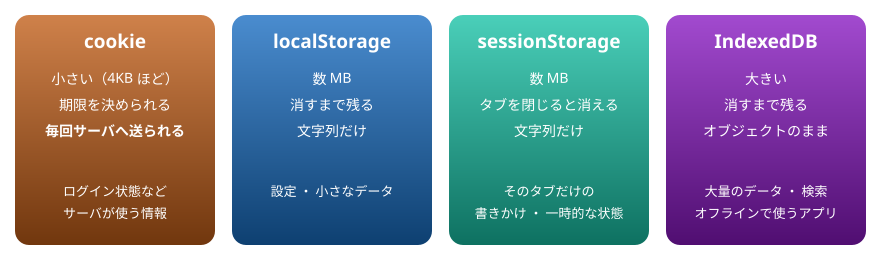

# 19. ブラウザの機能

ブラウザにデータを残す方法の比較（cookie ・ localStorage ・ sessionStorage ・ IndexedDB）、時刻とタイマー、URL、クリップボード

> 📅 作成: 2026-10-10 / 更新: 2026-10-10

[<<](18-通信.md)[^^](README.md)

1. [データを残す方法の比較](#1-データを残す方法の比較)
2. [localStorage と sessionStorage](#2-localstorage-と-sessionstorage)
3. [cookie と IndexedDB](#3-cookie-と-indexeddb)
4. [時刻とタイマー](#4-時刻とタイマー)
5. [URL とクリップボード](#5-url-とクリップボード)

## 1. データを残す方法の比較

ページを閉じても設定や書きかけの内容を覚えておきたいとき、ブラウザの中にデータを残せます。方法は 4 つあり、向いている使いどころが違います。



同じ「残す」でも、大きさ ・ 残る期間 ・ サーバーへ送られるかが違う

| 方法 | 残る期間 | サーバーへ | 書き方 | 使いどころ |
|---|---|---|---|---|
| cookie | 期限まで | ⚠️ **毎回送られる** | `document.cookie` | サーバーが知る必要のある情報 |
| localStorage | 消すまで | ⬜ **送られない** | `localStorage.setItem` | 設定 ・ 小さなデータ |
| sessionStorage | タブを閉じるまで | ⬜ **送られない** | `sessionStorage.setItem` | そのタブだけの一時的な状態 |
| IndexedDB | 消すまで | ⬜ **送られない** | 非同期の API（ライブラリ経由が多い） | 大量のデータ ・ オフライン |

> [!WARNING]
> 注意: どの方法も、ブラウザを使う人が開発者ツールで中身を見たり書き換えたりできます。パスワードのような秘密は残しません。また、同じオリジン（18 章）のページは、すべて同じ置き場を共有します。

> [!NOTE]
> メモ: 昔は、ブラウザの中で SQL を使える Web SQL Database という仕組みもありましたが、標準になる前に打ち切られ、いまのブラウザからは取り除かれています。古い資料で見かけても使いません。

## 2. localStorage と sessionStorage

どちらも、キーと値の組を文字列で保存します。書き方は同じで、残る期間だけが違います。

| 書き方 | すること |
|---|---|
| `setItem(キー, 値)` | 保存する。値は文字列に変わる |
| `getItem(キー)` | 読む。無ければ `null` |
| `removeItem(キー)` | 1 つ消す |

スクリプト

```javascript
localStorage.removeItem("jsl-visits"); // 例を何度動かしても同じ結果になるように、まず消す
const before = Number(localStorage.getItem("jsl-visits") ?? 0);
localStorage.setItem("jsl-visits", before + 1);
console.log(localStorage.getItem("jsl-visits"));
console.log(typeof localStorage.getItem("jsl-visits"));

const settings = { theme: "dark", fontSize: 16 };
localStorage.setItem("jsl-settings", JSON.stringify(settings));
const loaded = JSON.parse(localStorage.getItem("jsl-settings"));
console.log(loaded.theme, loaded.fontSize);

console.log(localStorage.getItem("jsl-nothing"));
```

```text
1
string
dark 16
null
```

- 数値を入れても、読むと文字列になる。数として使うなら `Number()`（04 章）
- オブジェクトは `JSON.stringify` で文字列にして保存し、`JSON.parse` で戻す（05 章）
- キーは、ほかのページと重ならないよう、アプリの名前などを頭に付ける

次の例は、開いた回数を数えます。「▶ 実行」を何度か押してみてください。ページを開き直しても、数は続きから増えます。

body の中身

```html
<p id="count"></p>
<button id="reset">数え直す</button>
```

スクリプト

```javascript
const KEY = "jsl-open-count";
const count = Number(localStorage.getItem(KEY) ?? 0) + 1;
localStorage.setItem(KEY, count);
document.querySelector("#count").textContent = `この画面を開いた回数: ${count}`;

document.querySelector("#reset").addEventListener("click", () => {
  localStorage.removeItem(KEY);
  document.querySelector("#count").textContent = "数え直します。もう一度「▶ 実行」を押してください";
});
```

`sessionStorage` は、タブを閉じると消えます。同じページを 2 つのタブで開くと、タブごとに別々です。

スクリプト

```javascript
sessionStorage.setItem("jsl-draft", "書きかけの文章");
console.log(sessionStorage.getItem("jsl-draft"));
sessionStorage.removeItem("jsl-draft");
console.log(sessionStorage.getItem("jsl-draft"));
```

```text
書きかけの文章
null
```

## 3. cookie と IndexedDB

### cookie

cookie は、`document.cookie` に「名前=値; 設定」の形の文字列を代入して保存します。読むと、そのページで使えるすべての cookie が「`名前=値; 名前=値`」とつながった 1 つの文字列で返ります。

スクリプト

```javascript
document.cookie = "jsl_theme=dark; max-age=60; path=/";
console.log(document.cookie.includes("jsl_theme=dark"));

document.cookie = "jsl_theme=; max-age=0; path=/"; // 期限を 0 にすると消える
console.log(document.cookie.includes("jsl_theme=dark"));
```

```text
true
false
```

cookie はリクエストのたびにサーバーへ送られるので、ブラウザの中だけで使うデータには向きません。ブラウザだけで使うなら `localStorage` を使います。ログイン状態のように、サーバーが決めてサーバーが読む情報は、サーバー側が cookie を設定するのがふつうです。

### IndexedDB

IndexedDB は、ブラウザの中のデータベースです。オブジェクトをそのまま大量に保存でき、キーで検索できます。ただし、API が古い形の非同期（イベントで結果を受け取る）で書きにくいため、小さなライブラリを通して使うのがふつうです。この資料では名前と使いどころだけを紹介します。

## 4. 時刻とタイマー

時刻は `Date` で扱います。表示の形は `toLocaleString` や `Intl.DateTimeFormat` で決めます。`timeZone` を指定すると、見ている人のパソコンの設定に関係なく、日本時間で表示できます。

```javascript
const d = new Date("2026-10-10T09:30:05+09:00");
console.log(d.toLocaleString("ja-JP", { timeZone: "Asia/Tokyo" }));

const fmt = new Intl.DateTimeFormat("ja-JP", {
  timeZone: "Asia/Tokyo",
  year: "numeric",
  month: "long",
  day: "numeric",
  weekday: "short",
});
console.log(fmt.format(d));

const later = new Date(d.getTime() + 90 * 60 * 1000); // 90 分後
console.log(later.toLocaleTimeString("ja-JP", { timeZone: "Asia/Tokyo" }));
```

```text
2026/10/10 9:30:05
2026年10月10日(土)
11:00:05
```

11 章のタイマーを画面に使うと、時計が作れます。「動かす」を押すと 1 秒ごとに表示が変わり、「止める」で止まります。

body の中身

```html
<p id="clock" style="font-size: 32px; font-weight: bold;">--:--:--</p>
<button id="start">動かす</button>
<button id="stop">止める</button>
```

スクリプト

```javascript
const clock = document.querySelector("#clock");
const format = (d) => d.toLocaleTimeString("ja-JP", { timeZone: "Asia/Tokyo" });
let timerId = null;

document.querySelector("#start").addEventListener("click", () => {
  if (timerId !== null) return;
  clock.textContent = format(new Date());
  timerId = setInterval(() => {
    clock.textContent = format(new Date());
  }, 1000);
});
document.querySelector("#stop").addEventListener("click", () => {
  clearInterval(timerId);
  timerId = null;
});
console.log(format(new Date("2026-10-10T09:30:05+09:00")));
```

```text
9:30:05
```

`timerId` を覚えておくのは、止めるときに必要だからです。「動かす」を 2 回押してもタイマーが 2 つにならないよう、動いているときは何もしません。

## 5. URL とクリップボード

### URL を組み立てる ・ 読む

`new URL(文字列)` で、URL を部品に分けて読み書きできます。`?` の後ろの検索条件は `searchParams` で扱います。文字列をつなげて組み立てるより、記号の書き間違いや、日本語のエンコードの漏れを防げます。

```javascript
const url = new URL("https://example.com/search?q=JavaScript&page=2#top");
console.log(url.hostname, url.pathname, url.hash);
console.log(url.searchParams.get("q"), Number(url.searchParams.get("page")));

url.searchParams.set("page", "3");
url.searchParams.set("tag", "入門");
console.log(url.href);
```

```text
example.com /search #top
JavaScript 2
https://example.com/search?q=JavaScript&page=3&tag=%E5%85%A5%E9%96%80#top
```

いま開いているページの URL は `location.href` で読めます。ページを移動せずに URL だけを変える `history.pushState` という仕組みもあり、1 つのページの中で画面を切り替えるアプリで使われます。

### クリップボード

`navigator.clipboard.writeText(文字)` で、文字をクリップボードにコピーできます。悪用を防ぐため、**ボタンを押すなど、人が操作したとき**にしか使えません。結果は Promise で返ります。

body の中身

```html
<input id="text" value="コピーする文字" size="20">
<button id="copy">コピー</button>
<span id="done"></span>
```

スクリプト

```javascript
document.querySelector("#copy").addEventListener("click", async () => {
  const text = document.querySelector("#text").value;
  try {
    await navigator.clipboard.writeText(text);
    document.querySelector("#done").textContent = "コピーしました";
  } catch (e) {
    document.querySelector("#done").textContent = `コピーできませんでした（${e.name}）`;
  }
});
```

この例は、画面の「コピー」を押したときだけ動きます。押した後、メモ帳などに貼り付けて確かめてください。

[<<](18-通信.md)[^^](README.md)
