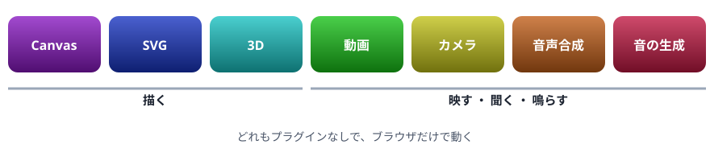

# 20. 紹介: 描画とメディア

Web でできることの紹介 1。Canvas ・ SVG ・ 3D ・ 動画 ・ カメラ ・ 音声合成 ・ 音の生成を、短い例で見る

> 📅 作成: 2026-10-10 / 更新: 2026-10-10

[<<](19-ブラウザの機能.md)[>>](21-リアルタイム通信.md)[^^](../README.md)

1. [この章の読み方](#1-この章の読み方)
2. [Canvas](#2-canvas)
3. [SVG](#3-svg)
4. [3D](#4-3d)
5. [動画とカメラ](#5-動画とカメラ)
6. [音声合成と音の生成](#6-音声合成と音の生成)

## 1. この章の読み方

20 〜 22 章は、ブラウザの JavaScript で**どんなことができるか**を、短い例で見せる紹介の章です。詳しい使い方は説明しません。「こんなことができる」と知っておき、必要になったときに調べる手がかりにしてください。



この章で紹介するもの

> [!NOTE]
> メモ: カメラ ・ 音 ・ 読み上げの例は、画面のボタンを押したときに動きます。ブラウザは、人の操作なしに音を鳴らしたりカメラを使ったりすることを許さないからです。

## 2. Canvas

`<canvas>` は、ピクセルの絵を JavaScript で描くための画用紙です。グラフ ・ ゲーム ・ 画像の加工に使います。

body の中身

```html
<canvas id="chart" width="400" height="170"></canvas>
```

スクリプト

```javascript
const ctx = document.querySelector("#chart").getContext("2d");
const data = [["りんご", 120], ["メロン", 980], ["みかん", 80]];
data.forEach(([label, value], i) => {
  const h = (value / 1000) * 130;
  ctx.fillStyle = `hsl(${280 - i * 110}, 60%, 50%)`;
  ctx.fillRect(40 + i * 120, 140 - h, 80, h);
  ctx.fillStyle = "#1c2330";
  ctx.font = "14px sans-serif";
  ctx.fillText(`${label} ${value}`, 40 + i * 120, 160);
});
console.log("描いた棒:", data.length);
```

```text
描いた棒: 3
```

`requestAnimationFrame` で、画面を描き直すたびに少しずつ動かすと、アニメーションになります。

body の中身

```html
<canvas id="stage" width="400" height="100" style="border: 1px solid #9aa6b8;"></canvas>
```

スクリプト

```javascript
const canvas = document.querySelector("#stage");
const ctx = canvas.getContext("2d");
let x = 20;
let dx = 3;
function frame() {
  ctx.clearRect(0, 0, canvas.width, canvas.height);
  ctx.beginPath();
  ctx.arc(x, 50, 16, 0, Math.PI * 2);
  ctx.fillStyle = "crimson";
  ctx.fill();
  x += dx;
  if (x < 16 || x > canvas.width - 16) dx = -dx;
  requestAnimationFrame(frame);
}
requestAnimationFrame(frame);
```

## 3. SVG

SVG は、図形を部品（要素）として持つ絵です。この資料の図も SVG です。DOM の要素なので、作った後も 1 つ 1 つの図形の色や位置を変えられ、拡大してもぼやけません。作るときは `createElementNS` を使います。

スクリプト

```javascript
const NS = "http://www.w3.org/2000/svg";
const svg = document.createElementNS(NS, "svg");
svg.setAttribute("viewBox", "0 0 320 100");
svg.setAttribute("width", "320");
for (let i = 0; i < 5; i++) {
  const c = document.createElementNS(NS, "circle");
  c.setAttribute("cx", 30 + i * 62);
  c.setAttribute("cy", 50);
  c.setAttribute("r", 10 + i * 4);
  c.setAttribute("fill", `hsl(${i * 60}, 70%, 50%)`);
  c.addEventListener("click", () => c.setAttribute("fill", "#1c2330"));
  svg.append(c);
}
document.body.append(svg);
console.log(svg.querySelectorAll("circle").length);
```

```text
5
```

丸を押すと、その丸だけ色が変わります。図形ごとにイベントを登録できるのが SVG の強みです。

|  | Canvas | SVG |
|---|---|---|
| 持ち方 | ピクセルの絵（描いたら 1 枚の絵） | 図形の部品の集まり |
| 得意 | 大量の点 ・ 激しい動き ・ 画像の加工 | 図 ・ アイコン ・ 押せる図形 |
| 拡大 | ぼやける | くっきり |

## 4. 3D

ブラウザには、グラフィックの部品（GPU）を使って 3D を描く WebGL という仕組みがあります。直接使うのは大変なので、three.js などのライブラリを使うのがふつうです。次の例は、three.js を CDN（22 章）から読み込んで、回る立方体を描きます。

スクリプト

```javascript
import * as THREE from "https://cdn.jsdelivr.net/npm/three@0.170.0/build/three.module.js";

console.log("three.js の版:", THREE.REVISION);
try {
  const renderer = new THREE.WebGLRenderer({ antialias: true });
  renderer.setSize(320, 200);
  document.body.append(renderer.domElement);
  const scene = new THREE.Scene();
  const camera = new THREE.PerspectiveCamera(50, 320 / 200, 0.1, 100);
  camera.position.z = 3;
  const cube = new THREE.Mesh(
    new THREE.BoxGeometry(1, 1, 1),
    new THREE.MeshNormalMaterial(),
  );
  scene.add(cube);
  renderer.setAnimationLoop(() => {
    cube.rotation.x += 0.01;
    cube.rotation.y += 0.015;
    renderer.render(scene, camera);
  });
} catch (e) {
  document.body.append("この環境では WebGL を使えません");
}
```

```text
three.js の版: 170
```

## 5. 動画とカメラ

### 動画

`<video>` 要素で動画を表示でき、JavaScript から再生 ・ 停止 ・ 位置の移動ができます。

```html
<video id="movie" src="movie.mp4" controls width="480"></video>
```

```javascript
const movie = document.querySelector("#movie");
await movie.play();      // 再生（Promise を返す）
movie.pause();           // 一時停止
movie.currentTime = 30;  // 30 秒の位置へ
movie.addEventListener("ended", () => console.log("最後まで再生した"));
```

### カメラ

`navigator.mediaDevices.getUserMedia` で、カメラやマイクの映像 ・ 音を受け取れます。使ってよいかをブラウザが尋ね、許可されたときだけ動きます。「カメラを使う」を押してみてください。

body の中身

```html
<button id="on">カメラを使う</button>
<button id="off">止める</button>
<p id="note"></p>
<video id="view" autoplay playsinline width="320"></video>
```

スクリプト

```javascript
const view = document.querySelector("#view");
const note = document.querySelector("#note");
let stream = null;
document.querySelector("#on").addEventListener("click", async () => {
  try {
    stream = await navigator.mediaDevices.getUserMedia({ video: true });
    view.srcObject = stream;
    note.textContent = "";
  } catch (e) {
    note.textContent = `使えませんでした（${e.name}）`;
  }
});
document.querySelector("#off").addEventListener("click", () => {
  stream?.getTracks().forEach((t) => t.stop());
  view.srcObject = null;
});
```

> [!WARNING]
> 注意: カメラやマイクは、`https://` か `http://localhost` のページでしか使えません。使い終わったら `stop()` で必ず止めます。止めないと、カメラが使用中のままになります。

## 6. 音声合成と音の生成

### 読み上げ

`speechSynthesis` で、文字を声で読み上げられます。声の種類は、OS やブラウザに入っているものから選ばれます。

body の中身

```html
<input id="text" value="こんにちは。JavaScript から話しています。" size="32">
<button id="speak">読み上げる</button>
```

スクリプト

```javascript
document.querySelector("#speak").addEventListener("click", () => {
  const utterance = new SpeechSynthesisUtterance(document.querySelector("#text").value);
  utterance.lang = "ja-JP";
  utterance.rate = 1.0;
  speechSynthesis.speak(utterance);
});
```

### 音を作る

Web Audio API を使うと、音の波を作って鳴らせます。次の例は、ド ・ ミ ・ ソを順に鳴らします。音量に注意して押してください。

body の中身

```html
<button id="play">ド ・ ミ ・ ソ を鳴らす</button>
```

スクリプト

```javascript
let audio = null;
document.querySelector("#play").addEventListener("click", () => {
  audio ??= new AudioContext();
  const notes = [523.25, 659.25, 783.99]; // ド ・ ミ ・ ソ の周波数（Hz）
  notes.forEach((freq, i) => {
    const start = audio.currentTime + i * 0.3;
    const osc = audio.createOscillator();
    const gain = audio.createGain();
    osc.frequency.value = freq;
    gain.gain.setValueAtTime(0.2, start);
    gain.gain.exponentialRampToValueAtTime(0.001, start + 0.28);
    osc.connect(gain).connect(audio.destination);
    osc.start(start);
    osc.stop(start + 0.3);
  });
});
```

マイクの音を `getUserMedia({ audio: true })` で受け取り、Web Audio API で音の大きさを測る、といった組み合わせもできます。

[<<](19-ブラウザの機能.md)[>>](21-リアルタイム通信.md)[^^](../README.md)
