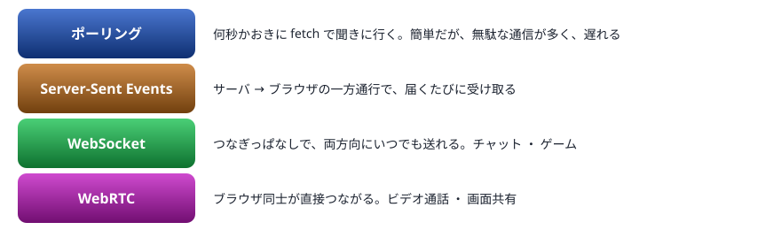
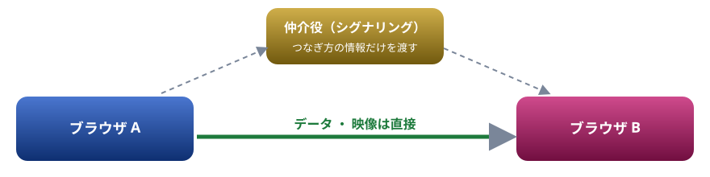

# 21. 紹介: リアルタイム通信

Web でできることの紹介 2。サーバーから知らせを受け取る仕組みと、タブ間のチャット、ブラウザ同士の直接通信（WebRTC）

> 📅 作成: 2026-10-10 / 更新: 2026-10-10

[<<](20-描画とメディア.md)[>>](22-ライブラリを埋め込む.md)[^^](README.md)

1. [知らせをすぐ受け取るには](#1-知らせをすぐ受け取るには)
2. [タブ間のチャット（BroadcastChannel）](#2-タブ間のチャットbroadcastchannel)
3. [WebSocket と Server-Sent Events](#3-websocket-と-server-sent-events)
4. [ブラウザ同士がつながる（WebRTC）](#4-ブラウザ同士がつながるwebrtc)

## 1. 知らせをすぐ受け取るには

18 章の `fetch` は「こちらから聞いて、答えをもらう」形です。チャットや通知のように、**相手の都合で届く知らせ**をすぐ受け取るには、別の仕組みを使います。



下へ行くほど、速く双方向になる代わりに、仕組みが大きくなる

WebSocket と Server-Sent Events は、受け持つサーバーが必要なので、このページでは書き方を紹介するだけにします。同じオリジンのタブ間で送り合う `BroadcastChannel` と、ブラウザ同士がつながる WebRTC は、このページの中で動かせます。

## 2. タブ間のチャット（BroadcastChannel）

`BroadcastChannel` は、**同じオリジンで開いている別のタブやウィンドウ**に、メッセージを送る仕組みです。サーバーは要りません。まず仕組みだけを見ます。別のタブの代わりに、同じページの中にもう 1 つ受け手を作っています。

スクリプト

```javascript
const me = new BroadcastChannel("jsl-demo");
const other = new BroadcastChannel("jsl-demo"); // 別のタブの代わり
other.addEventListener("message", (event) => {
  console.log("受け取った:", event.data.text);
});
me.postMessage({ text: "こんにちは" });
```

```text
受け取った: こんにちは
```

次はチャットの画面です。**このページをもう 1 つのタブで開き**、両方で「▶ 実行」を押してから、片方で書き込んでみてください。もう片方に届きます。

body の中身

```html
<form id="form">
  <input id="text" placeholder="メッセージ" autocomplete="off">
  <button>送る</button>
</form>
<ul id="log"></ul>
```

スクリプト

```javascript
const channel = new BroadcastChannel("jsl-chat");
const log = document.querySelector("#log");
const name = `タブ${Math.floor(Math.random() * 90 + 10)}`;

function show(who, text) {
  const li = document.createElement("li");
  li.textContent = `${who}: ${text}`;
  log.append(li);
}
channel.addEventListener("message", (event) => show(event.data.who, event.data.text));

document.querySelector("#form").addEventListener("submit", (event) => {
  event.preventDefault();
  const input = document.querySelector("#text");
  if (input.value.trim() === "") return;
  channel.postMessage({ who: name, text: input.value });
  show(`${name}（自分）`, input.value);
  input.value = "";
});
```

## 3. WebSocket と Server-Sent Events

### WebSocket

サーバーとつなぎっぱなしにして、どちらからでもいつでも送れます。チャットのサーバーにつなぐブラウザ側のコードは、次のような形です。

```javascript
const socket = new WebSocket("wss://chat.example.com/room/1");
socket.addEventListener("open", () => {
  socket.send(JSON.stringify({ type: "join", name: "ゲスト" }));
});
socket.addEventListener("message", (event) => {
  const msg = JSON.parse(event.data);
  console.log(`${msg.name}: ${msg.text}`);
});
socket.addEventListener("close", () => console.log("切れました"));
```

サーバー側は、Node.js なら `ws` などのパッケージ（10 章の npm）を使って書けます。

### Server-Sent Events

サーバーからの一方通行でよいなら、もっと簡単です。ブラウザ側は `EventSource` で受け取ります。

```javascript
const events = new EventSource("/notifications");
events.addEventListener("message", (event) => {
  console.log("お知らせ:", event.data);
});
```

サーバーは、つないだままのレスポンスに「`data: 本文`」と空行を書き足していくだけです。Node.js の `node:http`（14 章の `serve.mjs` と同じ道具）だけで書けます。

```javascript
res.writeHead(200, { "content-type": "text/event-stream" });
const id = setInterval(() => res.write(`data: ${new Date().toISOString()}\n\n`), 1000);
req.on("close", () => clearInterval(id));
```

## 4. ブラウザ同士がつながる（WebRTC）

WebRTC は、ブラウザ同士が**サーバーを通さずに直接**データや映像を送り合う仕組みです。ビデオ会議 ・ 画面共有 ・ ファイルの受け渡しに使われます。



つなぐための情報（offer と answer）だけを仲介役が渡し、中身は直接やり取りする

次の例は、仲介役の代わりに、同じページの中で 2 つの接続（`a` と `b`）を作って直接つなぎ、文字を送っています。本物のアプリでは、`offer` と `answer` を WebSocket などで相手に届けます。

スクリプト

```javascript
const a = new RTCPeerConnection();
const b = new RTCPeerConnection();
a.addEventListener("icecandidate", (e) => e.candidate && b.addIceCandidate(e.candidate));
b.addEventListener("icecandidate", (e) => e.candidate && a.addIceCandidate(e.candidate));

const channel = a.createDataChannel("chat");
channel.addEventListener("open", () => channel.send("WebRTC でこんにちは"));
b.addEventListener("datachannel", (e) => {
  e.channel.addEventListener("message", (m) => console.log("b が受け取った:", m.data));
});

// つなぎ方の情報を交換する（本物では仲介役が受け渡す）
const offer = await a.createOffer();
await a.setLocalDescription(offer);
await b.setRemoteDescription(offer);
const answer = await b.createAnswer();
await b.setLocalDescription(answer);
await a.setRemoteDescription(answer);

setTimeout(() => {
  a.close();
  b.close();
}, 2000); // 2 秒後に切る
```

```text
b が受け取った: WebRTC でこんにちは
```

[<<](20-描画とメディア.md)[>>](22-ライブラリを埋め込む.md)[^^](README.md)
