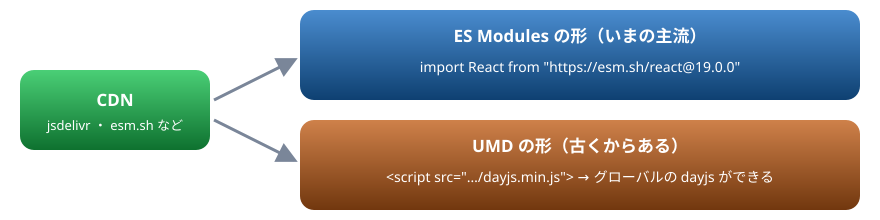

# 22. 紹介: ライブラリを埋め込む

Web でできることの紹介 3。CDN から React を ES Modules で読み込む、UMD のライブラリを script で読み込む、Mermaid で図を描く

> 📅 作成: 2026-10-10 / 更新: 2026-10-10

[<<](21-リアルタイム通信.md)[^^](README.md)

1. [CDN から読み込む](#1-cdn-から読み込む)
2. [React を ES Modules で読み込む](#2-react-を-es-modules-で読み込む)
3. [UMD を script で読み込む](#3-umd-を-script-で読み込む)
4. [Mermaid で図を描く](#4-mermaid-で図を描く)

## 1. CDN から読み込む

ほかの人が作ったライブラリは、10 章の npm で入れる方法のほかに、**CDN**（ファイルを配る専用のサーバー）から HTML へ直接読み込む方法があります。ビルドの道具を用意しなくても、HTML 1 枚で試せるのが利点です。読み込み方は、ライブラリの形式によって 2 通りあります。



import で読む ES Modules の形と、script タグで読む UMD の形

> [!WARNING]
> 注意: CDN の URL には、**版を必ず書きます**（`react@19.0.0` のように）。版を書かないと、ある日新しい版に入れ替わり、知らないうちに動かなくなります。また、CDN が止まったり、ネットワークが無かったりすると動きません。仕事のアプリでは npm で入れてビルドするのがふつうで、CDN は試す ・ 小さなページを作る、といった場面に向いています。

この章の例は、実際に CDN から読み込むので、「▶ 実行」にはネットワークが必要です。

## 2. React を ES Modules で読み込む

React は、画面を部品（コンポーネント）に分けて作るためのライブラリです。15 章で書いた「データが変わったら画面を作り直す」を、自動で効率よく行ってくれます。`esm.sh` という CDN から `import` で読み込みます。

body の中身

```html
<div id="root"></div>
```

スクリプト

```javascript
import React, { useState } from "https://esm.sh/react@19.0.0";
import { createRoot } from "https://esm.sh/react-dom@19.0.0/client?deps=react@19.0.0";

const h = React.createElement;

function Counter({ label }) {
  const [count, setCount] = useState(0);
  return h("button", { onClick: () => setCount(count + 1) }, `${label}: ${count}`);
}

function App() {
  return h("div", null,
    h("p", null, "React で作ったボタン（押すと数が増える）"),
    h(Counter, { label: "りんご" }),
    " ",
    h(Counter, { label: "みかん" }),
  );
}

createRoot(document.querySelector("#root")).render(h(App));
console.log("React の版:", React.version);
```

```text
React の版: 19.0.0
```

- `useState` は、部品ごとに状態（ここでは押した回数）を持つ仕組み。値を変えると、React が画面を描き直す
- React の資料では、`h("button", …)` の代わりに `<button>…</button>` と HTML のように書く **JSX** が使われる。JSX はブラウザがそのままでは読めないので、ビルドの道具で変換してから使う
- `?deps=react@19.0.0` は、react-dom が使う React の版を、こちらで読み込んだものとそろえるための指定

## 3. UMD を script で読み込む

古くからあるライブラリは、**UMD** という形で配られていることがあります。`<script src="…">` で読み込むと、グローバルに変数が 1 つでき（07 章）、それを通して使います。次の例は、日付を扱う小さなライブラリ Day.js を読み込みます。

body の中身

```html
<script src="https://cdn.jsdelivr.net/npm/dayjs@1.11.13/dayjs.min.js"></script>
<p id="out"></p>
```

スクリプト

```javascript
const d = dayjs("2026-10-10");
console.log(typeof window.dayjs);
console.log(d.format("YYYY年M月D日"));
console.log(d.add(1, "month").format("YYYY-MM-DD"));
document.querySelector("#out").textContent = `1 か月後は ${d.add(1, "month").format("M月D日")}`;
```

```text
function
2026年10月10日
2026-11-10
```

`type="module"` の付かない `<script src>` は、その場で読み込まれて実行されるので、後ろの `type="module"` のスクリプトからはもう使えます（14 章）。グローバルを使う形なので、ほかのライブラリと名前がぶつからないかに注意します。

## 4. Mermaid で図を描く

**Mermaid** は、文字で書いた図の説明から、シーケンス図 ・ フローチャート ・ ガントチャートなどを描くライブラリです。`class="mermaid"` の要素の中に図の説明を書き、`mermaid.run()` を呼ぶと、その場所に SVG の図ができます。GitHub の Markdown でも使えます。

body の中身

```html
<pre class="mermaid">
sequenceDiagram
  participant B as ブラウザ
  participant S as サーバー
  B->>S: GET /samples/api/products.json
  S-->>B: 200 OK（JSON）
  B->>B: 画面に映す
</pre>
<pre class="mermaid">
flowchart LR
  A[入力] --> B{数値？}
  B -- はい --> C[計算する]
  B -- いいえ --> D[エラーを出す]
</pre>
```

スクリプト

```javascript
import mermaid from "https://cdn.jsdelivr.net/npm/mermaid@11.4.1/dist/mermaid.esm.min.mjs";

mermaid.initialize({ startOnLoad: false });
await mermaid.run();
console.log("描いた図:", document.querySelectorAll(".mermaid svg").length);
```

```text
描いた図: 2
```

| 図の種類 | 書き出し | 向いているもの |
|---|---|---|
| シーケンス図 | `sequenceDiagram` | やり取りの順番（通信 ・ 処理の流れ） |
| フローチャート | `flowchart LR` | 条件分岐のある手順 |
| クラス図 | `classDiagram` | クラスの関係（08 章） |
| ガントチャート | `gantt` | 予定 |

> [!TIP]
> ヒント: 図を文字で書いておくと、変更の差分が読め、Git で管理しやすくなります。設計のメモや README に図を入れたいときに便利です。

[<<](21-リアルタイム通信.md)[^^](README.md)
