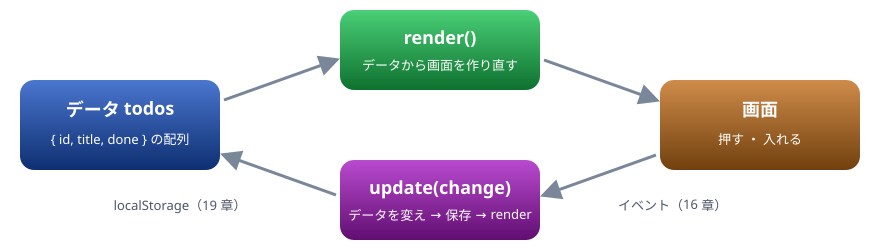

# 23. ハンズオン

宿題。やることリスト（ToDo）の画面を 4 つの手順で作る。データから画面を作り、操作でデータを変え、ブラウザに保存する

> 📅 作成: 2026-10-10 / 更新: 2026-10-10

[<<](22-ライブラリを埋め込む.md)[^^](../README.md)

1. [作るもの](#1-作るもの)
2. [手順 1: データから一覧を作る](#2-手順-1-データから一覧を作る)
3. [手順 2: 追加する](#3-手順-2-追加する)
4. [手順 3: 完了と削除](#4-手順-3-完了と削除)
5. [手順 4: 保存する（完成）](#5-手順-4-保存する完成)
6. [振り返りと発展課題](#6-振り返りと発展課題)

## 1. 作るもの

やることを足し、済んだら印を付け、要らなくなったら消せるリストを作ります。ページを閉じても中身が残るようにします。第2部で学んだ DOM ・ イベント ・ フォーム ・ 保存を、すべて使います。

組み立ての考え方は 1 つだけです。**データ（配列 `todos`）が主役で、画面はそれを映したもの**。操作されたらデータを変え、保存して、画面を作り直します。画面の部品を直接いじって状態を持たせないのがこつです。



データ → 画面 → 操作 → データ、の輪を回す

手順 1 と 4 は「▶ 実行」で動かせます。手順 2 と 3 は、足すコードだけを載せています。自分の手元では、14 章のように `index.html` と `main.js` を作り、ローカルサーバーで開いて進めてください。

## 2. 手順 1: データから一覧を作る

まず画面の骨組みを HTML で書き、データの配列から一覧を作る `render` 関数を書きます（15 章）。

body の中身

```html
<h2>やること</h2>
<ul id="list"></ul>
<p id="summary"></p>
```

CSS

```css
#list { list-style: none; padding: 0; }
#list li { display: flex; gap: 8px; align-items: center; padding: 4px 0; }
#list li.done span { text-decoration: line-through; color: #6b7280; }
```

スクリプト

```javascript
const todos = [
  { id: 1, title: "牛乳を買う", done: false },
  { id: 2, title: "資料を読む", done: true },
];

function render() {
  const list = document.querySelector("#list");
  list.textContent = ""; // いったん空にして、作り直す
  for (const todo of todos) {
    const li = document.createElement("li");
    li.dataset.id = todo.id;
    li.classList.toggle("done", todo.done);
    const check = document.createElement("input");
    check.type = "checkbox";
    check.checked = todo.done;
    const span = document.createElement("span");
    span.textContent = todo.title;
    li.append(check, span);
    list.append(li);
  }
  const rest = todos.filter((t) => !t.done).length;
  document.querySelector("#summary").textContent = `残り ${rest} 件 / 全 ${todos.length} 件`;
}

render();
console.log(document.querySelector("#summary").textContent);
```

```text
残り 1 件 / 全 2 件
```

- `classList.toggle("done", 真偽値)` は、2 つ目が真なら付け、偽なら外す
- 画面の文字は `textContent` で入れる。入力された文字を表示するので、`innerHTML` は使わない（15 章の XSS）
- この段階では、チェックを押しても、データが変わらないので何も起きない

## 3. 手順 2: 追加する

入力欄とボタンをフォームにまとめ、`submit` を受けて、データに足してから `render()` を呼びます（17 章）。Enter キーでも追加できます。

```html
<form id="form">
  <input id="title" placeholder="やることを入れる" autocomplete="off">
  <button>追加</button>
</form>
```

```javascript
let nextId = 3;
document.querySelector("#form").addEventListener("submit", (event) => {
  event.preventDefault();
  const input = document.querySelector("#title");
  const title = input.value.trim();
  if (title === "") return; // 空なら足さない
  todos.push({ id: nextId++, title, done: false });
  input.value = "";
  render();
});
```

> [!TIP]
> ヒント: `{ id: nextId++, title, done: false }` の `title` は、`title: title` を短く書いたものです（05 章）。`nextId++` は、いまの値を使ってから 1 増やします。

## 4. 手順 3: 完了と削除

各行に「削除」ボタンを足し、チェックとボタンのクリックを**リストに 1 つだけ登録したハンドラ**で受けます（16 章のイベントの委譲）。押された行は `closest("li")` で、その `data-id` からデータを探します。

```javascript
// render() の中で、行に削除ボタンも足す
const del = document.createElement("button");
del.className = "delete";
del.textContent = "削除";
li.append(check, span, del);
```

```javascript
document.querySelector("#list").addEventListener("click", (event) => {
  const li = event.target.closest("li");
  if (!li) return;
  const id = Number(li.dataset.id); // data-* は文字列なので数値に
  if (event.target.matches("input[type=checkbox]")) {
    const todo = todos.find((t) => t.id === id);
    todo.done = !todo.done;
  } else if (event.target.matches("button.delete")) {
    todos = todos.filter((t) => t.id !== id); // todos は let にしておく
  }
  render();
});
```

`el.matches(セレクタ)` は、要素がセレクタに当てはまるかを返します。`todos` を `filter` で作り直すので、宣言を `const` から `let` に変えます（03 章）。

## 5. 手順 4: 保存する（完成）

最後に `localStorage` へ保存し、開き直したときに読み込みます（19 章）。データを変える場所が 3 か所に増えたので、「変える → 保存する → 作り直す」を `update` という関数にまとめます。変える中身は、関数として渡します（06 章のコールバック）。

body の中身

```html
<h2>やること</h2>
<form id="form">
  <input id="title" placeholder="やることを入れる" autocomplete="off">
  <button>追加</button>
</form>
<ul id="list"></ul>
<p id="summary"></p>
<button id="clear">済んだものを消す</button>
<button id="reset">最初の状態に戻す</button>
```

CSS

```css
#list { list-style: none; padding: 0; }
#list li { display: flex; gap: 8px; align-items: center; padding: 4px 0; }
#list li.done span { text-decoration: line-through; color: #6b7280; }
```

スクリプト

```javascript
const KEY = "jsl-todos";
const form = document.querySelector("#form");
const input = document.querySelector("#title");
const list = document.querySelector("#list");
const summary = document.querySelector("#summary");

function load() {
  const saved = localStorage.getItem(KEY);
  if (saved === null) {
    return [
      { id: 1, title: "牛乳を買う", done: false },
      { id: 2, title: "資料を読む", done: true },
    ];
  }
  return JSON.parse(saved);
}
let todos = load();
let nextId = Math.max(0, ...todos.map((t) => t.id)) + 1;

function save() {
  localStorage.setItem(KEY, JSON.stringify(todos));
}

function render() {
  list.textContent = "";
  for (const todo of todos) {
    const li = document.createElement("li");
    li.dataset.id = todo.id;
    li.classList.toggle("done", todo.done);
    const check = document.createElement("input");
    check.type = "checkbox";
    check.checked = todo.done;
    const span = document.createElement("span");
    span.textContent = todo.title;
    const del = document.createElement("button");
    del.className = "delete";
    del.textContent = "削除";
    li.append(check, span, del);
    list.append(li);
  }
  const rest = todos.filter((t) => !t.done).length;
  summary.textContent = `残り ${rest} 件 / 全 ${todos.length} 件`;
}

// データを変える → 保存する → 作り直す、をいつも同じ順で行う
function update(change) {
  change();
  save();
  render();
}

form.addEventListener("submit", (event) => {
  event.preventDefault();
  const title = input.value.trim();
  if (title === "") return;
  update(() => todos.push({ id: nextId++, title, done: false }));
  input.value = "";
});

list.addEventListener("click", (event) => {
  const li = event.target.closest("li");
  if (!li) return;
  const id = Number(li.dataset.id);
  if (event.target.matches("input[type=checkbox]")) {
    update(() => {
      const todo = todos.find((t) => t.id === id);
      todo.done = !todo.done;
    });
  } else if (event.target.matches("button.delete")) {
    update(() => {
      todos = todos.filter((t) => t.id !== id);
    });
  }
});

document.querySelector("#clear").addEventListener("click", () => {
  update(() => {
    todos = todos.filter((t) => !t.done);
  });
});
document.querySelector("#reset").addEventListener("click", () => {
  update(() => {
    localStorage.removeItem(KEY);
    todos = load();
  });
});

render();
console.log(summary.textContent);
```

```text
残り 1 件 / 全 2 件
```

足したり消したりしてから、もう一度「▶ 実行」を押してみてください。前の状態から始まります。上の出力は、何も保存されていない状態で初めて実行したときのものです。

> [!IMPORTANT]
> ここが大事: データを変える場所は、すべて `update` を通しています。こうしておくと、「保存し忘れ」「画面の作り直し忘れ」が起きません。データの変え方が増えても、`update(() => { … })` の中身を書くだけで済みます。

## 6. 振り返りと発展課題

### 使ったもの

| 使ったもの | 章 |
|---|---|
| 要素を探す ・ 作る ・ 足す ・ `textContent` ・ `classList` ・ `dataset` | 15 |
| `addEventListener` ・ イベントの委譲 ・ `closest` ・ `matches` | 16 |
| `submit` ・ `preventDefault` ・ 入力の確かめ | 17 |
| `localStorage` ・ `JSON.stringify` ・ `JSON.parse` | 19 ・ 05 |
| 配列のメソッド ・ アロー関数 ・ コールバック ・ クロージャ | 05 ・ 06 ・ 09 |

### 発展課題

余裕があれば、次のどれかに挑戦してください。答えは載せていません。勉強会の最後に見せ合いましょう。

1. **絞り込み**: 「すべて ・ 未 ・ 済」の 3 つのボタンで、表示する行を切り替える。表示の条件もデータとして持ち、`render` の中で `filter` する
2. **書き換え**: 行の文字をダブルクリック（`dblclick`）すると入力欄になり、Enter で確定する
3. **期限**: `<input type="date">` で期限を付け、期限の近い順に並べる（05 章の `sort`）
4. **サーバーから読み込む**: 初めて開いたときの中身を、`fetch` で JSON から読み込む（18 章）
5. **タブ間で同期する**: 2 つのタブで開いたとき、片方の変更をもう片方にも映す（21 章の `BroadcastChannel`、または `storage` イベント）

> [!TIP]
> ヒント: 課題 5 は、`window.addEventListener("storage", …)` を使うと、別のタブで `localStorage` が変わったときに知らせを受け取れます。受け取ったら `todos = load()` にして `render()` を呼ぶだけです。

[<<](22-ライブラリを埋め込む.md)[^^](../README.md)
